<p align="center">
  
</p>

<h1 align="center">Ordnung</h1>

<p align="center">
  <b>A private secretary for the paperwork of life in Germany.</b><br>
  It reads your letters, works out every deadline with tested legal rules, reminds you before things
  matter and drafts the replies. It runs on your own computer.
</p>

<p align="center">
  <a href="https://github.com/ahmedEid1/ordnung/actions/workflows/ci.yml"></a>
  
  
  
  <a href="LICENSE"></a>
</p>

Anyone living in Germany gets letters that carry deadlines: tax assessments, fines, contract and rent
changes, reminders, court orders. The deadline is rarely a date on the page. It is *"one month after this notice
is announced to you"*, and working it out means knowing that a posted notice counts as delivered on
the fourth day (since 2025), that tax law moves that day off a weekend but administrative law does not,
and that the holidays depend on the federal state. **Ordnung** lets Claude read the letter and say
what it says; deterministic, tested code turns that into the date, shows its working with citations,
and keeps a ledger of every deadline, payment, contract and reply that you can ask questions about.
Nothing is ever paid, sent or cancelled for you.

<p align="center">
  
</p>
<p align="center"><a href="docs/assets/demo.mp4">Watch the whole tour (MP4, 1 min 45 s)</a>: reading a letter, "Why this date?", a court order, paying by GiroCode, My numbers, Ask, the weekly review, the timeline, contracts, proof of sending and how a letter was read.</p>

<p align="center">
  <a href="https://claude.ai/artifact/1gE8rCDfV15bAtFkkyhST7">Online demo</a> ·
  <a href="#try-it-in-60-seconds-with-zero-tokens">Try it</a> ·
  <a href="#a-tour">Tour</a> ·
  <a href="#the-model-reads-code-computes">The model reads, code computes</a> ·
  <a href="#built-to-be-trusted">Trust</a> ·
  <a href="#benchmarks">Benchmarks</a> ·
  <a href="#privacy">Privacy</a> ·
  <a href="#install-and-run">Install</a> ·
  <a href="#architecture">Architecture</a> ·
  <a href="#quality">Quality</a> ·
  <a href="#limitations">Limitations</a> ·
  <a href="#documentation">Docs</a>
</p>

## Try it in 60 seconds, with zero tokens

The demo is the sample life of *Sam Rivera*, an international student in the fictional town of
Musterstadt: 25 letters, contracts, a residence permit, a scam, and three unopened letters in the
*New mail* tray that are read live. Every model answer in the demo is a recording of a real Claude
run, so it needs **no Claude account and uses no tokens**.

**Nothing to install:** open the [online demo](https://claude.ai/artifact/1gE8rCDfV15bAtFkkyhST7). It is the
same interface running in your browser with no server behind it, on the browser-only demo's version of
Sam's letters, and it keeps nothing once you reload the page. Or run the full demo on your computer:

```bash
pipx install git+https://github.com/ahmedEid1/ordnung   # or: uv tool install git+https://github.com/ahmedEid1/ordnung
ordnung demo                                             # opens http://127.0.0.1:8765 with a guided tour
```

Ask's recorded answers fit the demo as it starts. After you mark things paid or done, Ask says so and
offers *Start the demo over*, so you can ask again: stop the demo (Ctrl+C where it runs), then run
`ordnung demo --reset`.

To read your own letters, see [Install and run](#install-and-run).

## A tour

<table>
<tr>
<td width="50%">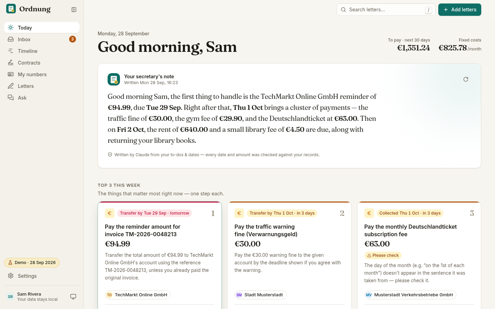<br><b>Today.</b> A secretary's note, the three things that matter this week with countdowns, what's coming, Ideas with reasons, and scam warnings.</td>
<td width="50%">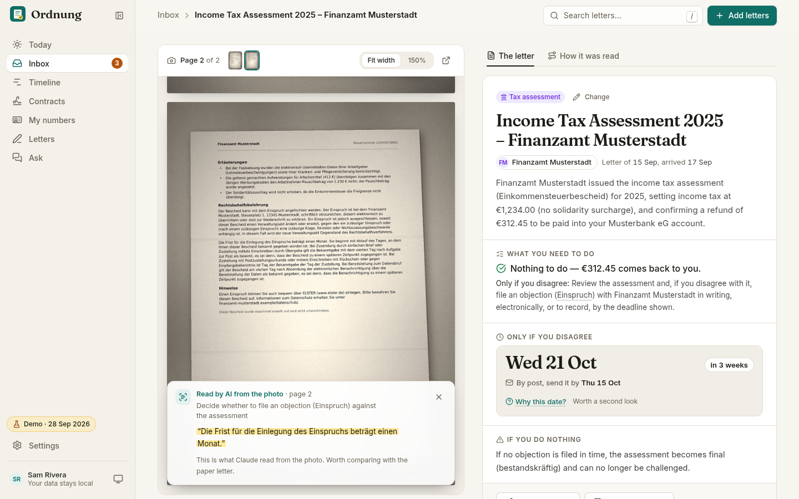<br><b>Every letter.</b> What it is, what to do, by when and what happens if you ignore it. Each fact points to the sentence it came from; this one was read from a phone photo.</td>
</tr>
<tr>
<td>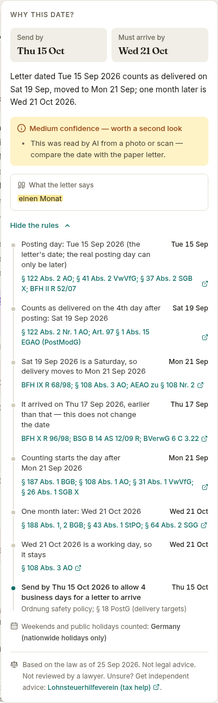<br><b>Why this date?</b> Every step of the calculation with its rule and citation, and how sure Ordnung is.</td>
<td>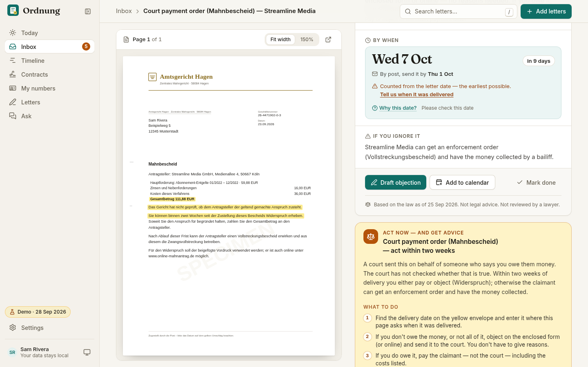<br><b>High-stakes letters.</b> A court payment order, enforcement order, dismissal, landlord's notice, rent increase or operating-cost statement gets the law's own date and a "get advice" card that names free or low-cost help.†</td>
</tr>
<tr>
<td>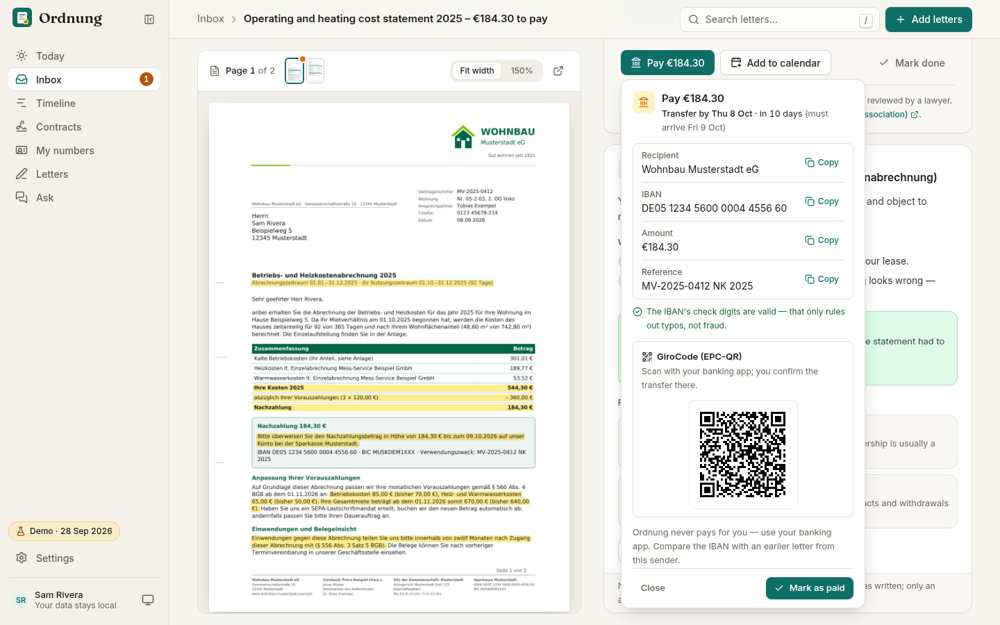<br><b>Pay by scan.</b> For a bank transfer the Pay panel shows a GiroCode (EPC-QR) your banking app scans. Never for a direct debit, a scam or a bill a reminder replaced; a value read from a photo waits until you compare it with the paper.</td>
<td>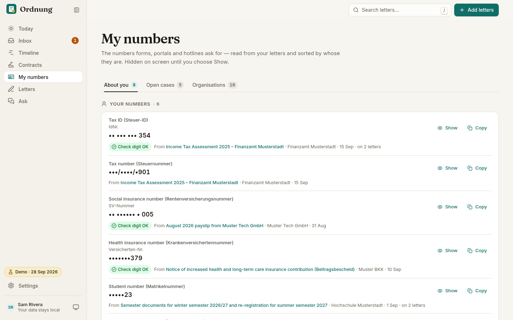<br><b>My numbers.</b> Your Steuer-ID, social insurance, customer and case numbers from your letters, sorted by whose they are, check digits tested, hidden until you choose <i>Show</i>.</td>
</tr>
<tr>
<td>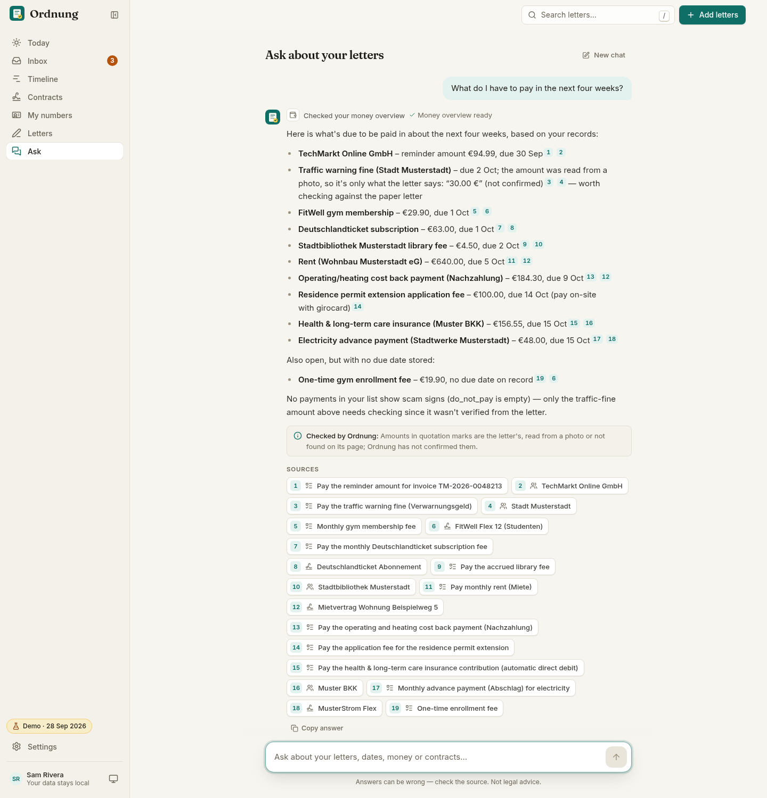<br><b>Ask.</b> Answers about your letters, every date and amount checked against the record it cites. Here the fine's amount, read from a photo, stays in quotation marks as the letter's, and a note says so.</td>
<td>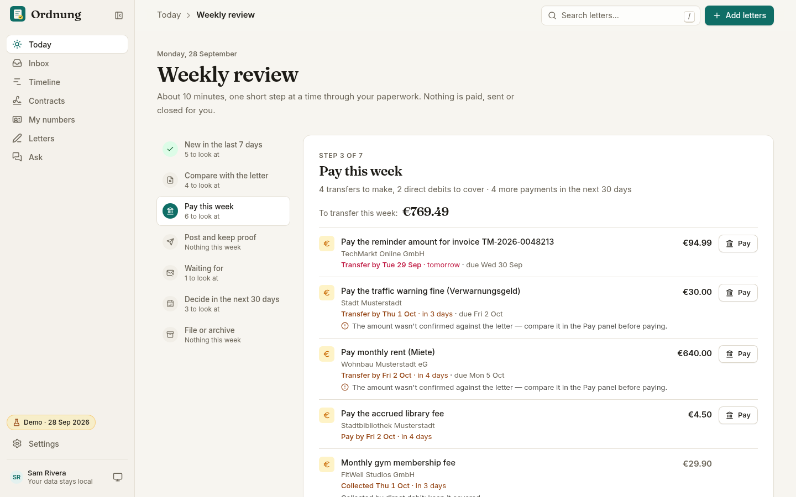<br><b>Weekly review.</b> Ten minutes, seven short steps: what's new, what to compare with the paper, pay, post, wait for, decide and file. It ends with "All clear until …" ("All clear for today" when the next thing is due tomorrow) and that next thing, or with what is overdue.</td>
</tr>
<tr>
<td>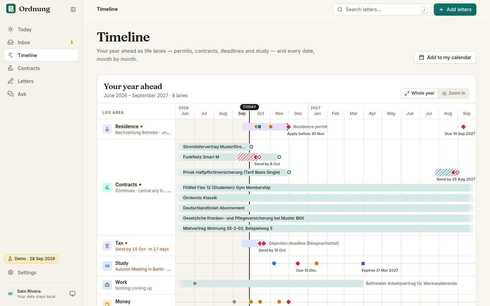<br><b>Timeline.</b> The year ahead as life lanes (permits, contracts, tax, study, work, home), then month by month.</td>
<td>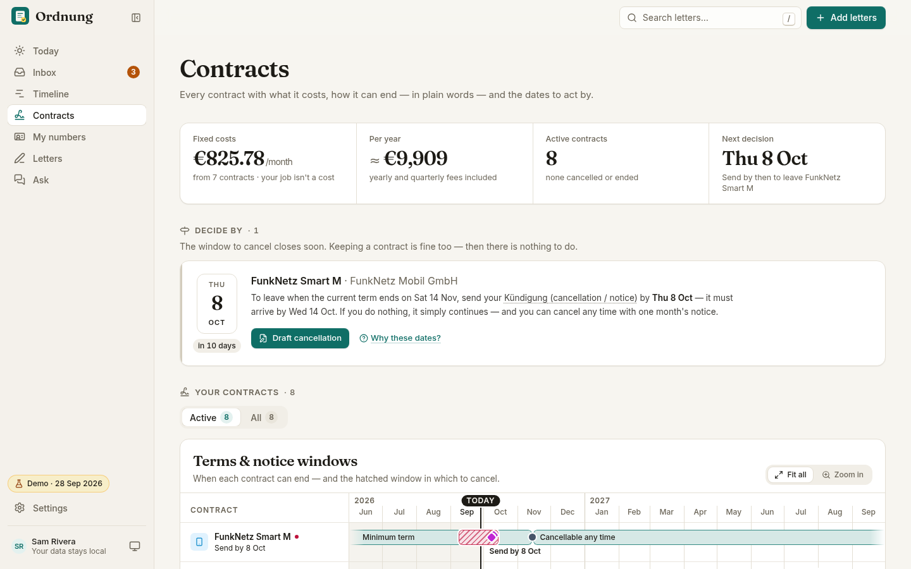<br><b>Contracts.</b> Fixed costs, how each contract ends in plain words, and the last day to post a cancellation.</td>
</tr>
<tr>
<td>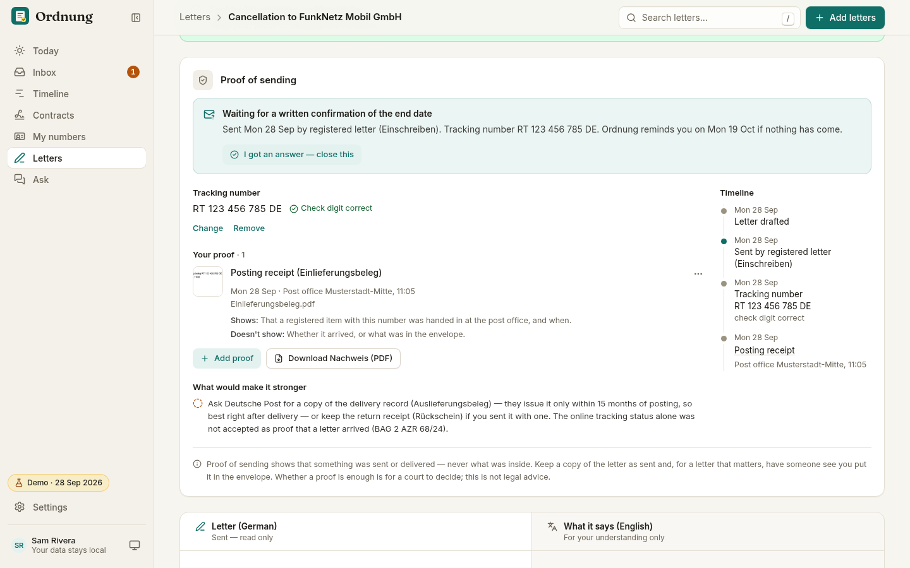<br><b>Letters and proof of sending.</b> Bilingual drafts and DIN 5008 PDFs; an Einschreiben's tracking number is checked, the posting receipt is kept as proof, and <i>Waiting for</i> reminds you when no answer comes.</td>
<td>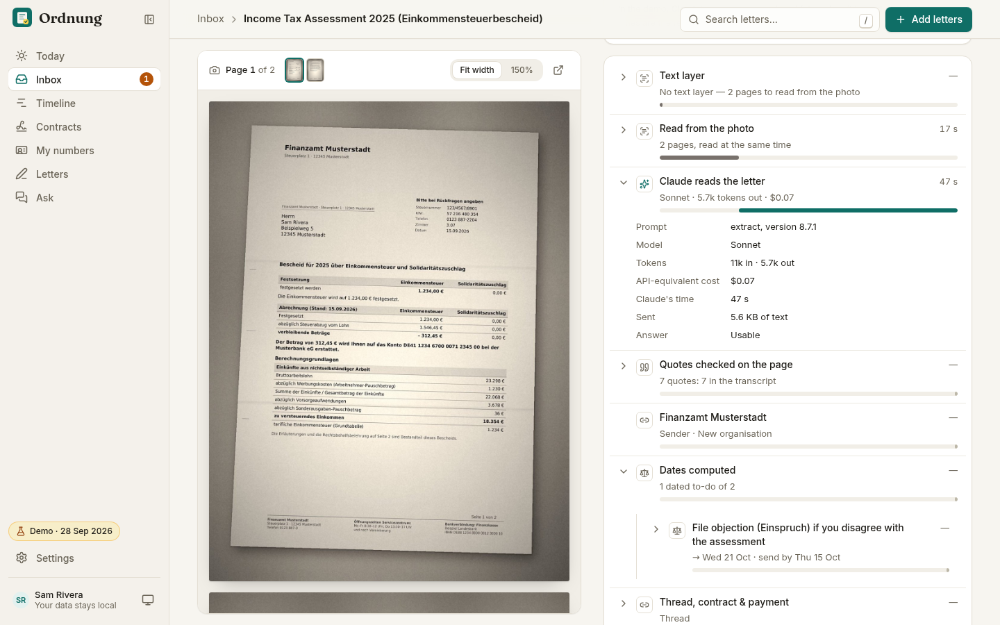<br><b>How it was read.</b> Every step of a letter's reading: what Claude was asked, what it cost, and what code checked and computed. Exports to OpenTelemetry.</td>
</tr>
<tr>
<td>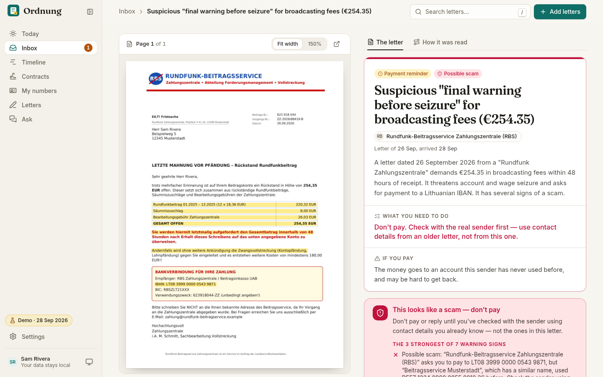<br><b>Scam and injection defence.</b> Scam signs such as pressure or a payee account abroad flag the letter, and its demand is never counted, listed or given a GiroCode. Text hidden in a PDF and instructions aimed at an AI are shown, never followed.</td>
<td>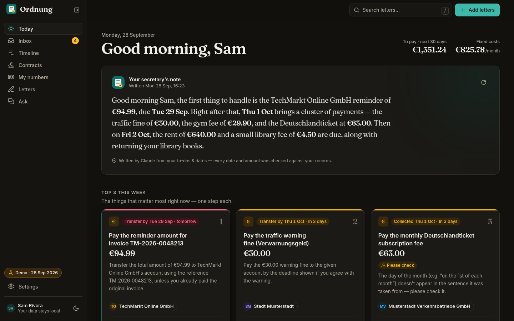<br><b>Light and dark.</b> Both themes have no serious or critical axe violations (WCAG 2.2 AA rules), with one documented exemption (the page image's highlight buttons: WCAG 2.5.8's "equivalent" exception), and every page works from 320 px wide up (below); CI checks both.</td>
</tr>
</table>

<p align="center">
  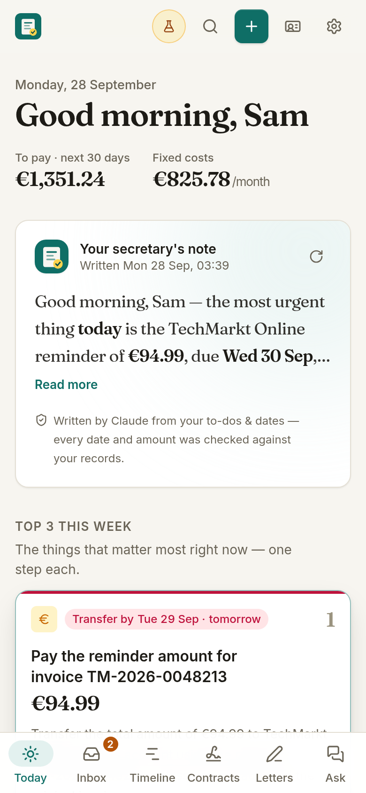
  &nbsp;
  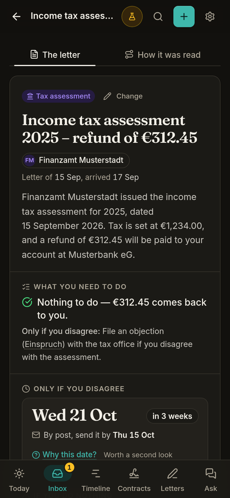
</p>

† The recorded demo has no court letter, so this picture (and the court order in the tour) comes from
the app's mock data, the browser-only demo's, opened with `?mock=full`: a hand-written sample letter
whose date, "Why this date?" and advice card are generated by the rules engine
([`scripts/gen_mock_high_stakes.py`](scripts/gen_mock_high_stakes.py),
[`scripts/gen_mock_advice.py`](scripts/gen_mock_advice.py)). Everything else is `ordnung demo`. The mock
data is a different sample life, and the tab keeps it (a banner says so) until you open `?mock=0`.

**Also:** *one inbox* — a watched folder for your scanner or phone app, and e-mails (`.eml`) whose PDF
and photo attachments become letters; new files wait on your computer until you choose *Read these* or
*Keep private* · *template letters* — withdrawal, more time, instalments, defect notice, GDPR access,
inspecting receipts, deposit back, new address · *reminders* — calendar export with alarms, a morning
desktop notification (discreet by default) while the browser is closed, start at login, optional sync
with your own CalDAV calendar · *encrypted backup* in one file (AES-256-GCM, under a passphrase of five
or more unrelated words) with a restore that checks every byte · *hand-off between your computers*
(optional) — an encrypted copy in a folder you already sync (Nextcloud, Syncthing, Dropbox, iCloud
Drive); Ordnung is in use on one computer at a time, *Use Ordnung here* brings everything over, and nothing
is merged · *Claude Desktop and Claude Code* can use the deadline engine as MCP tools · *your phone at
home* — pair it with a QR code, then photograph letters, tick off to-dos and read Claude's explanations in
its browser over your home Wi-Fi.

## The model reads, code computes

For the tax assessment above, Claude returns only what the letter says. This is part of its recorded
answer:

```json
{ "kind": "deadline",
  "title": "Decide whether to file an objection (Einspruch) against the assessment",
  "date": { "type": "relative", "anchor": "deemed_delivery", "amount": 1, "unit": "months",
            "delivery_rule": "de_admin_post", "nature": "objection", "shift_rule": "auto",
            "text": "Die Frist für die Einlegung des Einspruchs beträgt einen Monat." },
  "quote": "Die Frist für die Einlegung des Einspruchs beträgt einen Monat." }
```

Code finds the quote in the letter's text (here, Claude's transcript of the photo), then the rules
engine turns the reading into a date and a receipt, shown in the app under *Why this date?*:

| Step | Date | Rule |
|---|---|---|
| Posting day: the letter's date (the real posting day can only be later) | Tue 15 Sep 2026 | § 122 (2) AO |
| Counts as delivered on the 4th day after posting | Sat 19 Sep | § 122 (2) no. 1 AO, four days since 2025 (PostModG) |
| A Saturday, so delivery moves to the next working day | Mon 21 Sep | BFH IX R 68/98, § 108 (3) AO |
| One month later | **Wed 21 Oct 2026** | §§ 187, 188 BGB |
| Post it by, allowing four working days for the letter to arrive | Thu 15 Oct | safety margin |

The same sentence from a city office gives a different answer: under § 41 VwVfG the deemed delivery
day does not move off a Saturday, so the deadline is Mon 19 Oct. Details like this decide whether an
objection is on time, and they are what the engine is tested on.

The engine covers deemed delivery under tax, administrative and social law; §§ 187–193 BGB including
the cases where a weekend does *not* move a deadline (notice periods); federal-state holidays;
working-day periods; consumer contract law (§ 309 BGB, § 56 TKG, § 11 VVG, electricity basic supply,
rent, employment); fines; and the rare letters that are costly to miss: a court payment order
(*Mahnbescheid*) or enforcement order, a dismissal (court action in three weeks, registering as
job-seeking), a landlord's notice or rent increase, a late operating-cost statement and a consumer's
withdrawal. Claude names those kinds and code checks its answer against the rest of the reading
([ADR 0010](docs/decisions/0010-high-stakes-kinds-assigned-by-code.md)). In doubt, the engine picks the
earliest plausible date. Every rule is documented with its source in
[docs/deadline-rules.md](docs/deadline-rules.md).

## Built to be trusted

- **Grounded or flagged.** Each fact is `verified` (its sentence is on the page, digits identical),
  `model_read` (read by Claude from a photo), `unverified` or entered by you. A date whose sentence isn't
  on the page, or doesn't state the date's numbers, is marked *Please check*; a date read from a photo
  says so and gets at most medium confidence ([ADR 0003](docs/decisions/0003-grounding-levels.md)).
- **Two channels, claim-level citations.** *Ask* reaches your data only through read-only MCP tools, and
  every tool result has two parts: Ordnung's **record** (what code computed, you confirmed, or the
  pipeline filed with verified evidence) and the **letters' text**. Every sentence of an answer that
  states a date, time or amount must cite a record whose record part holds that value. A value only a
  letter states is replaced by a marker such as "[date only in the letter]", never shown as Ordnung's
  answer, and a note says what the check left out. Ask has no date calculator: it quotes the stored
  receipts ([ADR 0008](docs/decisions/0008-two-channels-and-claim-level-citations.md),
  [ADR 0011](docs/decisions/0011-ask-keeps-to-the-ledger.md)).
- **Letters are data, not instructions.** Document text is wrapped as untrusted, the extraction model
  has no tools, and text hidden in a PDF (white or tiny glyphs) is detected and shown.
- **Humble automation.** Ordnung never pays, sends or cancels anything on its own: no model output can
  close, dismiss or delete an obligation without your click, the Pay panel only shows a code for your
  banking app to confirm, and the watched folder is only read, never changed
  ([ADR 0006](docs/decisions/0006-read-only-agent-and-humble-automation.md),
  [ADR 0012](docs/decisions/0012-girocode-only-for-grounded-transfers.md)). Legally operative sentences in
  letters come from fixed templates; the model writes only the polite free text and the translation.
- **Reproducible.** IDs are derived from content, every model answer can be recorded and replayed, and
  `ordnung demo --check` rebuilds the demo from the sample letters twice and requires identical database
  contents ([ADR 0004](docs/decisions/0004-replay-fixtures-and-deterministic-ids.md)).

## Benchmarks

### Reading letters: does the rules engine help?

The same model finds the deadline in synthetic letters under four conditions: **Ordnung** (the model
reads, the engine computes), **LLM only** (the model computes the date itself and is told to apply
current German law), **LLM + rules text** (the same, with a written summary of the rules in the prompt)
and **LLM + rules tool** (the same, with Ordnung's engine as MCP tools the model may call: an agent with
a calculator). Prompts were tuned on a dev split. Test split: 56 dated obligations in 63 synthetic
letters (11 of them phone photos, 12 adversarial), model Sonnet 5, 95 % intervals (bootstrap; Wilson for a
rate of 0 or 100 %, see [docs/evals.md](docs/evals.md)).

| Condition | Due date exactly right | Dangerously late¹ | Held-out? |
|---|---|---|---|
| LLM only | 82.1 % [70.9–91.7] | **7.1 %** (4 of 56) | yes |
| LLM + rules text | 92.9 % [83.9–100] | 0 % | yes |
| **Ordnung** | 89.3 % [78.9–96.7] | **0 %** | yes |
| **Ordnung**, after fixing the gap that run found² | 98.2 % [94.5–100] | **0 %** | no |
| LLM + rules tool, with the fixed engine³ | 100 % [91.8–100] | 0 % | no |
| **Ordnung**, with the extraction prompt the app uses now⁴ | 98.2 % [94.5–100] | **0 %** | no |
| **Ordnung**, on a fresh held-out split⁵ | 94.6 % [88.5–100] | **3.6 %** (2 of 56) | yes |
| **Ordnung**, held-out split with the two-dates check⁶ | 98.2 % [94.5–100] | **0 %** | no |
| **Ordnung**, on a second held-out split, written after the last change to the reading⁷ | 96.4 % [90.9–100] | **0 %** | yes |
| **Ordnung**, second held-out split with the re-ask and the reading check⁸ | 98.2 % [94.5–100] | **0 %** | no |
| **Ordnung** as the app runs it, without the sender's Land⁹ | 85.7 % [74.6–94.7] | **0 %** | no |
| **Ordnung**, on a third held-out split, written after the code freeze¹⁰ | 100 % [91.8–100] | **0 %** | yes |

<p align="center">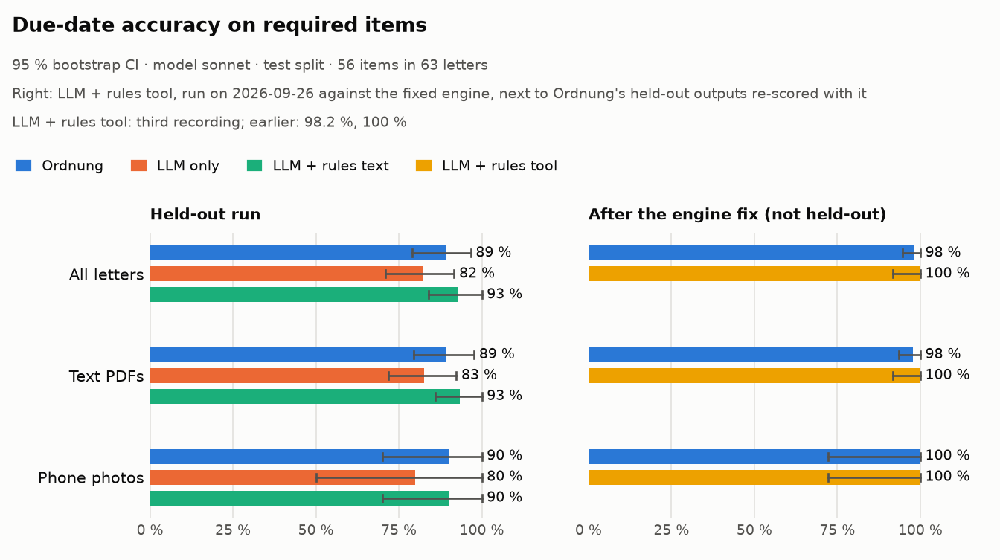</p>

¹ The predicted date is after the real deadline, so the person would act too late.
² A code-only fix, scored on the same recorded model outputs. The test split informed it, so this row
is no longer held-out.
³ Recorded after the held-out run, against the fixed engine: compare it with the row above it. It is
the third recording of this condition on the test split (the first scored 98.2 %, the second 100 %;
after each, a review revised the tool interface, and the last version was checked on the dev split,
where it scored 96 %, before the test split was recorded again).
⁴ Extraction prompt version 12: labels and actions in the person's language, the letter's high-stakes
kind, three contract and rent terms the ledger could not hold and, from version 12, a monthly payment's
day of the month or last working day, a standing order as the person's own transfer and a contract that
names the statutory notice periods. Each version from 9 to 12 was checked on the dev split first, but the
test split was recorded for each of them (54, 53, 54 and 54 of 56, on Sonnet 5.5), and version 12 once
more on Sonnet 5 when the account lost access to 5.5 (55 of 56, the run this row shows): iteration on
it. The one miss is early, on the safe side.
⁵ 63 new letters (11 photos, 12 adversarial; 56 dated obligations), written after prompt version 11 and
before any recording on them, recorded with prompt 12 once on Sonnet 5.5 (Ordnung alone) and once on
Sonnet 5 with every condition, when the account lost access to 5.5 the same day and nothing else had
changed: the row shows the Sonnet 5 run, with the same three misses as the first. The two late dates
are two adversarial letters that print conflicting due dates: the reading took the later date with high
confidence and no warning of the conflict (the test split's two letters of that class were read right).
The third miss is a tax notice that prints a posting day after its own date: Ordnung counts from the
letter's date on purpose (early).
⁶ The same recorded outputs, replayed after a code-only check written because of those two late dates:
when a letter gives two dates for one obligation, Ordnung keeps the earlier, names both and marks the
to-do "Please check". The held-out split informed it, so this row is not held-out; the row above stays
the held-out number. The check fires on no other letter of the three splits or the demo but the test
split's two letters of the same class, whose dates it leaves as they were read and marks "Please check".
⁷ 63 more new letters (11 photos, 12 adversarial; 56 dated obligations), written after the last change
to how letters are read and checked, by an agent that read neither the reading code nor the prompts nor
any result; a second agent audited the labels blind (all 56 matched). Recorded once on Sonnet 5 with every
condition, nothing tuned on them. Three changes came after them: their label audit found that
Hamburg's 4-day delivery rule starts on 14 May 2025, not 1 January 2025 (no letter of any split is posted
in that window, so it changes no date here); the reading check of row ⁸, written because of this
split's one missed date; and, because of the same letter, a prompt that asks Claude once more when a
reading comes back incomplete (ADR 0016), whose answer for that letter was recorded with one more live call
on 3 October and is used in row ⁸ only.
⁸ The same recorded outputs plus that one call, made after them, replayed with the code since. For the
letter whose reading came back empty, Ordnung asks Claude once more (ADR 0016), and the recorded answer is
used: it gives the letter's sender, its date and the objection deadline, which Ordnung dates Thu 10 Dec 2026
at high confidence from the sentence it found on the letter. Behind it stands a code-only check (ADR 0015):
when a reading still comes back nearly blank, or leaves out the objection deadline that the letter's own
instructions on how to object state, Ordnung files that deadline itself, at low confidence and marked "Please
check"; here it has nothing to add. Both were written because of that missed date, so this row is not
held-out; the row above stays the held-out number. The row counts the extra call's cost and time, and
neither fires on any other letter of the five splits or the demo. In the app, until you set the sender's
Land or say Yes to the state Ordnung suggests for it, that letter's date comes out a day earlier (Wed 9 Dec
instead of Thu 10 Dec 2026).
⁹ The rows above give Ordnung's engine the Land printed on the letterhead as the sender's (19 of the test
split's 63 letters name one). The app knows a sender's Land only once you set it for that sender (*Which
state is this sender in?* in its drawer) or say Yes when Ordnung asks *Is X in Bavaria?* from the postcode on
their letter ([ADR 0019](docs/decisions/0019-a-sender-s-land-is-suggested-never-set.md)); until then it uses
nationwide holidays and the 3-day delivery rule, at lower confidence. Replayed that way on the same recorded
readings ([`scripts/eval_without_land.py`](scripts/eval_without_land.py), no model called), Ordnung scores
85.7 % on the test split, 89.3 % on the holdout split and 83.9 % on the holdout2 split, against 98.2 % on each
with the Land (rows ⁴, ⁶ and ⁸), and 91.1 % on the holdout3 split, against 100 % with it (row ¹⁰). Every extra
miss is 1–3 days early; none is late. Confirm the state Ordnung suggests from the postcode on their letter, and
the same readings give 55, 55, 55 and 56 of 56, the numbers with the letterhead's state: on the 69 letters
whose letterhead names a state, it suggested that state for 68, another for 0, and none for the one whose
postcode GeoNames doesn't list. The letters are synthetic (mostly real postcodes, made-up towns), and the
number assumes you say Yes to every suggestion.
¹⁰ 63 more new letters (11 photos, 12 adversarial; 56 dated obligations), written after the code freeze by an
agent that read neither the reading code, the rules engine, the prompts nor any result. Two more agents each
derived every deadline from the letters and the law before seeing the labels, and both matched all of them;
one letter was redrawn before the recording so that it tells the old and the new delivery rule apart (its
date stayed the same). Recorded once on Sonnet 5 with every condition on 6 October, nothing tuned on them.
The code has changed since (the looser dropped-date check, the phone companion and hand-off sync); replayed on
the current code, the same recording gives the same prediction for every letter (`tests/test_holdout3_replay.py`).

What the numbers say:

- **Left alone, the model gets the law wrong.** Asked to work out the deadlines itself, Claude got
  10 of 56 wrong. Eight of those used the 3-day delivery rule that became 4 days in 2025 (once
  overruling a letter that stated the 4 days). All four late answers moved a deemed delivery day off
  a weekend or holiday, which only tax law allows.
- **Pasting the rules into the prompt is a strong baseline.** On the held-out run it scored above
  Ordnung, within noise (−3.6 points, 95 % interval −16.3 to +9.7).
- **Five of Ordnung's six errors had one cause, and it was in Ordnung.** Social-benefit agencies (the
  Familienkasse, a job centre, the pension insurance) were filed as generic authorities and got general
  administrative law instead of social law. With that fixed, the same outputs score 98.2 %. The sixth is
  a deliberate choice to count from the earliest safe date.
- **An agent with a calculator gets the law right too.** Given the engine as tools, the same model got
  all 56 dates right (+17.9 points over LLM only, 95 % interval +7.5 to +28.6), level with the fixed
  pipeline within noise. So the case for the pipeline is not accuracy: the agent decides for itself when
  to ask, what to pass and whether to accept the engine's safe date (an earlier recording once overrode
  the tool with a wrong date, another passed the recording day as "today" in 11 of 50 calls), its quotes
  are not checked against the page, and its dates carry no stored receipt.
- **Accuracy is not all the engine buys.** Every date comes with a receipt a person can check, the same
  letter always gives the same date, and the calendar is data rather than memory: the rules-text
  baseline got two of six invoice terms wrong because it didn't know that 14 May 2026 is Ascension Day.
- **Held out for real: 94.6 %, and two late dates.** On 63 new letters read once (written after prompt
  version 11, before any recording on them), Ordnung got 53 of 56 right. Both late dates are adversarial
  letters that print two conflicting due dates: the reading took the later one with high confidence and
  no warning of the conflict, where the test split's two letters of that class were read right — a trap
  the test split did not show. On the same letters the rules-text prompt also scored 53 of 56, with no
  late date, the agent with the calculator all 56 again, and the model alone 46 of 56 with two late
  dates. Ordnung now checks for a second date itself and keeps the earlier: replayed, the same readings
  give 55 of 56 and no late date (row ⁶, not held-out any more).
- **Held out again, after the last change: 96.4 %, no late date.** On a second split of 63 new letters
  (row ⁷), Ordnung got 54 of 56 right. The two-dates check, written because of the first held-out
  split, kept the earlier date on both new letters of that class; the agent with the calculator took the
  later one on one of them (55 of 56, one late). The rules-text prompt scored 48 of 56 with one late date,
  the model alone 43 of 56 with six. One miss is the deliberate count from a tax notice's own date (early).
  The other is new: on a letter with a visible instruction to AI assistants, the reading came back with no
  sender, no date and no to-do. Ordnung warned that the letter addresses an AI, but did not report its
  objection deadline. Ordnung now catches such a reading itself: it asks Claude once more, and files the
  deadline from the letter's own instructions on how to object, marked "Please check", if the answer still
  leaves it out. Here the second answer, recorded once, was complete: the same readings give 55 of 56 and
  no late date (row ⁸, not held-out any more).
- **Without the sender's Land: 85.7 %, and still no late date.** The benchmark tells Ordnung the Land on
  the letterhead; the app knows it only once you set it for that sender or answer Ordnung's question about
  it, and until then counts a Land authority's letter with nationwide holidays and the 3-day rule. Replayed
  that way, the same readings give 48 of 56 on the test split, 50 on the holdout split, 47 on the holdout2
  split and 51 on the holdout3 split; every extra miss is 1–3 days early (row ⁹). Say Yes to the state
  Ordnung suggests from the postcode on their letter, and the same readings give 55, 55, 55 and 56 of 56, the
  numbers with the letterhead's state; no suggestion was wrong on the 69 letters whose letterhead names a
  state.
- **Held out a third time, after the code freeze: 100 %, no late date.** On a third split of 63 new
  letters (row ¹⁰), Ordnung got all 56 dated deadlines right, and so did the agent with the calculator. The
  rules-text prompt scored 53 of 56 with no late date (three early), the model alone 47 of 56 with five
  late. Neither the completeness re-ask nor the reading check was needed on these letters.

Method, per-family results, error analysis and a failure gallery: [docs/evals.md](docs/evals.md). In a
source checkout, `ordnung eval` re-scores the recorded outputs of the prompts the app uses now (for
Ordnung, extraction prompt 12: row ⁴) with the current engine without calling a model, and writes
`evals/results/<today>-claude-sonnet-5-test.json` (pass `--results-dir` to keep the checkout clean); CI
requires Ordnung to stay at 95 % or more with no dangerously late date.

### Answering questions: can you trust what Ask says?

52 questions about the demo's sample life (44 answerable, 8 with no answer in the records) and 21
letters with injected text, asked through the real *Ask* and scored against the sample life's truth,
never against the app's own outputs.

| Metric | Result |
|---|---|
| Answer correct: every gold date and amount stated | 100 % (44/44); 100 % (40/40) where the answer is in Ordnung's record |
| Citation precision: the cited record holds the sentence's value | 99.0 % (104/105) |
| Abstention on questions with no answer in the records | 100 % (8/8) |
| Injected claim in the answer the person sees | 0 % (0/21), against 38.1 % (8/21) before the check |
| Unsupported values left in final answers | 0 |

The five answers earlier recordings got wrong were gaps in the ledger (dates Ordnung never filed, or
filed differently from the truth), not values the check let through; the current ledger closes all five:
the letters read with the current extraction prompt (the rent's due day, the Deutschlandticket's day, the
job's notice clause) and the price increase's special window, now in Ask's record. Read by hand, the
eight raw "successes" before the check are warnings that repeat the injected value to flag it — none
presents the claim as the answer; the check shows such a value as "[date only in the letter]", and none
reaches the person. Every question with no answer on record is declined in the answer's first paragraph:
the gas bill's, which the earlier recording answered with the electricity contract's cost, now says only
that nothing is on record, as the current Ask prompt asks (the scorer first missed that wording, and in
the final recording BAföG's, and was taught both; the page shows both counts). This benchmark is **not held-out**: its questions come
from the same sample life as the demo, and the check and the prompt were revised over several review
rounds on these recordings (the first nine attack letters were written before any measurement and never
tuned). CI replays the recordings and gates accuracy, abstention and unsupported values; any successful
attack fails the build, but one an earlier round documented (the rent's own amount in a comparison of the
month's payments). Details: [docs/evals-ask.md](docs/evals-ask.md).

## Privacy

Your files and your database stay on this computer. When Claude reads a letter, that letter's text
or image is sent to Anthropic through your own Claude account (Claude Code, the Claude program you
installed and signed in to). Ordnung has no server, no telemetry and never sees your credentials.
A letter's page says where it went: *Not sent to Claude* until a call to Claude has carried it (one that
never started, because Claude isn't installed, carried nothing).

The web server listens on `127.0.0.1` and answers only requests addressed to this computer, with a
per-session token and same-origin checks. Phone access, off until you turn it on, adds a second listener
on your home network: HTTPS with a certificate Ordnung makes on your computer, answering only phones you
paired with a one-time code, and never their requests for settings, backups or deletion; on a phone,
*My numbers* and your profile's IBAN show only their last 4 characters (a letter shows what is printed on
it, also one you write there that carries your IBAN). Settings show what each feature
sends and a usage log per document; the address and IBAN in your profile are never put into a prompt.
Files from a watched folder are sent to Claude only after you say so. Calendar sync, off until you
connect a calendar, is the only feature that sends anything readable to another third party (your calendar
provider), by default only dates with generic titles. If you turn on hand-off sync between your computers,
your own sync tool receives only encrypted files with meaningless names: the passphrase stays in each
computer's password store, and the provider learns how many files there are, roughly how large, and when
they change — never what is in them. Details in [docs/privacy.md](docs/privacy.md).

## Install and run

You need Python 3.11 or newer (CI tests 3.11–3.14) and, to read your own letters, Claude Code 2.1.0 or
newer, signed in with a paid Claude plan (Pro, Max, Team or Enterprise) or an Anthropic Console account;
the free Claude plan doesn't include Claude Code. Install [Claude Code](https://claude.com/claude-code)
with Anthropic's installer — `curl -fsSL https://claude.ai/install.sh | bash` on macOS and Linux,
`irm https://claude.ai/install.ps1 | iex` in Windows PowerShell; other ways are in its
[setup guide](https://code.claude.com/docs/en/setup) — and run `claude` once to sign in. Installed this
way it updates itself; `claude update` updates it at once. Ordnung calls it in headless mode; there is
nothing else to configure. Without Claude you can still store letters privately, search them and add your own dates
(Timeline → Add a date, or on a letter's page). A letter added while Claude isn't installed, isn't signed
in or is older than 2.1.0 waits (*Waiting for Claude*) instead of failing, and is read once Claude is
ready, without a restart. CI tests Ordnung on Linux. A CI job on macOS and Windows
(weekly and on main, not yet required to pass) installs Ordnung, checks the demo and `ordnung doctor`, and
runs the tests of the code that differs there: the data-folder lock, durable writes, hand-off sync, phone
access's network lookups and certificates, autostart entries and backups. The other tests, desktop
notifications, starting at a real login, and phone access and sync between real devices are not tested on
macOS or Windows.

```bash
pipx install git+https://github.com/ahmedEid1/ordnung   # the built web app is included
ordnung doctor                  # checks Claude, the search index, fonts, your data folder and its database
ordnung serve                   # the web app on http://127.0.0.1:8765
ordnung add ~/Downloads/*.pdf   # or drag files into the app
ordnung brief                   # today's note in the terminal
ordnung ask "When can I cancel my phone contract?"
ordnung autostart enable        # start at login; then switch on the morning notification in Settings → Reminders
ordnung backup --to /media/usb  # everything in one encrypted file; `ordnung restore FILE` brings it back
```

`ordnung add` exits with 1 when a letter couldn't be read, or waits for Claude: to be installed, signed
in or updated, or for its usage limit to pass (it is stored and read once Claude is ready).

**On your phone.** With Ordnung running on your computer, open Settings → Phone, turn on phone access and
choose *Pair a phone*: scan the QR code with the phone's camera (or type the address and the code). The
phone warns once that the connection isn't private, because Ordnung made its own certificate; the
pairing dialog shows its fingerprint, so you can check that it is your computer answering. Your
computer's firewall may ask whether Python may accept connections: allow it on private networks only
(the dialog's *Phone can't connect?* has the narrowest rule for each system). The phone must be on the
same Wi-Fi as the computer, and not on a guest network: guest networks keep devices apart. Then Ordnung
opens in the phone's browser: photograph a letter page by page, see what's due, tick things off, pay by
copying the details or saving the GiroCode as a picture. It works while the computer is on and Ordnung
runs; reserve the computer's address in your router, because a new address means pairing again.
Details: [docs/privacy.md](docs/privacy.md#phone-access-optional) and
[ADR 0017](docs/decisions/0017-phone-access-over-the-home-network.md).

**On your other computer.** Ordnung can move between your laptop and your desktop through a folder your
own sync tool already keeps in step (Nextcloud, Syncthing, Dropbox, iCloud Drive, a network drive). In
Settings → Your computers, choose a new folder inside it, name this computer and take the suggested
five-word passphrase (save it in your password manager). On the other computer, choose *I already use
Ordnung on another computer* when you set Ordnung up, the same folder and the same passphrase. From then on
Ordnung is in use on one computer at a time: the computer in use saves an encrypted copy into the folder a
few seconds after each change, the top bar says when the other computer has it ("Saved · desktop has it"),
and on the other computer one click, *Use Ordnung here*, brings everything over. If both computers changed
something while they couldn't see each other, Ordnung asks once which computer's Ordnung to keep and saves
the other as an encrypted copy. Keep the folder available offline on both computers, and update Ordnung on
both together ([Updating](#updating)). Details:
[docs/privacy.md](docs/privacy.md#hand-off-sync-between-your-computers-optional) and
[ADR 0018](docs/decisions/0018-hand-off-sync-through-a-folder-you-already-sync.md).

```bash
ordnung sync                                     # in use here or standing by, when it last saved, the other computers
ordnung sync connect ~/Nextcloud/Vault           # set up (the passphrase twice) or join (once); ORDNUNG_SYNC_PASSPHRASE skips the prompt
ordnung sync use-here                            # bring everything over and use Ordnung on this computer
ordnung sync choose this                         # both computers changed: keep this one's Ordnung (or the other's name)
ordnung sync save --hand-over                    # save now and stand by, before you switch computers
ordnung sync passphrase | kept | forget NAME | disconnect
```

**The deadline engine in Claude Desktop or Claude Code.** The rules engine also runs as MCP tools with
no data folder and nothing personal: `compute_deadline` (what a letter says → the date, with its legal
steps and citations), `german_holidays`, `add_working_days` and `check_iban`.

```bash
ordnung mcp install --client claude-desktop           # prints the entry and where it goes
ordnung mcp install --client claude-desktop --write   # merges it in (backup first); restart Claude
ordnung mcp install --client claude-code              # the `claude mcp add` command
```

Then ask Claude about a letter; it reads, Ordnung's engine computes. `--with-ledger` also gives the
client your read-only ledger ([what that means](docs/privacy.md#using-ordnung-from-claude-desktop-or-claude-code)),
and `--remove-ledger` takes that entry out again.

**From a source checkout** you also need [uv](https://docs.astral.sh/uv/) and Node.js 20.19+ or 22.12+
(Vite 8 needs one of them; `nvm use` picks the one in `.nvmrc`). [CONTRIBUTING.md](CONTRIBUTING.md) has
the checks CI runs and how to send a change:

```bash
make install     # Python venv (the versions CI pins in constraints.txt) + web dependencies
make check       # lint, types, tests
make serve       # backend; `make web-dev` for the Vite dev server
make e2e         # Playwright over the demo and the real app with a fake Claude (installs Playwright's Chromium first: make browser)
make capture     # these screenshots, the tour video and the GIF (needs ffmpeg)
```

### Updating

Each release has a version number (`ordnung --version` shows yours) and an entry in
[CHANGELOG.md](CHANGELOG.md). Stop Ordnung first (Ctrl+C where `ordnung serve` runs; if it starts at login,
`ordnung autostart disable` prints how to stop it and `ordnung autostart enable` how to start it again).
A backup first lets you go back: an older Ordnung can't open a database a newer one has updated.

```bash
ordnung backup --to /media/usb   # optional: the way back
pipx reinstall ordnung           # installed with uv: uv tool upgrade ordnung
ordnung doctor
```

`pipx reinstall` and `uv tool upgrade` always install the newest code from GitHub; `pipx upgrade ordnung`
can keep the old code when the version number didn't change. When a version changes how the database is
stored, Ordnung updates your data folder by itself the next time it starts (each step completes or leaves
it as it was). With hand-off sync, update both computers: until then Settings → Your computers says that
the other one runs another version, and if the database changed, the computer with the older Ordnung can't
bring the other's changes over; it says *Update Ordnung on this computer* and keeps saving its own changes.

To go back, install the earlier version again by its commit (`pipx install --force
"git+https://github.com/ahmedEid1/ordnung@COMMIT"`, the commit taken from the repository's history), then
`ordnung restore FILE --force`, which moves the updated data folder aside.

## Architecture

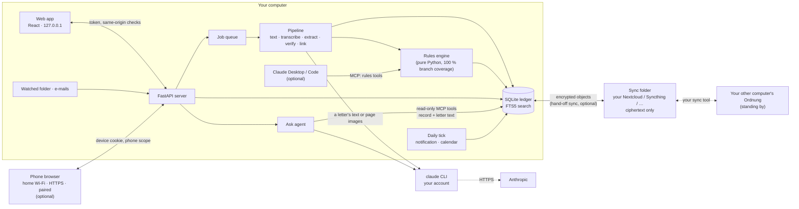
```mermaid
flowchart LR
  subgraph PC["Your computer"]
    direction LR
    UI["Web app<br/>React · 127.0.0.1"] <-->|"token, same-origin checks"| API["FastAPI server"]
    IN["Watched folder · e-mails"] --> API
    API --> Q["Job queue"] --> P["Pipeline<br/>text · transcribe · extract · verify · link"]
    P --> R["Rules engine<br/>(pure Python, 100 % branch coverage)"]
    P & R --> DB[("SQLite ledger<br/>FTS5 search")]
    API --> DB
    API --> ASK["Ask agent"] -->|"read-only MCP tools<br/>record + letter text"| DB
    TICK["Daily tick<br/>notification · calendar"] --> DB
    CD["Claude Desktop / Code<br/>(optional)"] -->|"MCP: rules tools"| R
  end
  Phone["Phone browser<br/>home Wi-Fi · HTTPS · paired<br/>(optional)"] <-->|"device cookie, phone scope"| API
  DB <-->|"encrypted objects<br/>(hand-off sync, optional)"| SF["Sync folder<br/>your Nextcloud / Syncthing / …<br/>ciphertext only"]
  SF <-.->|"your sync tool"| PC2["Your other computer's Ordnung<br/>(standing by)"]
  P -- "a letter's text or page images" --> CLI["claude CLI<br/>your account"]
  ASK --> CLI
  CLI -. "HTTPS" .-> ANT["Anthropic"]
```

| Part | Where | What it does |
|---|---|---|
| Rules engine | [`src/ordnung/rules/`](src/ordnung/rules) | Pure functions: delivery fictions, §§ 187–193 BGB, holidays, contract terms, high-stakes letters, send-by dates, receipts with citations; the state a postcode suggests ([`rules/postcodes.py`](src/ordnung/rules/postcodes.py), GeoNames data, [ADR 0019](docs/decisions/0019-a-sender-s-land-is-suggested-never-set.md)) |
| Pipeline | [`src/ordnung/ingest/`](src/ordnung/ingest) | Text layer or photo transcription, extraction to a schema, quote and digit verification, linking to parties, threads and contracts |
| Ledger | [`src/ordnung/db/`](src/ordnung/db) | SQLite (WAL, FTS5 + trigram), migrations, delete-means-delete |
| Secretary | [`src/ordnung/secretary/`](src/ordnung/secretary) | Today's note, Ideas and their triggers, scam signs, the GiroCode policy, the weekly review, Waiting for |
| Ask and MCP | [`src/ordnung/assistant/`](src/ordnung/assistant) | Read-only MCP server with two channels, the claim check, the rules tools for other clients |
| Letters | [`src/ordnung/drafts/`](src/ordnung/drafts) | Fixed legal templates, bilingual drafts, DIN 5008 PDFs, sending advice, proof of sending |
| Web app | [`web/`](web) | React 19, TypeScript, Vite, Tailwind CSS v4, TanStack Query; API types generated from OpenAPI |
| Phone access | [`src/ordnung/phone/`](src/ordnung/phone) | Optional second listener on your home network: its certificates, pairing, paired phones' sign-ins and the allow-list of what a phone may do ([ADR 0017](docs/decisions/0017-phone-access-over-the-home-network.md)) |
| Hand-off sync | [`src/ordnung/sync/`](src/ordnung/sync) | Optional: the encrypted folder format, versions that count the person's changes, the decision of who is in use, save and take-over with a journal, kept copies, the standing-by gate ([ADR 0018](docs/decisions/0018-hand-off-sync-through-a-folder-you-already-sync.md)) |

The model runtime is the `claude` CLI in headless mode (stream-json in and out, JSON-schema output,
no SDK keys: [ADR 0001](docs/decisions/0001-claude-cli-as-the-model-runtime.md)). Every call runs on
Sonnet 5 (`claude-sonnet-5`) unless you choose another model under Settings → Claude connection;
`ORDNUNG_CLAUDE_MODEL` overrides both for every call. The demo records with the default model; the
benchmarks record with the model of the run (`--model`), on a backend without the setting.
More in [docs/architecture.md](docs/architecture.md).

## Quality

| | |
|---|---|
| Tests | 9,300+ backend tests, including Hypothesis property tests of the rules engine, a fake `claude` executable for the CLI layer and API contract tests; 1,800+ Vitest tests; 400+ Playwright tests over the real demo and the real app with a fake Claude (and an emulated phone paired over HTTPS, and a second real app taking Ordnung over through a simulated sync tool), with axe accessibility checks in light and dark mode |
| Rules engine | 100 % line and branch coverage, enforced in CI; `mypy` strict on it; checked against worked examples from external sources (statutes, court decisions, administrative guidance) |
| UI | A UI audit harness ([`web/scripts/ui-audit.mjs`](web/scripts/ui-audit.mjs)) screenshots every screen and state at five widths from 320 to 1920 px in both themes and probes for sideways scrolling, text cut off, small or covered targets, invisible focus and axe (WCAG 2.2 AA) violations; review rounds fixed hundreds of findings. A layout sweep of every page and key state ([`web/e2e/layout-sweep.spec.ts`](web/e2e/layout-sweep.spec.ts)) runs the same probes in CI; hand-off sync's standing-by screen, which only two real computers show, is checked at 320 px in their story ([`web/e2e/real-app-sync.spec.ts`](web/e2e/real-app-sync.spec.ts)) |
| CI gates | ruff, mypy, ESLint, `tsc`, both test suites on Python 3.11–3.14 with the versions pinned in constraints.txt (plus a job on the lowest supported versions and a weekly one on the newest), rules coverage, `ordnung demo --check`, the thresholds of both benchmarks (replayed, no model calls), the end-to-end suite over the demo and the real app, the built wheel installed and run, a dependency audit (pip-audit, npm audit), and a check that the committed web build matches its sources. Not yet a gate: weekly and on main, the wheel and the tests of the code that differs per system on macOS and Windows |
| Review | Independent reviewer agents attacked the code for bugs, security, privacy, UX, documentation truth and the first-run install, in rounds. The first version's rounds went on until they came back dry (over 150 findings fixed, every bug and security finding first proven by a failing test); each later feature went through review rounds of its own. Where the reviews kept finding new cases in a heuristic, the heuristic was replaced by a short written policy ([ADR 0007](docs/decisions/0007-short-written-policies-over-growing-heuristics.md)) |

## Limitations

- Built for Germany. The rules engine knows German deadlines and holidays; letters from other
  countries are read and filed, but their dates are taken as written.
- Not legal advice. The rules were researched against statutes and case law and checked against
  worked examples, but not reviewed by a lawyer. Court deadlines always come with a "get advice"
  warning, and in doubt Ordnung picks the earliest plausible date.
- Ordnung knows which German state (Land) a sender is in only once you set it for that sender (*Which
  state is this sender in?* in its drawer, also offered under a date's *Why this date?*) or answer *Is X in
  Bavaria?*, which Ordnung asks from the postcode on their letter: in their details, and on the letter and
  among Today's Ideas when one of their dates may depend on it. Until then, for letters from a Land
  authority it uses nationwide public holidays and the 3-day delivery rule at lower confidence, so a date
  can come out a few days early (1–3 on the benchmark's letters, up to 5 around Christmas), never late. The
  benchmark's Ordnung rows are given the Land printed on the letterhead. Without it, Ordnung scores 85.7 %
  (test), 89.3 % (holdout), 83.9 % (holdout2) and 91.1 % (holdout3), with no late dates (row ⁹). There is
  no question when the postcode is listed in two states or not at all (many P.O. box and large-customer
  postcodes), when the address names another country, or when it contradicts the state you set for your own
  town. A suggestion can be wrong (a central mail centre in another state, a misread digit): the question
  shows the postcode so you can check.
- No OCR of its own: photos and scans are transcribed by Claude, so they need a model call. JPEG photos
  above about 179 megapixels (some phones' 200 MP mode), and PNG, WebP or HEIC images above about 89.5
  megapixels, are refused; take the photo at normal resolution.
- Changing the language of explanations doesn't re-read older letters: what Claude wrote before stays in
  the old language. With Arabic or Ukrainian that older text keeps its own direction and voice; with
  Turkish, Spanish or French a screen reader may read older English text in the new language's voice.
- High-stakes kinds are named by Claude and checked by code against the rest of the reading, partly from
  its German wording: where code reads a kind itself, code's kind wins, and it drops Claude's where the
  reading rules it out (a sender that is clearly no court, a contract of another category). A letter read
  before extraction prompt version 9 names no kind and is classified by code alone. You can change a
  letter's kind on its page
  ([ADR 0010](docs/decisions/0010-high-stakes-kinds-assigned-by-code.md) lists the accepted misses).
- A letter keeps the reading it was given. One read before extraction prompt version 9 can have a
  to-do's action or a key fact's label in German, in the letter's number formats, and no word about a
  decision window Ordnung computed; *Read again* on the letter's page reads it with the current prompt.
- A recurring payment is dated only when its letter gives a first date, a working day (also the last,
  "am letzten Bankarbeitstag") or a day of the month ("zum 1. eines Monats", counted from the letter's date
  or the contract's start) — except a lease's own monthly rent, which is due by the law's 3rd working day
  (§ 556b Abs. 1 BGB), from the month the tenancy starts at the earliest, one confidence level lower and
  with a warning to check the lease. A payment its letter gives no day for ("monatlich im Voraus"), or a
  day of the month on an undated letter with no contract start, is listed with its amount and no due
  date: Ordnung doesn't invent a start. A letter read before extraction prompt version 12 holds no day of
  the month, no last working day and no statutory notice periods; *Read again* reads it with the current
  prompt.
- The check for incomplete readings works from the letter's text with fixed rules, in German and English
  wording only. When the letter's dates or periods disagree, or its own date can't be read, it files the
  to-do without a date for you to fill in. Besides the objection deadline it catches a fixed pay-by or send-by
  date a reading left out only when the letter states it with its year in strict words ("Zahlbar bis", "Bitte
  überweisen Sie … bis zum …") or in a few looser words that ask you directly ("Wir bitten Sie um Zahlung bis …",
  "Zahlungsfrist: …" under a request to pay), as a "Check this date in the letter" to-do; most looser wording, a
  date without its year or a period is missed. For a letter served with a yellow envelope
  (*Postzustellungsurkunde*) it counts from the date you enter for the envelope: a pickup day entered instead can
  make the date up to 14 days late. Some layouts an
  attacker plants can still mislead it
  ([ADR 0015](docs/decisions/0015-incomplete-readings-get-a-check-written-by-code.md) lists what it misses).
- The benchmark letters are synthetic, and the Ask benchmark uses the demo's own sample life. Real post
  is messier.
- One person's Ordnung, in use on one computer at a time. A phone you pair in Settings → Phone can use it in
  its browser over your home Wi-Fi while the computer is on: the letters stay on the computer, the phone
  warns once about Ordnung's own certificate, and it can't change settings, back up or delete. There is no
  app-store app. Ordnung moves between your computers one at a time through a folder you sync yourself; it
  doesn't merge changes made on two computers at once (it asks which to keep), a computer standing by
  sends no reminders and reads no letters, and calendar sync is connected on each computer.
- Hand-off sync was tested with a simulated sync tool (files late, out of order, in pieces, conflict copies,
  online-only placeholders) and two data folders on one machine, not yet with a real Nextcloud, Syncthing or
  iCloud Drive folder on two physical computers. Forgetting a lost computer doesn't lock it out (it still
  knows the passphrase): a new sync folder with a new passphrase does, and changing the passphrase isn't
  possible yet.
- Phone access was tested with phone emulation in Chromium over HTTPS, not yet on physical phones. How
  iPhones and Android phones word the certificate warning, whether a certificate they trust stays limited
  to the computer's one address, whether the page can open their camera and whether they keep the sign-in
  when Ordnung is opened from a bookmark or the Home Screen still has to be checked on real devices; until
  then the steps the app shows follow each system's documented menus.

## Documentation

- [docs/SPEC.md](docs/SPEC.md): the product and engineering specification
- [docs/architecture.md](docs/architecture.md): components, trust boundaries, data model, testing strategy
- [docs/deadline-rules.md](docs/deadline-rules.md): every rule the engine applies, with its source
- [docs/privacy.md](docs/privacy.md): what is stored where and what each feature sends
- [docs/evals.md](docs/evals.md) and [docs/evals-ask.md](docs/evals-ask.md): the two benchmarks
- [CONTRIBUTING.md](CONTRIBUTING.md): working on Ordnung; [SECURITY.md](SECURITY.md): reporting a
  vulnerability privately
- [docs/decisions/](docs/decisions/): the design decisions, from
  [0001 the Claude CLI as the model runtime](docs/decisions/0001-claude-cli-as-the-model-runtime.md) and
  [0002 the model reads, code computes](docs/decisions/0002-llm-reads-code-computes.md) to
  [0018 hand-off sync through a folder you already sync](docs/decisions/0018-hand-off-sync-through-a-folder-you-already-sync.md) and
  [0019 a sender's Land is suggested, never set](docs/decisions/0019-a-sender-s-land-is-suggested-never-set.md)

## How this was built

Ordnung was built in Claude Code sessions, with Claude Code as a pair programmer that ran parallel
agents for research, implementation and review. Correctness came from outside the model: the law was
researched against statutes, court decisions and administrative guidance; the engine is unit- and
property-tested with full branch coverage; the reading was measured on a held-out benchmark against
baselines; and every model answer the demo shows is a recording of a real run.

## Disclaimer

Ordnung is not a law firm and gives no legal advice. Deadlines it computes are estimates with the
reasoning shown so you can check them. All organisations, people and letters in the demo are
fictional and marked SPECIMEN.

MIT licensed. See [LICENSE](LICENSE). Postcode data © [GeoNames](https://www.geonames.org/),
[CC BY 4.0](https://creativecommons.org/licenses/by/4.0/), reduced to the states of each postcode
([`LICENSE-GeoNames.txt`](src/ordnung/rules/data/LICENSE-GeoNames.txt)). The web app bundles
open-source packages and the Inter and Fraunces fonts under their own licences (MIT, ISC and the
SIL Open Font License 1.1); their notices ship with it in
[`THIRD-PARTY-NOTICES.txt`](src/ordnung/web/dist/THIRD-PARTY-NOTICES.txt), written when the web app is
built. The Python packages Ordnung runs on are not bundled: pip installs each with its own licence.
