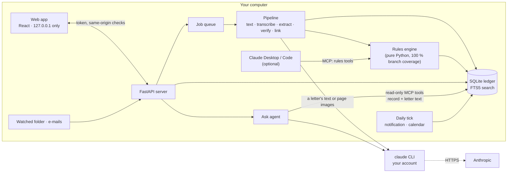

<p align="center">
  
</p>

<h1 align="center">Ordnung</h1>

<p align="center">
  <b>A private secretary for the paperwork of life in Germany.</b><br>
  It reads your letters, works out every deadline with tested legal rules, reminds you before things
  matter and drafts the replies. It runs on your own computer.
</p>

<p align="center">
  <a href="https://github.com/ahmedEid1/ordnung/actions/workflows/ci.yml"></a>
  
  
  
  <a href="LICENSE"></a>
</p>

Anyone living in Germany gets letters that carry deadlines: tax assessments, fines, contract and rent
changes, reminders, court orders. The deadline is rarely a date on the page. It is *"one month after this notice
is announced to you"*, and working it out means knowing that a posted notice counts as delivered on
the fourth day (since 2025), that tax law moves that day off a weekend but administrative law does not,
and that the holidays depend on the federal state. **Ordnung** lets Claude read the letter and say
what it says; deterministic, tested code turns that into the date, shows its working with citations,
and keeps a ledger of every deadline, payment, contract and reply that you can ask questions about.
Nothing is ever paid, sent or cancelled for you.

<p align="center">
  
</p>
<p align="center"><a href="docs/assets/demo.mp4">Watch the whole tour (MP4, 1 min 36 s)</a>: reading a letter, "Why this date?", a court order, paying by GiroCode, My numbers, Ask, the weekly review, the timeline, contracts, proof of sending and how a letter was read.</p>

<p align="center">
  <a href="#try-it-in-60-seconds-with-zero-tokens">Try it</a> ·
  <a href="#a-tour">Tour</a> ·
  <a href="#the-model-reads-code-computes">The model reads, code computes</a> ·
  <a href="#built-to-be-trusted">Trust</a> ·
  <a href="#benchmarks">Benchmarks</a> ·
  <a href="#privacy">Privacy</a> ·
  <a href="#install-and-run">Install</a> ·
  <a href="#architecture">Architecture</a> ·
  <a href="#quality">Quality</a> ·
  <a href="#limitations">Limitations</a> ·
  <a href="#documentation">Docs</a>
</p>

## Try it in 60 seconds, with zero tokens

The demo is the sample life of *Sam Rivera*, an international student in the fictional town of
Musterstadt: 25 letters, contracts, a residence permit, a scam, and three unopened letters in the
*New mail* tray that are read live. Every model answer in the demo is a recording of a real Claude
run, so it needs **no Claude account and uses no tokens**.

```bash
pipx install git+https://github.com/ahmedEid1/ordnung   # or: uv tool install git+https://github.com/ahmedEid1/ordnung
ordnung demo                                             # opens http://127.0.0.1:8765 with a guided tour
```

To read your own letters, see [Install and run](#install-and-run).

## A tour

<table>
<tr>
<td width="50%"><br><b>Today.</b> A secretary's note, the three things that matter this week with countdowns, what's coming, Ideas with reasons, and scam warnings.</td>
<td width="50%"><br><b>Every letter.</b> What it is, what to do, by when and what happens if you ignore it. Each fact points to the sentence it came from; this one was read from a phone photo.</td>
</tr>
<tr>
<td><br><b>Why this date?</b> Every step of the calculation with its rule and citation, and how sure Ordnung is.</td>
<td><br><b>High-stakes letters.</b> A court payment order, enforcement order, dismissal, landlord's notice, rent increase or operating-cost statement gets the law's own date and a "get advice" card that names free or low-cost help.†</td>
</tr>
<tr>
<td><br><b>Pay by scan.</b> For a bank transfer the Pay panel shows a GiroCode (EPC-QR) your banking app scans. Never for a direct debit, a scam or a bill a reminder replaced; a value read from a photo waits until you compare it with the paper.</td>
<td><br><b>My numbers.</b> Your Steuer-ID, social insurance, customer and case numbers from your letters, sorted by whose they are, check digits tested, hidden until you choose <i>Show</i>.</td>
</tr>
<tr>
<td><br><b>Ask.</b> Answers about your letters, every date and amount checked against the record it cites. Here the fine's amount, read from a photo, stays in quotation marks as the letter's, and a note says so.</td>
<td><br><b>Weekly review.</b> Ten minutes, seven short steps: what's new, what to compare with the paper, pay, post, wait for, decide and file. It ends with "All clear until …" ("All clear for today" when the next thing is due tomorrow) and that next thing, or with what is overdue.</td>
</tr>
<tr>
<td><br><b>Timeline.</b> The year ahead as life lanes (permits, contracts, tax, study, work, home), then month by month.</td>
<td><br><b>Contracts.</b> Fixed costs, how each contract ends in plain words, and the last day to post a cancellation.</td>
</tr>
<tr>
<td><br><b>Letters and proof of sending.</b> Bilingual drafts and DIN 5008 PDFs; an Einschreiben's tracking number is checked, the posting receipt is kept as proof, and <i>Waiting for</i> reminds you when no answer comes.</td>
<td><br><b>How it was read.</b> Every step of a letter's reading: what Claude was asked, what it cost, and what code checked and computed. Exports to OpenTelemetry.</td>
</tr>
<tr>
<td><br><b>Scam and injection defence.</b> Scam signs such as pressure or a payee account abroad flag the letter, and its demand is never counted, listed or given a GiroCode. Text hidden in a PDF and instructions aimed at an AI are shown, never followed.</td>
<td><br><b>Light and dark.</b> Both themes pass axe's WCAG 2.2 AA checks, with one documented exemption (the page image's highlight buttons: WCAG 2.5.8's "equivalent" exception), and every page works from 320 px wide up (below); CI checks both.</td>
</tr>
</table>

<p align="center">
  
  &nbsp;
  
</p>

† The recorded demo has no court letter, so this picture (and the court order in the tour) comes from
the app's mock data, the browser-only demo's, opened with `?mock=full`: a hand-written sample letter
whose date, "Why this date?" and advice card are generated by the rules engine
([`scripts/gen_mock_high_stakes.py`](scripts/gen_mock_high_stakes.py),
[`scripts/gen_mock_advice.py`](scripts/gen_mock_advice.py)). Everything else is `ordnung demo`. The mock
data is a different sample life, and the tab keeps it (a banner says so) until you open `?mock=0`.

**Also:** *one inbox* — a watched folder for your scanner or phone app, and e-mails (`.eml`) whose PDF
and photo attachments become letters; new files wait on your computer until you choose *Read these* or
*Keep private* · *template letters* — withdrawal, more time, instalments, defect notice, GDPR access,
inspecting receipts, deposit back, new address · *reminders* — calendar export with alarms, a morning
desktop notification (discreet by default) while the browser is closed, start at login, optional sync
with your own CalDAV calendar · *encrypted backup* in one file (AES-256-GCM) with a restore that checks
every byte · *Claude Desktop and Claude Code* can use the deadline engine as MCP tools.

## The model reads, code computes

For the tax assessment above, Claude returns only what the letter says. This is part of its recorded
answer:

```json
{ "kind": "deadline", "title": "File objection (Einspruch) if you disagree with the assessment",
  "quote": "Die Frist für die Einlegung des Einspruchs beträgt einen Monat.",
  "date": { "type": "relative", "anchor": "deemed_delivery", "amount": 1, "unit": "months",
            "delivery_rule": "de_admin_post", "nature": "objection", "shift_rule": "auto",
            "text": "einen Monat", "legal_basis": null } }
```

Code finds the quote in the letter's text (here, Claude's transcript of the photo), then the rules
engine turns the reading into a date and a receipt, shown in the app under *Why this date?*:

| Step | Date | Rule |
|---|---|---|
| Posting day: the letter's date (the real posting day can only be later) | Tue 15 Sep 2026 | § 122 (2) AO |
| Counts as delivered on the 4th day after posting | Sat 19 Sep | § 122 (2) no. 1 AO, four days since 2025 (PostModG) |
| A Saturday, so delivery moves to the next working day | Mon 21 Sep | BFH IX R 68/98, § 108 (3) AO |
| One month later | **Wed 21 Oct 2026** | §§ 187, 188 BGB |
| Post it by, allowing four working days for the letter to arrive | Thu 15 Oct | safety margin |

The same sentence from a city office gives a different answer: under § 41 VwVfG the deemed delivery
day does not move off a Saturday, so the deadline is Mon 19 Oct. Details like this decide whether an
objection is on time, and they are what the engine is tested on.

The engine covers deemed delivery under tax, administrative and social law; §§ 187–193 BGB including
the cases where a weekend does *not* move a deadline (notice periods); federal-state holidays;
working-day periods; consumer contract law (§ 309 BGB, § 56 TKG, § 11 VVG, electricity basic supply,
rent, employment); fines; and the rare letters that are costly to miss: a court payment order
(*Mahnbescheid*) or enforcement order, a dismissal (court action in three weeks, registering as
job-seeking), a landlord's notice or rent increase, a late operating-cost statement and a consumer's
withdrawal. Claude names those kinds and code checks its answer against the rest of the reading
([ADR 0010](docs/decisions/0010-high-stakes-kinds-assigned-by-code.md)). In doubt, the engine picks the
earliest plausible date. Every rule is documented with its source in
[docs/deadline-rules.md](docs/deadline-rules.md).

## Built to be trusted

- **Grounded or flagged.** Each fact is `verified` (its sentence is on the page, digits identical),
  `model_read` (read by Claude from a photo), `unverified` or entered by you. A date whose sentence isn't
  on the page, or doesn't state the date's numbers, is marked *Please check*; a date read from a photo
  says so and gets at most medium confidence ([ADR 0003](docs/decisions/0003-grounding-levels.md)).
- **Two channels, claim-level citations.** *Ask* reaches your data only through read-only MCP tools, and
  every tool result has two parts: Ordnung's **record** (what code computed, you confirmed, or the
  pipeline filed with verified evidence) and the **letters' text**. Every sentence of an answer that
  states a date, time or amount must cite a record whose record part holds that value. A value only a
  letter states is replaced by a marker such as "[date only in the letter]", never shown as Ordnung's
  answer, and a note says what the check left out. Ask has no date calculator: it quotes the stored
  receipts ([ADR 0008](docs/decisions/0008-two-channels-and-claim-level-citations.md),
  [ADR 0011](docs/decisions/0011-ask-keeps-to-the-ledger.md)).
- **Letters are data, not instructions.** Document text is wrapped as untrusted, the extraction model
  has no tools, and text hidden in a PDF (white or tiny glyphs) is detected and shown.
- **Humble automation.** Ordnung never pays, sends or cancels anything on its own: no model output can
  close, dismiss or delete an obligation without your click, the Pay panel only shows a code for your
  banking app to confirm, and the watched folder is only read, never changed
  ([ADR 0006](docs/decisions/0006-read-only-agent-and-humble-automation.md),
  [ADR 0012](docs/decisions/0012-girocode-only-for-grounded-transfers.md)). Legally operative sentences in
  letters come from fixed templates; the model writes only the polite free text and the translation.
- **Reproducible.** IDs are derived from content, every model answer can be recorded and replayed, and
  `ordnung demo --check` rebuilds the demo from the sample letters twice and requires identical database
  contents ([ADR 0004](docs/decisions/0004-replay-fixtures-and-deterministic-ids.md)).

## Benchmarks

### Reading letters: does the rules engine help?

The same model finds the deadline in synthetic letters under four conditions: **Ordnung** (the model
reads, the engine computes), **LLM only** (the model computes the date itself and is told to apply
current German law), **LLM + rules text** (the same, with a written summary of the rules in the prompt)
and **LLM + rules tool** (the same, with Ordnung's engine as MCP tools the model may call: an agent with
a calculator). Prompts were tuned on a dev split. Test split: 56 dated obligations in 63 synthetic
letters (11 of them phone photos, 12 adversarial), model Sonnet, 95 % intervals (bootstrap; Wilson for a
rate of 0 or 100 %, see [docs/evals.md](docs/evals.md)).

| Condition | Due date exactly right | Dangerously late¹ | Held-out? |
|---|---|---|---|
| LLM only | 82.1 % [70.9–91.7] | **7.1 %** (4 of 56) | yes |
| LLM + rules text | 92.9 % [83.9–100] | 0 % | yes |
| **Ordnung** | 89.3 % [78.9–96.7] | **0 %** | yes |
| **Ordnung**, after fixing the gap that run found² | 98.2 % [94.5–100] | **0 %** | no |
| LLM + rules tool, with the fixed engine³ | 100 % [91.8–100] | 0 % | no |
| **Ordnung**, with the extraction prompt the app uses now⁴ | 96.4 % [91.2–100] | **0 %** | no |

<p align="center"></p>

¹ The predicted date is after the real deadline, so the person would act too late.
² A code-only fix, scored on the same recorded model outputs. The test split informed it, so this row
is no longer held-out.
³ Recorded after the held-out run, against the fixed engine: compare it with the row above it. It is
the third recording of this condition on the test split (the first scored 98.2 %, the second 100 %;
after each, a review revised the tool interface, and the last version was checked on the dev split,
where it scored 96 %, before the test split was recorded again).
⁴ Extraction prompt version 11: labels and actions in the person's language, the letter's high-stakes
kind, and three contract and rent terms the ledger could not hold. Each version from 9 to 11 was
checked on the dev split first, but the test split was recorded for each of them (54, 53 and 54 of
56), which is iteration on it. Both misses are early, on the safe side.

What the numbers say:

- **Left alone, the model gets the law wrong.** Asked to work out the deadlines itself, Claude got
  10 of 56 wrong. Eight of those used the 3-day delivery rule that became 4 days in 2025 (once
  overruling a letter that stated the 4 days). All four late answers moved a deemed delivery day off
  a weekend or holiday, which only tax law allows.
- **Pasting the rules into the prompt is a strong baseline.** On the held-out run it scored above
  Ordnung, within noise (−3.6 points, 95 % interval −16.3 to +9.7).
- **Five of Ordnung's six errors had one cause, and it was in Ordnung.** Social-benefit agencies (the
  Familienkasse, a job centre, the pension insurance) were filed as generic authorities and got general
  administrative law instead of social law. With that fixed, the same outputs score 98.2 %. The sixth is
  a deliberate choice to count from the earliest safe date.
- **An agent with a calculator gets the law right too.** Given the engine as tools, the same model got
  all 56 dates right (+17.9 points over LLM only, 95 % interval +7.5 to +28.6), level with the fixed
  pipeline within noise. So the case for the pipeline is not accuracy: the agent decides for itself when
  to ask, what to pass and whether to accept the engine's safe date (an earlier recording once overrode
  the tool with a wrong date, another passed the recording day as "today" in 11 of 50 calls), its quotes
  are not checked against the page, and its dates carry no stored receipt.
- **Accuracy is not all the engine buys.** Every date comes with a receipt a person can check, the same
  letter always gives the same date, and the calendar is data rather than memory: the rules-text
  baseline got two of six invoice terms wrong because it didn't know that 14 May 2026 is Ascension Day.

Method, per-family results, error analysis and a failure gallery: [docs/evals.md](docs/evals.md). In a
source checkout, `ordnung eval` re-scores the recorded outputs of the prompts the app uses now (for
Ordnung, extraction prompt 11: the last Ordnung row) with the current engine without calling a model; CI
requires Ordnung to stay at 95 % or more with no dangerously late date.

### Answering questions: can you trust what Ask says?

52 questions about the demo's sample life (44 answerable, 8 with no answer in the records) and 21
letters with injected text, asked through the real *Ask* and scored against the sample life's truth,
never against the app's own outputs.

| Metric | Result |
|---|---|
| Answer correct: every gold date and amount stated | 100 % (44/44); 100 % (40/40) where the answer is in Ordnung's record |
| Citation precision: the cited record holds the sentence's value | 99.4 % (159/160) |
| Abstention on questions with no answer in the records⁵ | 100 % (8/8) |
| Injected claim in the answer the person sees | 0 % (0/21), against 4.8 % (1/21) before the check |
| Unsupported values left in final answers | 0 |

The five answers earlier recordings got wrong were gaps in the ledger (dates Ordnung never filed, or
filed differently from the truth), not values the check let through; the current ledger closes all five:
the letters read with the current extraction prompt (the rent's due day, the Deutschlandticket's day, the
job's notice clause) and the price increase's special window, now in Ask's record. Read by hand, the one raw "success" before the check is a denial that
repeats the question's injected date to say the record does not hold it; the answer the person sees
shows it in quotation marks. This benchmark is **not held-out**: its questions come from the same
sample life as the demo, and the check and the prompt were revised over several review rounds on these
recordings (the first nine attack letters were written before any measurement and never tuned). CI
replays the recordings and gates accuracy, abstention and unsupported values; any successful attack
fails the build. Details: [docs/evals-ask.md](docs/evals-ask.md).

⁵ 7/8 as first scored: the gas-bill answer leads with "I found no gas contract or gas bill in your
records", a wording the scorer's abstention reader did not know; it was added after the measurement,
with a test.

## Privacy

Your files and your database stay on this computer. When Claude reads a letter, that letter's text
or image is sent to Anthropic through your own Claude account (Claude Code, the Claude program you
installed and signed in to). Ordnung has no server, no telemetry and never sees your credentials.

The web server listens on `127.0.0.1` by default (another `--host` prints a warning and still needs
the token) and requires a per-session token, a known `Host` header and same-origin requests. Settings
show what each feature sends and a usage log per document; the address and IBAN in your profile are
never put into a prompt. Files from a watched folder are sent to Claude only after you say so. Calendar
sync, off until you connect a calendar, is the only feature that sends anything to another third party
(your calendar provider), by default only dates with generic titles. Details in
[docs/privacy.md](docs/privacy.md).

## Install and run

You need Python 3.11+ and, to read your own letters, the
[Claude Code CLI](https://docs.anthropic.com/en/docs/claude-code) signed in with your Claude
subscription (or an API key). Ordnung calls it in headless mode; there is nothing else to configure.

```bash
pipx install git+https://github.com/ahmedEid1/ordnung   # the built web app is included
ordnung doctor                  # checks Claude, the search index, fonts and your data folder
ordnung serve                   # the web app on http://127.0.0.1:8765
ordnung add ~/Downloads/*.pdf   # or drag files into the app
ordnung brief                   # today's note in the terminal
ordnung ask "When can I cancel my phone contract?"
ordnung autostart enable        # start at login; then switch on the morning notification in Settings → Reminders
ordnung backup --to /media/usb  # everything in one encrypted file; `ordnung restore FILE` brings it back
```

**The deadline engine in Claude Desktop or Claude Code.** The rules engine also runs as MCP tools with
no data folder and nothing personal: `compute_deadline` (what a letter says → the date, with its legal
steps and citations), `german_holidays`, `add_working_days` and `check_iban`.

```bash
ordnung mcp install --client claude-desktop           # prints the entry and where it goes
ordnung mcp install --client claude-desktop --write   # merges it in (backup first); restart Claude
ordnung mcp install --client claude-code              # the `claude mcp add` command
```

Then ask Claude about a letter; it reads, Ordnung's engine computes. `--with-ledger` also gives the
client your read-only ledger ([what that means](docs/privacy.md#using-ordnung-from-claude-desktop-or-claude-code)),
and `--remove-ledger` takes that entry out again.

**From a source checkout:**

```bash
make install     # Python venv + web dependencies
make check       # lint, types, tests
make serve       # backend; `make web-dev` for the Vite dev server
make e2e         # Playwright over the demo
make capture     # these screenshots, the tour video and the GIF (needs ffmpeg)
```

## Architecture



| Part | Where | What it does |
|---|---|---|
| Rules engine | [`src/ordnung/rules/`](src/ordnung/rules) | Pure functions: delivery fictions, §§ 187–193 BGB, holidays, contract terms, high-stakes letters, send-by dates, receipts with citations |
| Pipeline | [`src/ordnung/ingest/`](src/ordnung/ingest) | Text layer or photo transcription, extraction to a schema, quote and digit verification, linking to parties, threads and contracts |
| Ledger | [`src/ordnung/db/`](src/ordnung/db) | SQLite (WAL, FTS5 + trigram), migrations, delete-means-delete |
| Secretary | [`src/ordnung/secretary/`](src/ordnung/secretary) | Today's note, Ideas and their triggers, scam signs, the GiroCode policy, the weekly review, Waiting for |
| Ask and MCP | [`src/ordnung/assistant/`](src/ordnung/assistant) | Read-only MCP server with two channels, the claim check, the rules tools for other clients |
| Letters | [`src/ordnung/drafts/`](src/ordnung/drafts) | Fixed legal templates, bilingual drafts, DIN 5008 PDFs, sending advice, proof of sending |
| Web app | [`web/`](web) | React 19, TypeScript, Vite, Tailwind CSS v4, TanStack Query; API types generated from OpenAPI |

The model runtime is the `claude` CLI in headless mode (stream-json in and out, JSON-schema output,
no SDK keys: [ADR 0001](docs/decisions/0001-claude-cli-as-the-model-runtime.md)). More in
[docs/architecture.md](docs/architecture.md).

## Quality

| | |
|---|---|
| Tests | 5,400+ backend tests, including Hypothesis property tests of the rules engine, a fake `claude` executable for the CLI layer and API contract tests; 1,500+ Vitest tests; 360+ Playwright tests over the real demo with axe accessibility checks in light and dark mode |
| Rules engine | 100 % line and branch coverage, enforced in CI; `mypy` strict on it; checked against worked examples from external sources (statutes, court decisions, administrative guidance) |
| UI | A UI audit harness ([`web/scripts/ui-audit.mjs`](web/scripts/ui-audit.mjs)) screenshots every screen and state at five widths from 320 to 1920 px in both themes and probes for sideways scrolling, text cut off, small or covered targets, invisible focus and axe (WCAG 2.2 AA) violations; review rounds fixed hundreds of findings. A layout sweep of every page and key state ([`web/e2e/layout-sweep.spec.ts`](web/e2e/layout-sweep.spec.ts)) runs the same probes in CI |
| CI gates | ruff, mypy, ESLint, `tsc`, both test suites, rules coverage, `ordnung demo --check`, the thresholds of both benchmarks (replayed, no model calls), the end-to-end suite, and a check that the committed web build matches its sources |
| Review | Independent reviewer agents attacked the code for bugs, security, privacy, UX, documentation truth and the first-run install, in rounds. The first version's rounds went on until they came back dry (over 150 findings fixed, every bug and security finding first proven by a failing test); each later feature went through review rounds of its own. Where the reviews kept finding new cases in a heuristic, the heuristic was replaced by a short written policy ([ADR 0007](docs/decisions/0007-short-written-policies-over-growing-heuristics.md)) |

## Limitations

- Built for Germany. The rules engine knows German deadlines and holidays; letters from other
  countries are read and filed, but their dates are taken as written.
- Not legal advice. The rules were researched against statutes and case law and checked against
  worked examples, but not reviewed by a lawyer. Court deadlines always come with a "get advice"
  warning, and in doubt Ordnung picks the earliest plausible date.
- No OCR of its own: photos and scans are transcribed by Claude, so they need a model call.
- High-stakes kinds are named by Claude and checked by code against the rest of the reading, partly from
  its German wording: where code reads a kind itself, code's kind wins, and it drops Claude's where the
  reading rules it out (a sender that is clearly no court, a contract of another category). A letter read
  before extraction prompt version 9 names no kind and is classified by code alone. You can change a
  letter's kind on its page
  ([ADR 0010](docs/decisions/0010-high-stakes-kinds-assigned-by-code.md) lists the accepted misses).
- A letter keeps the reading it was given. One read before extraction prompt version 9 can have a
  to-do's action or a key fact's label in German, in the letter's number formats, and no word about a
  decision window Ordnung computed; *Read again* on the letter's page reads it with the current prompt.
- A recurring payment is dated only when its letter gives a first date or a working day — except a
  lease's own monthly rent, which is due by the law's 3rd working day (§ 556b Abs. 1 BGB), from the month
  the tenancy starts at the earliest, one confidence level lower and with a warning to check the lease. A
  direct debit "zum 1. eines Monats" with no start month, like the demo's gym fee, is listed with its
  amount and no due date: Ordnung doesn't invent one from a contract's start.
- The benchmark letters are synthetic, and the Ask benchmark uses the demo's own sample life. Real post
  is messier.
- A single user on a single computer. There is no sync between computers (calendar sync only sends
  dates to your own calendar) and no mobile app.

## Documentation

- [docs/SPEC.md](docs/SPEC.md): the product and engineering specification
- [docs/architecture.md](docs/architecture.md): components, trust boundaries, data model, testing strategy
- [docs/deadline-rules.md](docs/deadline-rules.md): every rule the engine applies, with its source
- [docs/privacy.md](docs/privacy.md): what is stored where and what each feature sends
- [docs/evals.md](docs/evals.md) and [docs/evals-ask.md](docs/evals-ask.md): the two benchmarks
- [docs/decisions/](docs/decisions/): the design decisions, from
  [0001 the Claude CLI as the model runtime](docs/decisions/0001-claude-cli-as-the-model-runtime.md) and
  [0002 the model reads, code computes](docs/decisions/0002-llm-reads-code-computes.md) to
  [0014 proof files are deleted for good](docs/decisions/0014-proof-files-are-deleted-for-good.md)

## How this was built

Ordnung was built in Claude Code sessions, with Claude Code as a pair programmer that ran parallel
agents for research, implementation and review. Correctness came from outside the model: the law was
researched against statutes, court decisions and administrative guidance; the engine is unit- and
property-tested with full branch coverage; the reading was measured on a held-out benchmark against
baselines; and every model answer the demo shows is a recording of a real run.

## Disclaimer

Ordnung is not a law firm and gives no legal advice. Deadlines it computes are estimates with the
reasoning shown so you can check them. All organisations, people and letters in the demo are
fictional and marked SPECIMEN.

MIT licensed. See [LICENSE](LICENSE).
