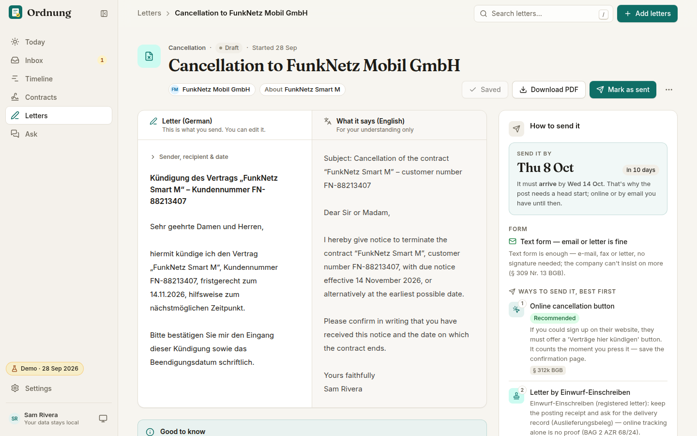
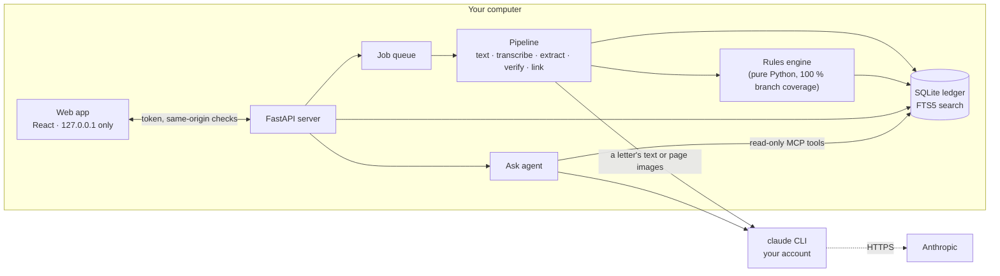

<p align="center">
  
</p>

<h1 align="center">Ordnung</h1>

<p align="center">
  <b>A private AI secretary for life admin.</b><br>
  It reads your letters, keeps track of every deadline, payment and contract, reminds you before
  things matter, and drafts the replies. It runs on your own computer.
</p>

<p align="center">
  <a href="https://github.com/ahmedEid1/ordnung/actions/workflows/ci.yml"></a>
  
  
  
  <a href="LICENSE"></a>
</p>

> **Drop in a German tax assessment. Get the exact objection deadline, the sentence it came from,
> and the legal calculation behind it.**

<p align="center">
  
</p>
<p align="center"><a href="docs/assets/demo.mp4">Watch the full 70-second tour (MP4)</a>: letters, the year ahead, contracts, Ask and a cancellation letter.</p>

## The problem

Anyone living in Germany gets letters that carry deadlines: tax assessments, fines, rent and
contract changes, reminders from the city, insurance renewals. The deadline is rarely a date on
the page. It is *"one month after this notice is announced to you"*, and working it out means
knowing that a posted notice counts as delivered on the fourth day (since 2025), that the day moves
if it lands on a weekend or public holiday, that the holidays depend on the federal state, and that
a contract's notice period follows different rules again. Get it wrong and the objection is too
late, the contract renews for another year, or a reminder turns into a debt collector.

Chat assistants read German letters well, but they are unreliable at the legal arithmetic, and they
forget: nothing tracks the letter once the chat is closed.

## What Ordnung does

| | |
|---|---|
| **Reads anything** | PDFs, scans and phone photos, German or English. Claude transcribes and extracts senders, references, amounts, dates, contracts and what the letter wants from you. |
| **Computes, doesn't guess** | The model only says *what the letter says* ("one month after delivery"). A tested rules engine computes the date and shows its working, with citations. |
| **Shows its evidence** | Every fact comes with the sentence it was read from: highlighted on the page for PDFs, shown next to the page for photos. Dates and amounts must match their sentence digit for digit; anything that doesn't is flagged *Please check*. |
| **Keeps a ledger** | Parties, letter threads, contracts, to-dos and payments, linked across letters. A reminder is joined to its invoice; a price increase is joined to its contract. |
| **Acts like a secretary** | A *Today* page with the three things that matter, a note on what's coming, *Ideas* with reasons (for example "special right to cancel until 31 Oct"), and scam warnings. |
| **Shows your year** | A timeline and *life lanes* (money, housing, work, study, health, permits) for the next twelve months, including contract notice windows. |
| **Answers questions** | *Ask* runs an agent over read-only tools and streams the answer. Answers cite the records they come from; a citation must name a record the agent actually read, and a sentence with a date or amount it can't back up is removed. |
| **Writes the reply** | Objections, cancellations and general replies as a bilingual draft, rendered as a DIN 5008 PDF, with advice on how to send it so it can be proven. |
| **Reminds you** | Calendar export (`.ics`) with alarms at the send-by date, and browser notifications. |

Nothing is ever sent, paid or cancelled for you. Ordnung suggests; you decide.

## Try it in 60 seconds, with zero tokens

The demo is the sample life of *Sam Rivera*, an international student in the fictional town of
Musterstadt: 25 letters, contracts, a residence permit, a scam, and three unopened letters in the
*New mail* tray that are processed live. Every model answer in the demo is a recording of a real
Claude run, so the demo needs **no Claude account and uses no tokens**.

```bash
pipx install git+https://github.com/ahmedEid1/ordnung   # or: uv tool install git+https://github.com/ahmedEid1/ordnung
ordnung demo                                             # opens http://127.0.0.1:8765 with a guided tour
```

To use it on your own letters you need Python 3.11+ and the [Claude Code CLI](https://docs.anthropic.com/en/docs/claude-code)
signed in with your Claude subscription (or an API key). Ordnung calls it in headless mode; there is
nothing else to configure.

```bash
ordnung doctor                  # checks Claude, the search index, fonts and your data folder
ordnung serve                   # the web app on http://127.0.0.1:8765
ordnung add ~/Downloads/*.pdf   # or drag files into the app
ordnung brief                   # today's note in the terminal
ordnung ask "When can I cancel my phone contract?"
```

## Use Ordnung's deadline engine from Claude Desktop

The rules engine also works as MCP tools, with no data folder and nothing personal:
`compute_deadline` (what a letter says → the date, with its legal steps and citations),
`german_holidays`, `add_working_days` and `check_iban`.

```bash
ordnung mcp install --client claude-desktop           # prints the entry and where it goes
ordnung mcp install --client claude-desktop --write   # merges it in (backup first); restart Claude
ordnung mcp install --client claude-code              # the `claude mcp add` command
```

Then ask Claude about a letter; it reads, Ordnung's engine computes. This adds the rules tools only;
`--with-ledger` gives the client your read-only ledger as well — see [what that means](docs/privacy.md#using-ordnung-from-claude-desktop-or-claude-code) —
and `--remove-ledger` takes that entry out again.

## A tour

<table>
<tr>
<td width="50%"><br><b>Today.</b> The secretary's note, the top three actions with countdowns, what's coming, ideas and scam warnings.</td>
<td width="50%"><br><b>Every letter.</b> What it is, what to do, by when and what happens if you ignore it, with the sentence each fact came from.</td>
</tr>
<tr>
<td><br><b>Why this date?</b> Each step of the calculation with its rule and citation, in plain words.</td>
<td><br><b>Timeline.</b> Twelve months of life lanes, then a month-by-month list.</td>
</tr>
<tr>
<td><br><b>Contracts.</b> Fixed costs per month, how each contract ends, and the last day to post a cancellation.</td>
<td><br><b>Ask.</b> Streamed answers with a visible tool trace and checked citations.</td>
</tr>
<tr>
<td><br><b>Letters.</b> A bilingual draft, a DIN 5008 PDF and how to send it.</td>
<td><br><b>Scam and injection defence.</b> Hidden text, instructions aimed at AI and mismatched bank details are caught and shown.</td>
</tr>
</table>

<p align="center">
  
  
</p>

## How it works



**The language model reads, deterministic code computes.** For the tax assessment in the demo,
Claude returns only what the letter says (this is its recorded answer):

```json
{ "type": "relative", "anchor": "deemed_delivery", "amount": 1, "unit": "months",
  "delivery_rule": "de_admin_post", "nature": "objection",
  "text": "Die Frist für die Einlegung des Einspruchs beträgt einen Monat. Sie beginnt mit Ablauf des Tages, an dem Ihnen dieser Bescheid bekannt gegeben worden ist." }
```

The rules engine turns that into a date and a receipt, shown in the app under *Why this date?*:

| Step | Date | Rule |
|---|---|---|
| Posting day: the letter's date (the real posting day can only be later) | Tue 15 Sep 2026 | § 122 (2) AO |
| Counts as delivered on the 4th day after posting | Sat 19 Sep | § 122 (2) no. 1 AO, four days since 2025 (PostModG) |
| A Saturday, so delivery moves to the next working day | Mon 21 Sep | BFH IX R 68/98, § 108 (3) AO |
| One month later | **Wed 21 Oct 2026** | §§ 187, 188 BGB |
| Post it by, allowing four working days for the letter to arrive | Thu 15 Oct | safety margin |

The same sentence from a city office gives a different answer: under § 41 VwVfG the deemed
delivery day does not move off a Saturday, so the deadline is Mon 19 Oct. Details like this decide
whether an objection is on time, and they are what the engine is tested on.

The engine covers deemed delivery under tax, administrative and social law; §§ 187–193 BGB
including the cases where a weekend does *not* move a deadline (notice periods); federal-state
holidays; working-day periods; consumer contract law (§ 309 BGB, § 56 TKG, § 11 VVG, electricity
basic supply, rent, employment); and fines. Every rule is documented with its source in
[docs/deadline-rules.md](docs/deadline-rules.md).

A few other things keep it honest:

- **Grounding levels.** Each fact is `verified` (its sentence is on the page, digits identical),
  `model_read` (read by Claude from a photo), `unverified` or entered by you. A date whose sentence
  isn't on the page, or doesn't state the date's numbers, is marked *Please check*; a date read from a
  photo is labelled as such and gets at most medium confidence.
- **Letters are data, not instructions.** Document text is wrapped as untrusted, the extraction
  model has no tools, and text hidden in the PDF (white or tiny glyphs) is detected and shown.
- **The assistant can only read.** *Ask* reaches your data through a read-only MCP server. Its
  answers must cite records that exist, or the citation is removed.
- **Reproducible by construction.** IDs are derived from content, every model answer can be
  recorded and replayed, and `ordnung demo --check` rebuilds the demo from the sample letters twice
  and requires identical database contents (timestamps aside).

More in [docs/architecture.md](docs/architecture.md) and the
[design decisions](docs/decisions/).

## Does the rules engine actually help? A benchmark

The benchmark asks the same model to find the deadline in synthetic letters under four
conditions: **Ordnung** (the model reads, the engine computes), **LLM only** (the model computes the
date itself and is told to apply current German law), **LLM + rules text** (the same, with a
written summary of the rules in the prompt) and **LLM + rules tool** (the same, with Ordnung's engine
as MCP tools the model may call). Prompts were tuned on a dev split; the numbers below are the
held-out test split.

Test split: 56 dated obligations in 63 synthetic letters (11 of them phone photos, 12 adversarial),
model Sonnet, 95 % bootstrap intervals.

| Condition | Due date exactly right | Dangerously late¹ |
|---|---|---|
| LLM only | 82.1 % [70.9–91.7] | **7.1 %** (4 of 56) |
| LLM + rules text | 92.9 % [83.9–100] | 0 % |
| **Ordnung**, held-out run | 89.3 % [78.9–96.7] | **0 %** |
| **Ordnung**, after fixing the gap that run found² | 98.2 % [94.5–100] | **0 %** |
| LLM + rules tool, recorded later with the fixed engine³ | 100 % [91.8–100] | 0 % |

<p align="center"></p>

¹ The predicted date is after the real deadline, so the person would act too late.
² A code-only fix, scored on the same recorded model outputs. The test split informed it, so this
row is no longer held-out.
³ Not held-out: it calls the engine as fixed after the held-out run, so compare it with the row
above it (the chart puts the two side by side). It is also the second recording of this condition
on the test split: the first scored 98.2 %, the tool descriptions, argument checks and hints were
then revised after a review, and the test split was recorded again.

What the numbers say:

- **Left alone, the model gets the law wrong.** Asked to work out the deadlines itself, Claude got
  10 of 56 wrong. Eight of those used the 3-day delivery rule that became 4 days in 2025 (once
  overruling a letter that stated the 4 days). All four late answers moved a deemed delivery day
  off a weekend or holiday, which only tax law allows.
- **Pasting the rules into the prompt is a strong baseline.** It closed most of the gap. On the
  held-out run it scored above Ordnung, although the difference is within noise
  (−3.6 points, 95 % interval −16.3 to +9.7).
- **Five of Ordnung's six errors had one cause, and it was in Ordnung.** They came from how it
  categorised senders, not from arithmetic: social-benefit agencies (the Familienkasse, a job
  centre, the pension insurance) were filed as generic authorities and got general administrative
  law instead of social law. With that fixed, the same outputs score 98.2 %. The sixth is a
  deliberate choice to count from the earliest safe date.
- **Given the engine as a tool, the model gets the law right too.** With Ordnung's engine as MCP
  tools, the same model got all 56 dates right (+17.9 points over LLM only, 95 % interval +7.5 to
  +28.6), level with the fixed pipeline within noise. It asked the tool on 41 of 53 letters and
  dated the rest, all printed dates, itself. The one letter between it and the pipeline states a
  posting day after its own date: the agent passed that day as the letter's date, against the
  tool's description, which gave the labelled date; passed as documented, the tool gives the
  pipeline's earlier date. So the case for the pipeline is not accuracy: the agent decides for
  itself when to ask and what to pass (the first recording once overrode the tool with a wrong
  date; in 11 of 50 calls it passed the recording day as "today", and eight answers then called a
  live deadline passed, which the scorer, checking due dates only, does not count), its quotes are
  not checked against the page, and its dates carry no stored receipt.
- **Accuracy is not the only thing the engine buys.** Every date comes with a receipt a person can
  check, the same letter always gives the same date, and the calendar is data rather than memory:
  the rules-text baseline got two of six invoice terms wrong because it didn't know that
  14 May 2026 is Ascension Day, a public holiday.

Full method, per-family results, error analysis and a failure gallery are in
[docs/evals.md](docs/evals.md). Every model output is recorded: in a source checkout,
`ordnung eval` re-scores them with the current engine (the "after the fix" row) without calling a
model, and the held-out run is kept as it was in `evals/results/`.

## Privacy

Your files and your database stay on this computer. When Claude reads a letter, that letter's text
or image is sent to Anthropic through your own Claude account (the `claude` CLI you installed and
signed in to). Ordnung has no server, no telemetry and never sees your credentials.

The web server listens on `127.0.0.1` by default (another `--host` prints a warning and still needs
the token) and requires a per-session token, a known `Host` header and same-origin requests. Settings
show what each feature sends and a usage log per document.
Details in [docs/privacy.md](docs/privacy.md).

## Engineering

| | |
|---|---|
| Backend | Python 3.11–3.13, FastAPI, SQLite (WAL, FTS5 + trigram), pdfplumber, Pydantic, Typer |
| Frontend | React 19, TypeScript, Vite, Tailwind CSS v4, TanStack Query; API types generated from OpenAPI |
| Model runtime | The `claude` CLI in headless mode (`-p`, stream-json in and out, JSON schema output), no SDK keys |
| Agent | Read-only MCP server (official `mcp` SDK), streamed tool trace, citation validation |
| Tests | 1,700+ backend tests, including Hypothesis property tests of the rules engine, a fake `claude` executable for the CLI layer and API contract tests; 380+ Vitest tests; 35 Playwright tests over the real demo with axe accessibility checks in light and dark mode |
| Quality gates in CI | ruff, mypy (strict on the pure core), ESLint, `tsc`, 100 % branch coverage of the rules engine, `ordnung demo --check`, benchmark thresholds, and a check that the committed web build matches its sources |

```bash
make install     # Python venv + web dependencies
make check       # lint, types, tests
make serve       # backend; `make web-dev` for the Vite dev server
make e2e         # Playwright over the demo
```

## Limitations

- Built for Germany. The rules engine knows German deadlines and holidays; letters from other
  countries are read and filed, but their dates are taken as written.
- Not legal advice. The rules were researched against statutes and case law and checked against
  worked examples, but not reviewed by a lawyer. Court deadlines always come with a "get advice"
  warning, and in doubt Ordnung picks the earliest plausible date.
- No OCR of its own: photos and scans are transcribed by Claude, so they need a model call.
- The benchmark letters are synthetic. Real post is messier.
- A single user on a single computer. There is no sync and no mobile app.

## How this was built

Ordnung was built in Claude Code sessions, with Claude Code as a pair programmer that ran parallel
agents for research, implementation and review. Correctness came from outside the model:

- **The law.** The rules were researched against statutes, court decisions and administrative
  guidance, and checked against 45 worked examples from external sources.
- **The engine.** It is unit- and property-tested, with 100 % branch coverage enforced in CI.
- **The reading.** Extraction was measured on a held-out benchmark against two baselines, and every
  model answer the demo shows is a recording of a real run.
- **Adversarial review.** Independent reviewer agents attacked the code for bugs, security, privacy,
  UX, documentation truth and the first-run install, in rounds, until they came back dry. Over 150
  findings were fixed; every bug and security finding was first proven by a failing test. Where the
  reviews kept finding new cases in a heuristic, the heuristic was replaced by a short written policy
  ([ADR 0007](docs/decisions/0007-short-written-policies-over-growing-heuristics.md)).

## Disclaimer

Ordnung is not a law firm and gives no legal advice. Deadlines it computes are estimates with the
reasoning shown so you can check them. All organisations, people and letters in the demo are
fictional and marked SPECIMEN.

MIT licensed. See [LICENSE](LICENSE).
