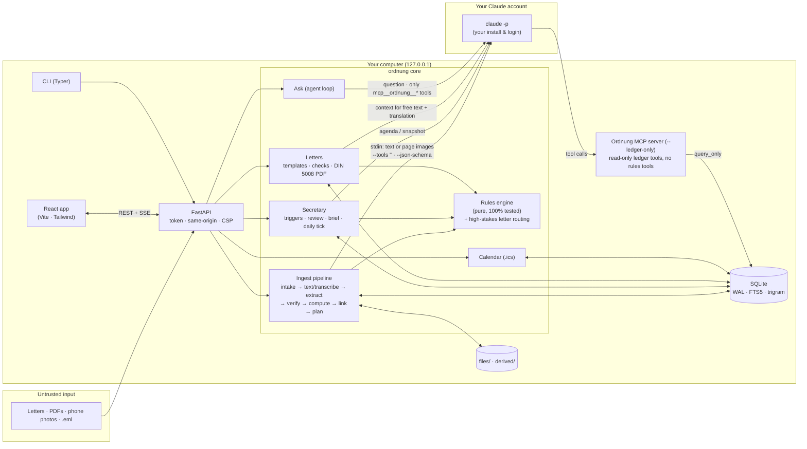
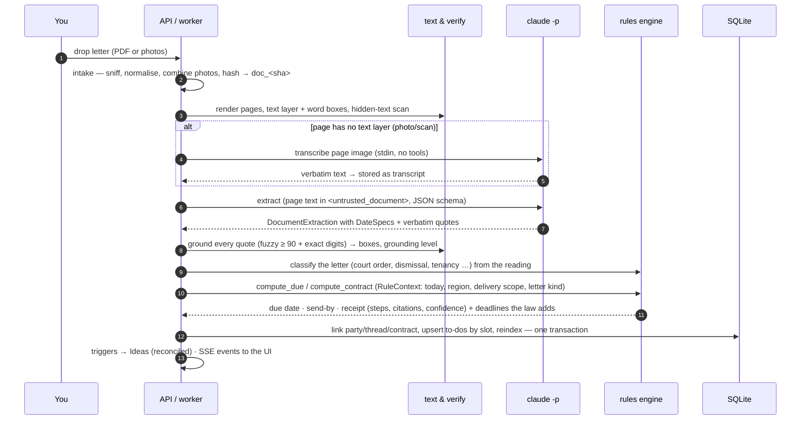
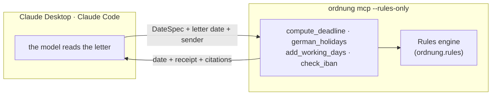
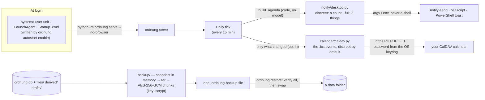
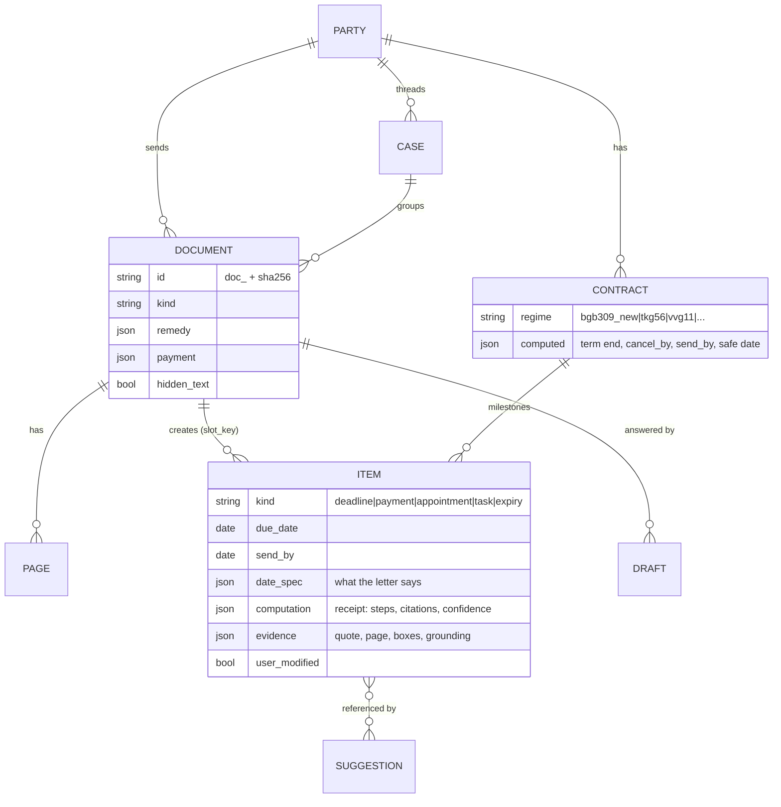

# Architecture

Ordnung is a single Python package (`ordnung`) that serves a React single-page app on
`127.0.0.1`, keeps everything in one SQLite file, and talks to Claude only through the user's own
`claude` CLI. This page explains how the pieces fit together and why.

## Components and trust boundaries



**Trust boundaries**

| Boundary | Defence |
|---|---|
| Document → model | Documents are untrusted: hidden text removed, content wrapped in `<untrusted_document>`, **no tools** during reading, output forced through a JSON schema |
| Model → ledger | Schema validation, quote grounding with exact digits, `spec_consistency`, deterministic date computation, confidence rubric → "Please check"; high-stakes letter kinds (court orders, a dismissal …) are assigned by a written code policy from the reading, never by the model (ADR 0010), and court deadlines — every date on a court's letter, whatever kind it is filed as — are never `high` and never use a delivery fiction |
| Model → user | Ideas and letters are suggestions; nothing is sent, paid, closed or deleted without a click; letters use fixed legal templates |
| Agent → data | Ask only has read-only MCP tools on a `query_only` connection. Every tool result has two channels: Ordnung's record (`<ordnung_record>`: ids, statuses, due and send-by dates, rules-engine dates, verified amounts, totals, code-written receipts) and the letters' text by record id (`<untrusted_document>`: titles, summaries, names, quotes, page text, unverified amounts); `<` and `>` are escaped in both. A tool keeps each result within a size budget by leaving out rows, so the model and the check read the same whole result — the CLI backend never shortens the check's copy ([ADR 0008](decisions/0008-two-channels-and-claim-level-citations.md)). Ask's server is `--ledger-only`: the ledger-free rules tools are not among its tools, and a result of any tool that is not one of Ordnung's ledger tools is never evidence for the check ([ADR 0011](decisions/0011-ask-keeps-to-the-ledger.md)) |
| Agent → user | Citations must name records from a record part of the same turn. The answer's words are never streamed: the person sees the tool trace (which tools ran, the words searched for with every word of a value the check reads — any word with a digit, a part of a month — shown as "…", the date range looked at) and a "writing" line until the check is done, and nothing of an answer that stops or fails before it. The answer is read as it will be shown (its bidirectional formatting characters removed first); each date, time or amount must be in the record part of a record its sentence cites; a sentence without a citation of its own may state a value of a record the answer cites, and the check then adds that record's citation — when the values belong to one record, never a record with scam signs; overview totals only in a sentence without a citation of its own; a cited record's unverified amount or the person's own words are shown quoted as unconfirmed; every other value is left out — one the cited letter's text holds as "[date only in the letter]", whatever the sentence's wording — and never shown within its sentence (the edit keeps the sentence's full stop and citation), and a § nobody vouches for removes its sentence, with a note in the answer's language that only the check writes, that says only what is true of every case it covers, and that travels in its own field with its label. The prompt (`ask_system` v5) says the same, so the model does not state a letter's value in the first place. Every date form the web formats inside an answer is read by the check (one shared list, tested on both sides), the placeholders the check writes are one list the web marks, the month words that keep a day line from being a list item are one list, the web shows a line starting with a day as written (never renumbered), and a run of digit groups shaped like a date that is none is never supported, nor is a day, a word and a year in a language whose month names the check does not know (Ask answers in the question's language), a clock time moved by words or a day in words; a law cited in words is checked like a §, and the model can never write the note's label (look-alike letters and soft line breaks included). The check fails closed: an answer it cannot read ends in an error and is not shown; a number no amount can be is unreadable, never an exception. Measured by `python -m evals.ask` ([evals-ask](evals-ask.md)), whose replay — like `ordnung demo --check` — answers every recorded tool call again and fails when the tools' output changed |
| Other clients → Ordnung | `ordnung mcp --rules-only` serves only the rules tools: no data folder is opened, results are computed from the arguments alone. The full server gives a client the same read-only ledger Ask has; `ordnung mcp install` prints before it writes and never clobbers a client's config |
| Upload → machine | Checked before anything decodes it: PDF stream expansion, image pixels and text pages are capped; the data folder is private to the account (`0700`, files `0600`) |
| Browser → server | Loopback by default (another `--host` warns and still needs the token), session token cookie (the browser is opened through a private local page, never with the token on a command line), `X-Ordnung-Client` header on writes, Fetch-Metadata/Origin checks, strict CSP, side-effect-free GETs |
| Process → OS | Documents and user prompts never on argv (stdin only; argv carries flags and the fixed system prompt), own process group killed on timeout, `--setting-sources ""`, `--strict-mcp-config`, `--no-session-persistence`. The desktop notification's texts (letters' titles in *full* mode) reach `notify-send` / `osascript` / PowerShell as separate arguments of a fixed script or in environment variables — never a shell line; markup is escaped, control and bidi characters removed. The start-at-login entry is a file Ordnung writes (quoted per format, a line break refused) and discards the server's standard output, so the session token never reaches a journal |
| Ordnung → your calendar provider (opt-in) | Nothing is sent until a calendar is connected; `https://` (or `http://` to this computer's loopback address), TLS verified, no redirects followed to another host; discreet by default (dates, times and alarms — no titles, names or amounts); only resources Ordnung created are replaced or deleted; the app password lives in the OS keyring (a backend that doesn't keep passwords safely — `null`, `keyrings.alt`, priority below 1 — is refused), never in `ordnung.db`, a log or an answer, and the keyring is read only to connect, send a change, check once a day that Ordnung's events are still there, or disconnect (never to show Settings); the keyring account is bound to the data folder's connection, so a restored copy of the data never reads or deletes the original's password and starts with syncing paused; "Delete everything" removes Ordnung's events and the password first; a server's XML is size-capped and read without a DTD |
| Backup file → data folder | Authenticated encryption end to end (header MAC, AES-256-GCM chunks bound to the header, their order and the last one), a newer format refused before any key is derived, scrypt costs capped when read (at most 256 MiB of memory, p ≤ 2); the archive extracted under a name policy (regular files in three folders only) into a staging folder, read to its authenticated end and checked against its manifest before it replaces anything; a folder with data is moved aside, never deleted ([ADR 0013](decisions/0013-backups-and-reminders-outside-the-browser.md)) |

## Reading a letter



Every stage updates the durable `jobs` queue and publishes `job.progress` events, which drive the
live stepper in the UI. Rate limits pause the whole worker until the reset time instead of failing
documents; a restart resumes queued work.

## Asking a question

```mermaid
sequenceDiagram
  participant U as You
  participant S as Ask service
  participant C as claude -p
  participant M as MCP (read-only)
  U->>S: "When can I cancel my phone contract?"
  S->>C: question + system prompt (tools: the ledger tools only, --ledger-only; budget cap, timeout)
  loop agent loop
    C->>M: search / get_document / list_contracts / explain_date
    M-->>C: <ordnung_record> ids, dates, verified amounts + <untrusted_document> letter text by id
  end
  S-->>U: tool trace, then "writing…" (no words of the answer yet)
  C-->>S: answer with [contract:…] [doc:…] citations
  S->>S: citations: exist + in a record part of this turn, else stripped
  S->>S: each date, time or amount: in a cited record's record part? (no citation of its own: a cited record's, whose citation is added) else unverified amount / person's words (quoted)? else left out
  S-->>U: checked answer + note + citation chips (SSE)
```

The check is a written policy (`assistant/support.py`): deterministic, linear in the answer and the
tool results (each value is looked up in hash maps of the cited records, and no pattern rescans a
run of brackets, digits or spaces; tests time one 88 KB sentence and 40,000-character bracket runs), run in
a worker thread so a long answer never blocks the server, and re-run by the Ask benchmark over
recorded answers.

## The rules engine for other Claude clients

The same engine that dates letters in the app is served as MCP tools that need no ledger
(`ordnung/assistant/rules_tools.py`): `compute_deadline` takes what a letter says — the extractor's
`DateSpec`, validated strictly — plus the letter's date, sender and region, and returns the date
with its receipt (steps, rule ids, citations, warnings, confidence, and hints that name a missing
argument); `german_holidays`, `add_working_days` and `check_iban` expose the calendar and the IBAN
check. Every result says it is information, not legal advice.



- `ordnung mcp --rules-only` opens no data folder, so nothing personal is exposed (a `--data-dir`
  given with it is refused, not ignored); the full `ordnung mcp --data-dir D` serves the rules tools
  next to the ledger tools. Ask's own server leaves them out (`--ledger-only`, the server in the
  diagram above): Ask quotes stored receipts and never computes a date. A rules tool's date is
  computed by code, but from a `DateSpec` the model passed — possibly read from an injected letter —
  and it has no record to cite, so it can never be Ordnung's answer under Ask's claim-level check;
  the check reads only the ledger tools' results ([ADR 0011](decisions/0011-ask-keeps-to-the-ledger.md)).
- A model, not a person, passes the facts here, so the tools check them: an arrival day — or a
  delivery day the letter states — after today is refused, an implausible one lowers confidence, a
  letter dated after today is flagged, and a result is always for the server's today — a caller's
  `today` far from it only adds that day's view (the benchmark's server, started with
  `rules_server_config(today=…)`, ignores it). Whether a sender has deemed delivery at all is the
  engine's rule, so the tools and the app agree (a company's letter counts from its arrival; for a
  kind a public body may be filed as, or a period whose own words name an administrative act, a late
  arrival never makes the date later than counting from the day a letter usually counts as delivered),
  and so
  is the warning about a holiday of only part of a Land (15 August in Bavaria) that a date is counted
  back over. A stated posting or delivery day without the letter's date cannot be checked, so the
  result says so and asks for it. Warnings are in the tools' voice (no "tell us"); what to pass is a
  hint. Next to the ledger, a letter in the ledger keeps its stored date: the full server's
  instructions say so.
- `ordnung mcp install --client claude-desktop|claude-code` adds the rules tools unless the ledger
  is asked for (`--with-ledger`, with the privacy warning first); it prints the entry and the file
  it belongs in, and `--write` merges only Ordnung's entry, backs the file up and refuses a file it
  cannot parse (`ordnung/assistant/mcp_install.py`, policy in its docstring). Installing the rules
  tools where the full server already is says so, and `--remove-ledger` takes that entry out.
- The benchmark's fourth condition runs exactly this server next to the *LLM only* prompt, to
  measure an agent with a calculator against the fixed pipeline ([evals](evals.md)).

## While the browser is closed: reminders and backups

A secretary that only speaks while its tab is open doesn't do the job, and for a local-first app
the backup is the person's only copy. Both work without the browser and without a model.



- **The notification** is the agenda's words, not a model's: `notify/desktop.py` counts what ends
  today, what is overdue and what is due within 7 days and, in *full* mode, lists the first three —
  today's first. The tick wakes up for it at the chosen time (or a minute after start-up, when the
  desktop may still be starting), retries one the system couldn't show at its next checks (three a
  day at most) and keeps the last failure for Settings; a missing tool shows nothing. The web app's
  preview and test use the same functions (`GET /api/reminders/desktop`, `POST …/test`).
- **Start at login** (`autostart.py`) writes one entry and runs nothing; `status` reads it back
  (which folder it starts, whether it is current) for the CLI and for Settings.
- **Calendar sync** (`calendar/caldav.py`, opt-in) puts the calendar file's events into the
  person's own CalDAV calendar — discreet by default — and keeps them current from the same tick:
  it remembers a digest per event it sent, so an unchanged ledger sends nothing (and reads no
  password) and a finished to-do's event is removed; once a day it asks which of its own events
  are still there and puts back missing ones. The password is in the OS keyring
  (`calendar/secrets.py`), under an account bound to this data folder's connection: a restored
  backup starts detached (`backup/restore.py` → `caldav.detached`). While a calendar is connected the "import the calendar file" Idea stays
  quiet, and "Delete everything" (`api/routes/data.py`) clears the calendar and the keyring first,
  holding calendar sync's lock so no running sync writes its record back.
- **The backup** (`backup/`) is a pull-based stream (`BackupStream`, one step per file): the CLI
  writes it to a file atomically, the API sends it as the HTTP response while it is made. Restore is
  all or nothing (`backup/restore.py`). The format and its policies are in
  [ADR 0013](decisions/0013-backups-and-reminders-outside-the-browser.md).

## Data model (simplified)



IDs are content-derived (`doc_` from the file hash, `itm_` from document + slot, `pty_` from the
normalised name), so re-processing is idempotent and recorded demo outputs stay valid.

## Concurrency model

- **One process.** FastAPI (uvicorn) runs the API, the ingest worker and the daily tick on one
  asyncio loop; CPU-heavy work (PDF text, rendering) runs in threads (`asyncio.to_thread`).
- **SQLite:** one connection per thread, WAL, `BEGIN IMMEDIATE` write transactions (re-entrant via
  savepoints). Linking + planning for a document happen in one transaction under a ledger lock, so
  two letters from the same new sender can't create duplicate parties.
- **Model calls:** two lanes — *interactive* (Ask, letters, brief) never waits behind *background*
  (transcribe, extract, review) — each bounded by a semaphore.
- **CLI + server:** if a server is running for the data directory, the CLI talks to its API;
  otherwise it takes an exclusive data-dir lock and runs in-process.

## Testing strategy

| Layer | How it is tested |
|---|---|
| Rules engine | Worked examples from verified legal research (with sources), external golden cases, Hypothesis property tests, branch coverage |
| Text & verification | Generated PDFs (rotated pages, CropBox offsets, hidden text, scans), exact-digit and consistency rules |
| Store | CRUD round-trips, search escaping, idempotent upserts, purge-on-delete, concurrency, migrations |
| Pipeline & services | `FakeBackend` scripted model outputs end-to-end through the real pipeline |
| CLI subprocess layer | A fake `claude` executable replaying captured CLI outputs (errors, timeouts, huge lines) |
| Demo | `ordnung demo --check`: rebuild twice with strict replay → zero misses, identical dumps, all references resolve |
| Web app | Vitest units + Playwright tour over demo mode with axe accessibility checks |
| Model quality | The benchmark in [evals](evals.md), recomputed deterministically in CI from recorded outputs |
| MCP tools and install | In-memory MCP client and a real stdio handshake (`python -m ordnung mcp --rules-only`); config merge, backup and refusal in temporary home folders |
| Ask | Unit tests of the two channels and the claim policy (incl. injected dates and ids), and the Ask benchmark in [evals-ask](evals-ask.md), replayed in CI with gates |
| Backup and restore | Byte-for-byte round trips with equal row counts (a seeded ledger and the whole demo life), every byte flipped, chunks cut, swapped, appended or taken from another backup, hostile header parameters, a Hypothesis round-trip-and-flip property, hostile archives inside validly encrypted files (`..`, absolute names, links, duplicates, extras, a damaged or newer database), and the restore policy (free folder, `--force` moves aside, a held lock, a failed swap); a write only in the WAL; every file written through a binary descriptor, and a restored file whose size on disk differs refused; links named, not silently skipped |
| Reminders outside the browser | Notification text in both modes from seeded agendas (discreet never names a title, party or amount), argv/env per system with hostile titles, the once-a-day policy and the tick; autostart entries per system written into temporary home folders, quoting of awkward paths, status and removal |
| Calendar sync | A small fake CalDAV server (in-process and on a loopback socket) that checks the password, one event per resource and UID conflicts: discreet events never carry a title, name or amount; only changed events are sent, only Ordnung's own removed; discovery (well-known, principal, calendar home, another https host); every refusal (password, not a calendar, tasks only, redirects, DTDs, oversized answers, TLS, the network); the pause after a refused password; the password never in the data folder; the keyring adapter with an in-memory backend; events deleted from the calendar put back by the daily check; a backup restored next to the original, or on a new computer after the old one was wiped; addresses in a server's answer that can't be read |
