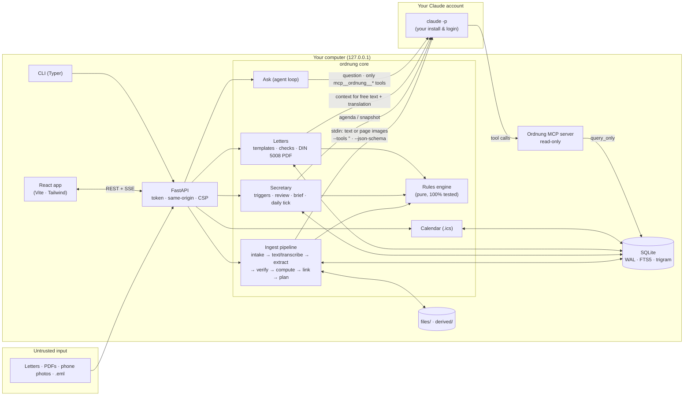
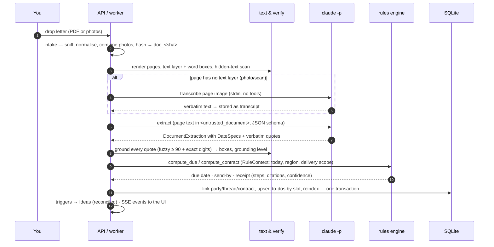
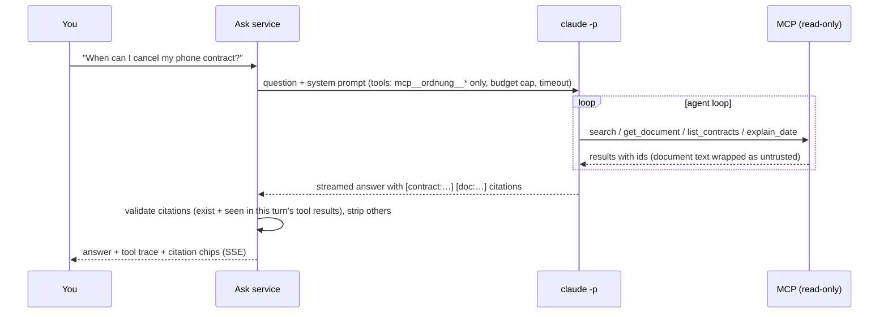
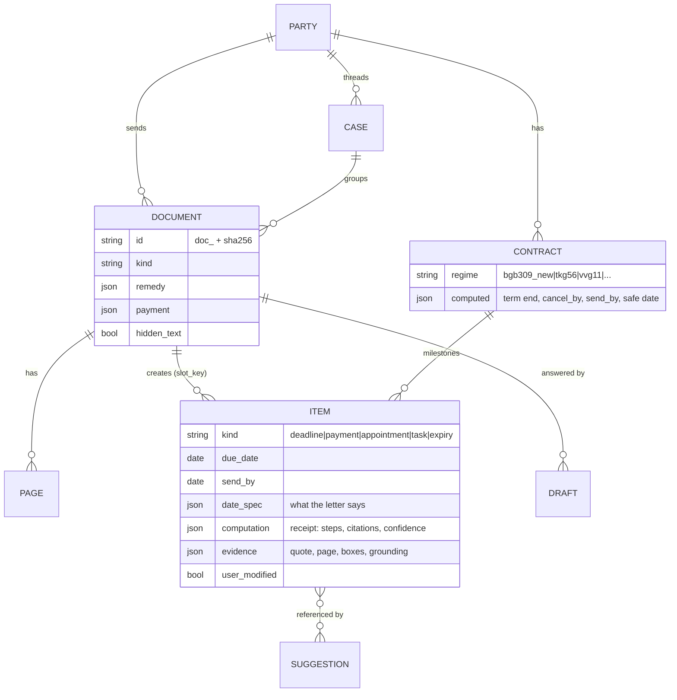

# Architecture

Ordnung is a single Python package (`ordnung`) that serves a React single-page app on
`127.0.0.1`, keeps everything in one SQLite file, and talks to Claude only through the user's own
`claude` CLI. This page explains how the pieces fit together and why.

## Components and trust boundaries

**Trust boundaries**

| Boundary | Defence |
|---|---|
| Document → model | Documents are untrusted: hidden text removed, content wrapped in `<untrusted_document>`, **no tools** during reading, output forced through a JSON schema |
| Model → ledger | Schema validation, quote grounding with exact digits, `spec_consistency`, deterministic date computation, confidence rubric → "Please check" |
| Model → user | Ideas and letters are suggestions; nothing is sent, paid, closed or deleted without a click; letters use fixed legal templates |
| Agent → data | Ask only has read-only MCP tools on a `query_only` connection; every tool result is wrapped as untrusted; citations must appear in the same turn's tool results |
| Upload → machine | Checked before anything decodes it: PDF stream expansion, image pixels and text pages are capped; the data folder is private to the account (`0700`, files `0600`) |
| Browser → server | Loopback by default (another `--host` warns and still needs the token), session token cookie (the browser is opened through a private local page, never with the token on a command line), `X-Ordnung-Client` header on writes, Fetch-Metadata/Origin checks, strict CSP, side-effect-free GETs |
| Process → OS | Documents and user prompts never on argv (stdin only; argv carries flags and the fixed system prompt), own process group killed on timeout, `--setting-sources ""`, `--strict-mcp-config`, `--no-session-persistence` |

## Reading a letter

Every stage updates the durable `jobs` queue and publishes `job.progress` events, which drive the
live stepper in the UI. Rate limits pause the whole worker until the reset time instead of failing
documents; a restart resumes queued work.

## Asking a question

## Data model (simplified)

IDs are content-derived (`doc_` from the file hash, `itm_` from document + slot, `pty_` from the
normalised name), so re-processing is idempotent and recorded demo outputs stay valid.

## Concurrency model

- **One process.** FastAPI (uvicorn) runs the API, the ingest worker and the daily tick on one
  asyncio loop; CPU-heavy work (PDF text, rendering) runs in threads (`asyncio.to_thread`).
- **SQLite:** one connection per thread, WAL, `BEGIN IMMEDIATE` write transactions (re-entrant via
  savepoints). Linking + planning for a document happen in one transaction under a ledger lock, so
  two letters from the same new sender can't create duplicate parties.
- **Model calls:** two lanes — *interactive* (Ask, letters, brief) never waits behind *background*
  (transcribe, extract, review) — each bounded by a semaphore.
- **CLI + server:** if a server is running for the data directory, the CLI talks to its API;
  otherwise it takes an exclusive data-dir lock and runs in-process.

## Testing strategy

| Layer | How it is tested |
|---|---|
| Rules engine | Worked examples from verified legal research (with sources), external golden cases, Hypothesis property tests, branch coverage |
| Text & verification | Generated PDFs (rotated pages, CropBox offsets, hidden text, scans), exact-digit and consistency rules |
| Store | CRUD round-trips, search escaping, idempotent upserts, purge-on-delete, concurrency, migrations |
| Pipeline & services | `FakeBackend` scripted model outputs end-to-end through the real pipeline |
| CLI subprocess layer | A fake `claude` executable replaying captured CLI outputs (errors, timeouts, huge lines) |
| Demo | `ordnung demo --check`: rebuild twice with strict replay → zero misses, identical dumps, all references resolve |
| Web app | Vitest units + Playwright tour over demo mode with axe accessibility checks |
| Model quality | The benchmark in [evals](evals.md), recomputed deterministically in CI from recorded outputs |
