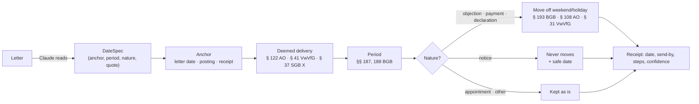

# How Ordnung computes dates

> **Not legal advice.** This page describes the law as of **25 September 2026** (`LAST_CHECKED` in
> `src/ordnung/rules/catalog.py`). It was researched and cross-checked against the statutes and court
> decisions linked below, but it has **not been reviewed by a lawyer**. When a date really matters —
> a court case, a fine, your residence permit — get advice (Verbraucherzentrale, Studierendenwerk,
> Mieterverein, a lawyer).

Ordnung's promise is simple: **the language model reads, deterministic code computes.** When Claude
reads a letter it does not produce a deadline. It produces a `DateSpec` — *what the letter says*
("one month after delivery", "by 10.10.2026", "two weeks after the letter's date") together with the
sentence it came from. The rules engine in `src/ordnung/rules/` turns that into a date, and every
result comes with a receipt that answers **"Why this date?"**:

- `due_date` — the date, `send_by` — when to send it, `safe_date` — the working day to aim for when a
  notice deadline falls on a weekend;
- `summary` — one plain-English sentence, e.g. *"Letter dated Tue 15 Sep 2026 counts as delivered on
  Sat 19 Sep, moved to Mon 21 Sep; one month later is Wed 21 Oct 2026."*;
- `steps` — each step with its rule id and citation; `holiday_calendar` — which holidays were used;
- `confidence` and `warnings` — how sure the engine is, and why not more.

Every worked example on this page is an executable test (`tests/test_rules_*.py`), and the engine is
covered 100 % by line and branch, plus Hypothesis property tests (month-end invariants, business
days never land on a holiday, deemed delivery ≥ posting + 4 days, send-by ≤ cancel-by …).

---

## 1. Safety policy and confidence

**Missing a deadline is far worse than acting early.** Whenever something is uncertain, the engine
computes the **earliest plausible date**, lowers the confidence and says why. Concretely:

| Uncertainty | What Ordnung does |
|---|---|
| Holiday region of the sender unknown | Uses only nationwide holidays: counted forward, a regional holiday could only make the deadline *later*. Counted back — a period before an event, the safe date of a deadline that never moves — one could make it *earlier* there: flagged (`medium`), "act a working day before it". |
| Payment to a company or person, payer's Land unknown | Uses only nationwide holidays (money is owed at the payer's home, §§ 269, 270 Abs. 4 BGB). |
| Posting day unknown | Uses the date printed on the letter (the real posting day can only be the same or later). |
| Letter arrived later than the deemed delivery day | Keeps the earlier deadline; shows the later one as "only if you can show it" (keep the envelope). |
| Letter says a later posting day than its date | Keeps the letter's date; mentions the later deadline. |
| Letter counts from "today" | Reads it as the letter's date, never the (later) day it is processed (`medium`). |
| Fine or penal order without the envelope date | Counts from the letter's date — no 4-day fiction, which could be later than a yellow-envelope delivery. |
| Period counted backwards ("one month before …") on a weekend/holiday | Never moves to a later day + a `safe_date` on the working day before. |
| Implausible period (over 100 years) or a date at the end of the calendar | No date, `low` confidence, "please check" — never an error that stops the document. |
| Arrival day of a letter needed but not confirmed | Uses the letter's date and asks when it really arrived (`low` confidence). |
| Kind of sender (procedural law) unknown | 3rd/4th-day rule **without** the weekend shift; 3 days unless the Land is known to use 4 (portal: the day after it was made available). |
| Letter from a company, landlord, bank, employer or other private sender | No deemed delivery — it is a rule for authorities' letters: a period from delivery runs from the day the letter arrived (§ 130 Abs. 1 BGB), the letter's date until the person says when (`low`); a period the letter counts from its own date or another date it names runs from that date, with no delivery days added and no question about the arrival day (`private_sender_no_delivery`). Whether the sender is an authority is read, not known (a municipal utility's Gebührenbescheid, a statutory health insurer filed as a company), so for a kind a public body may be filed as (company, insurer, utility, employer), and for any sender whose period names an administrative act in its own words (a *Bescheid*, its *Bekanntgabe* — in the spec's text or legal basis, or the item's quote), an arrival day after the day a letter usually counts as delivered never moves the date later: it runs from that earlier day (`medium`; from the arrival when both days give the same date), and a note says the date from arrival holds once the arrival is shown — for an authority's letter too (§ 41 Abs. 2 S. 3 VwVfG) — and that the deadline may still be open when only the earlier date has passed (`private_sender_late_arrival`). A gym's, landlord's or bank's letter whose words name no administrative act counts from the day it arrived. Words alone never bring deemed delivery back (a gym, too, writes "nach Bekanntgabe der Preiserhöhung"). A sender filed as private keeps the deemed delivery only when its letter names a remedy statute, or its *Einspruch*, *Widerspruch* or *Klage* notice names an administrative route (a *Bescheid* as the decision — "diesen Bescheid", a *Gebührenbescheid*, "Bescheid vom …", not "Bescheid geben" (let us know) —, its *Bekanntgabe*, an administrative, social or finance court); a Kündigungsschutzklage (§ 4 KSchG), a Widerspruch under the BGB or VVG, or a firm's own "Einspruch" window (a private parking operator's, say) does not. An unknown sender (kind `other`) keeps the deemed delivery. |
| A date counted back over a holiday of only part of a Land (15 August in Bavaria, Augsburg's 8 August, Fronleichnam in parts of Saxony and Thuringia) | The calendar never counts it (the community is unknown), so where it holds a send-by or safe date is a working day late: the warning names the holiday and where it holds (confidence unchanged). |
| Letter's period differs from the statute (e.g. "6 weeks" for a tax objection) | Computes both and uses the earlier date. |
| Notice period missing from a contract | Assumes the longest notice the law allows (earliest deadline). |
| Notice deadline on a weekend/holiday | No shift (BGH III ZR 172/04) + a `safe_date` on the working day before. |
| 3rd *Werktag* for a tenancy notice is a Saturday | Keeps the Saturday (see section 7). |

**Confidence rubric** (SPEC § 21). The engine judges the rule-related criteria; the ingest pipeline
further lowers confidence for quote problems (quote not found, digits not matching):

| Criterion | Fails when… | Weight |
|---|---|---|
| Anchor date stated in the document or confirmed by the user | anchor missing; arrival date assumed | hard → `low` |
| Anchor date stated in the document | "today" read as the letter's date | soft |
| Rule known and its scope verified | unknown sender type; channel assumed; letter's period ≠ statute; Land not confirmed for the 4-day rule; *Anhörungsbogen*; fine counted from the letter date; court action (*Klage*: "get advice") | soft |
| Holiday region known | region unknown **and** a regional holiday could change this result (counted forward: the days counted or the end; counted back: the days counted back or the safe date) | soft |

`high` only if every criterion holds; one soft failure → `medium`; two soft failures or any hard
failure → `low`. The reasons are listed in `warnings` in plain English.

---

## 2. Calendar: holidays, business days and *Werktage*

- **Business day** — Monday to Friday, not a public holiday. This is the "next working day" of every
  end-of-period shift rule, which all treat Saturday like Sunday.
- **Werktag** — Monday to Saturday, not a public holiday. Used where the law counts *Werktage*, such
  as the three-day grace period for a tenancy notice. In legal language Saturday **is** a Werktag
  (BGH VIII ZR 206/04).
- **Holidays** come from the [`holidays`](https://pypi.org/project/holidays/) package
  (`holidays.Germany(subdiv=…)`). The nine nationwide holidays always count. Regional ones (e.g.
  Fronleichnam, Allerheiligen, Reformationstag, Buß- und Bettag, Frauentag in Berlin) count **only
  when the region is known**. 24 and 31 December are **not** public holidays (BFH III B 135/17), nor
  is Rosenmontag. Municipal holidays (Augsburg, Mariä Himmelfahrt in parts of Bavaria, Fronleichnam
  in parts of Saxony and Thuringia) are not used, which can only make a date counted forward earlier;
  a date counted back over one can come out a day late, so the engine names such a holiday where a
  send-by, safe or backward date passes it (`check_partial_holidays`; the app and the rules tools
  alike).
- **Whose holidays?** Those at the place where the declaration must be received — the seat of the
  authority, court or company (BAG 8 AZN 808/11, BGH VI ZA 27/11), i.e. `Party.region`. A **payment**
  to a company or person is owed at the payer's home (§§ 269, 270 Abs. 4 BGB), so § 193 BGB uses the
  holidays where you live (`RuleContext.recipient_region`; research *zahlungsziel*); payments to an
  authority use the authority's seat. For a tax letter's deemed delivery day, a regional holiday
  counts only if it applies both where you live and where the tax office is (OFD Cottbus 2004); a
  holiday only where you live is flagged, one only at the tax office is not. `recipient_region` is
  the Land chosen during onboarding — before that it is unknown.
- Every receipt names the calendar it used: `Nordrhein-Westfalen` or
  `Germany (nationwide holidays only)`.

| Example (research rule *feiertage_massgeblicher_ort*) | Result |
|---|---|
| Period ends Thu 4 Jun 2026 (Fronleichnam), authority in Cologne (NW) | Fri 5 Jun 2026 |
| Same day, tax office in Hamburg | Thu 4 Jun 2026 (no holiday there) |
| Ends Mon 8 Mar 2027 (Frauentag), Jobcenter Berlin / Potsdam | Tue 9 Mar 2027 / Mon 8 Mar 2027 |
| Ends Wed 18 Nov 2026 (Buß- und Bettag), court in Leipzig / Munich | Thu 19 Nov 2026 / Wed 18 Nov 2026 |
| Invoice payable within 7 days of Thu 28 May 2026, payer in Stuttgart (BW) | Thu 4 Jun (Fronleichnam) → Fri 5 Jun 2026 |
| Invoice payable within 14 days of Mon 22 Feb 2027, company in Berlin, payer in NRW | Mon 8 Mar 2027 (Frauentag only in Berlin) |

---

## 3. Periods — §§ 187, 188 BGB

The same arithmetic applies to civil, tax (§ 108 Abs. 1 AO), administrative (§ 31 Abs. 1 VwVfG),
social (§ 26 Abs. 1 SGB X, § 64 SGG) and fine/criminal (§ 43 StPO) periods.
`add_period(start, amount, unit, mode=…)` supports two start modes:

- **`event`** (§ 187 Abs. 1 BGB) — the period starts with an event during a day (delivery, receipt,
  the letter's date). That day is **not** counted. Weeks, months and years end on the day with the
  same weekday name or day number as the event day (§ 188 Abs. 2 Alt. 1); if the last month has no
  such day, on its last day (§ 188 Abs. 3). There is **no end-of-month rule**.
- **`day_start`** (§ 187 Abs. 2 BGB) — the period starts at the beginning of a day, like a contract
  term "from 1 March". That day counts, and the period ends on the day **before** the matching day
  (§ 188 Abs. 2 Alt. 2).

Units: `days`, `weeks`, `months`, `years`, `business_days` (Mon–Fri), `werktage` (Mon–Sat).

| Start | Period | Mode | Last day | Source |
|---|---|---|---|---|
| Mon 21 Sep 2026 | 10 days | event | Thu 1 Oct 2026 | *fristende* |
| Tue 31 Mar 2026 | 1 month | event | Thu 30 Apr 2026 (§ 188 Abs. 3) | *fristende* |
| Thu 30 Apr 2026 | 1 month | event | Sat 30 May 2026 — not 31 May | SPEC § 21 |
| Sat 31 Jan 2026 | 1 month | event | Sat 28 Feb 2026 | *arithmetic* |
| Thu 29 Feb 2024 | 1 year | event | Fri 28 Feb 2025 | *rbb one year* |
| Thu 17 Sep 2026 | 2 weeks | event | Thu 1 Oct 2026 (same weekday, § 43 StPO) | *owig 67* |
| Fri 1 Mar 2024 | 24 months | day_start | Sat 28 Feb 2026 | SPEC § 21 |
| Fri 15 Nov 2024 | 24 months | day_start | Sat 14 Nov 2026 | *arithmetic* |
| Thu 1 Oct 2026 | 1 year | day_start | Thu 30 Sep 2027 | *fristbeginn* |
| Wed 1 Mar 2023 | 12 months | day_start | Thu 29 Feb 2024 | leap year |

**Backwards** ("notice of three months to 31 January"): the latest day a notice can arrive is the
latest day from which the forward period still fits (`latest_receipt_for`). A month-end needs the
previous month-end, which a naive "minus n months" gets wrong:

| Contract ends | Notice | Must arrive by |
|---|---|---|
| Thu 31 Dec 2026 | 3 months | Wed 30 Sep 2026 |
| Sun 31 Jan 2027 | 3 months | Sat 31 Oct 2026 — no shift to Monday |
| Wed 30 Jun 2027 | 3 months | Wed 31 Mar 2027 (not 30 Mar) |
| Sun 28 Feb 2027 | 3 months | Mon 30 Nov 2026 (not 28 Nov) |
| Sun 28 Feb 2027 | 1 month | Sun 31 Jan 2027 |

The same backward count is used for any deadline a letter states backwards ("pay one month before
the course starts on Tue 6 Oct 2026" → Sat 5 Sep 2026). § 193 BGB only extends periods that run
forward, so a backward deadline **never moves to a later day** (`backward_no_shift`): it stays on
Sat 5 Sep and gets a `safe_date` of Fri 4 Sep.

---

## 4. When the last day is a weekend or holiday

If the **end** of a period (never its start) is a Saturday, Sunday or public holiday, it moves to the
next working day — repeatedly, so shifts chain:

| Rule id | Citation | Used for |
|---|---|---|
| `bgb_193` | § 193 BGB | private declarations and payments (e.g. a 14-day withdrawal period) |
| `ao_108_3` | § 108 Abs. 3 AO | tax deadlines |
| `vwvfg_31_3` | § 31 Abs. 3 VwVfG; § 57 Abs. 2 VwGO with § 222 Abs. 2 ZPO | authorities, VwGO objections |
| `sgbx_26_3` | § 26 Abs. 3 SGB X; § 64 Abs. 3 SGG | social law |
| `stpo_43` | § 43 StPO with § 46 OWiG | fines and penal orders |

| Raw last day | Moves to | Why |
|---|---|---|
| Sat 28 Mar 2026 | Mon 30 Mar 2026 | Saturday |
| Fri 25 Dec 2026 | Mon 28 Dec 2026 | Christmas, Saturday, Sunday |
| Fri 3 Apr 2026 | Tue 7 Apr 2026 | Good Friday … Easter Monday |
| Fri 1 Jan 2027 | Mon 4 Jan 2027 | New Year |
| Thu 31 Dec 2026 | Thu 31 Dec 2026 | Silvester is not a holiday |

Which DateSpecs shift (`DateSpec.nature` and `shift_rule`):

| nature | Shift? |
|---|---|
| `objection`, `payment`, `declaration` | yes, unless `shift_rule == "none"` (an authority may expressly exclude it, § 31 Abs. 3 S. 2 VwVfG) — and never for a period counted backwards (safe date instead) |
| `notice` | **never** — BGH III ZR 172/04: § 193 BGB does not apply to notice periods. A notice due on a Saturday must arrive by that Saturday; Ordnung adds `safe_date` = the working day before. |
| `appointment` | never — appointments keep their day (§ 108 Abs. 5 AO, § 31 Abs. 5 VwVfG) |
| `other` | only if `shift_rule == "next_business_day"` |

**Fixed dates** ("bis zum 10.10.2026") are used **as written**, and moved only when the DateSpec says
`shift_rule == "next_business_day"`. Deadlines *set by an authority* do move by law (§ 108 Abs. 3
AO; example: "Belege bis zum 10.10.2026" → Mon 12 Oct 2026); when the DateSpec doesn't say so, the
receipt keeps the written (earlier) date and warns that it may legally be later.

---

## 5. Deemed delivery (*Bekanntgabefiktion*)

A letter from an authority legally "arrives" on a fixed day after it was posted, whatever day it
really landed in your letterbox. Since the Postrechtsmodernisierungsgesetz (PostModG) this is the
**4th day** after posting for items posted from **1 January 2025** (3rd day before). Which rule
applies depends on the sender (`RuleContext.delivery_scope`, derived by `scope_for_party_kind`
from the sender's kind and, for a sender filed as a plain *authority*, its name and the letter's
remedy notice: a job centre, the employment agency, pension, care or accident insurance, a statutory
health insurer (a *Krankenkasse*, or by the brand of one of the largest: AOK, Die Techniker/TK,
BARMER, DAK, IKK, BKK, KKH, hkk, HEK, SBK, VIACTIV, BIG direkt gesund, mhplus, Knappschaft — not a
complete list; an unlisted one filed as an insurer counts from its arrival, never later than deemed
delivery), social welfare, a BAföG, Wohngeld or Elterngeld office, or a notice naming the Sozialgericht
or the SGB means social law; the Familienkasse is tax law when the remedy is an *Einspruch*, social law
otherwise):

| Scope | Senders | Rule | Weekend/holiday? |
|---|---|---|---|
| `ao` | tax office (`tax_office`), Familienkasse for Kindergeld (EStG), municipal Grundsteuer bills (delivery under the AO, but the remedy is *Widerspruch* or *Klage*) | § 122 Abs. 2 Nr. 1 AO; electronic § 122 Abs. 2a; ELSTER § 122a Abs. 4; abroad: one month (§ 122 Abs. 2 Nr. 2) | **moves** to the next working day (BFH IX R 68/98; AEAO zu § 108 Nr. 2) |
| `vwvfg` | general authorities: immigration office, city, university, broadcasting fee | § 41 Abs. 2 VwVfG and the Länder VwVfGs; portal: day after download (§ 41 Abs. 2a) | **does not move** (OVG NRW 19 A 4216/99, Nds. OVG 4 LA 44/10) |
| `sgbx` | health insurer (`health_insurer`), job centre, pension fund | § 37 Abs. 2 SGB X; portal: 4th day after the notification (§ 37 Abs. 2a) | **does not move** (BSG B 14 AS 12/09 R) |
| unknown | — | 3rd/4th day as below | does not move (earliest plausible) |

Only the *end* of the following objection period moves in every scope.

**Channel** (`DateSpec.delivery_rule`): `de_admin_post` (letter), `de_admin_electronic` (e-mail,
4th day after sending) and `de_admin_portal` (made available for download: ELSTER, BundID or another
portal). A portal decision of a general authority — or of a sender whose law is unknown — counts as
delivered the day after download (§ 41 Abs. 2a VwVfG); unless the download day is known, Ordnung
takes the day it was made available as the earliest download. Tax portals use the 4th day after
provision (§ 122a Abs. 4 AO), social-law portals the 4th day after the notification (§ 37 Abs. 2a SGB X).

**The Länder.** Authorities of a Land apply their own VwVfG. Confirmed 4-day rule: BY, NW, HH, MV
(from 1 Jan 2025), BW (from 7 Feb 2025, GBl. 2025 Nr. 8) and SH (§ 110 LVwG; confirmed in the text as
of 10 Jun 2025, so earlier postings keep 3 days); BE, BB, NI, RP, SN and ST refer to the federal law.
For Hessen (still showing the 3rd day), Bremen, Saarland and Thüringen — and whenever the Land is
unknown — Ordnung uses the **3rd day** with `medium` confidence (SPEC § 21). Baden-Württemberg keeps 3 days for procedures begun before 7 Feb 2025
(§ 102b LVwVfG); Ordnung cannot see when a procedure began and notes this here.

**Posting day.** The day the letter was handed to the post counts, not the printed date — but the
printed date is the conservative stand-in, because posting can only be the same day or later. If a
letter names a later posting day, Ordnung keeps the letter's date and mentions the later deadline
(legal research verdict: never replace the anchor with a later date for the primary result).

**Early receipt changes nothing** (BFH X R 96/98; BSG B 14 AS 12/09 R). **Late receipt** only helps
if you can show it (BFH VI R 18/22, VI R 6/23, IX B 95/25): Ordnung keeps the earlier deadline and
adds the later one as a warning. A **pre-dated** letter (received before its printed date) is
counted from the day it arrived, with a hint that you may get more time (Wiedereinsetzung).

**Formal delivery.** With a yellow envelope (*Postzustellungsurkunde*) the date written on the
envelope is the delivery day — no 4-day rule; the pipeline passes it as `anchor="explicit_date"`.
With *Einschreiben mit Rückschein* the date on the return receipt counts; with
*Übergabe-Einschreiben* the 4th day after posting (§ 4 Abs. 2 VwZG). A DateSpec cannot say which of
these a fine or penal order came by, so for § 67 OWiG and § 410 StPO the 4th-day fiction is never
applied: without the envelope date (`anchor="explicit_date"`/`"receipt"`) the two weeks are counted
from the letter's date, the earliest plausible start, with a warning to enter the envelope date. An *Einwurf-Einschreiben* is no
formal delivery: it is treated as an ordinary letter — unless the letter says it is meant as a
formal delivery, in which case the day it was put in your letterbox is used (the earlier, safe date).

| Posted | Sender (Land) | Delivered | Deadline (one month) | Source |
|---|---|---|---|---|
| **Tue 15 Sep 2026** | **tax office (NW)** | **Sat 19 Sep → Mon 21 Sep** | **Wed 21 Oct 2026** | hero case |
| Tue 29 Sep 2026 | tax office (NW) | Sat 3 Oct (holiday) → Mon 5 Oct | Thu 5 Nov 2026 | *ao 122* |
| Thu 24 Sep 2026 | tax office | Mon 28 Sep | Wed 28 Oct 2026 | *ao 122* |
| Tue 22 Dec 2026 | tax office (BE) | Sat 26 Dec → Mon 28 Dec | Thu 28 Jan 2027 | *ao 122* |
| Mon 21 Sep 2026 | tax office (NW) | Fri 25 Sep | Sun 25 Oct → Mon 26 Oct 2026 | *ao 355* |
| Fri 27 Feb 2026 | tax office (HE) | Tue 3 Mar | Fri 3 Apr (Good Friday) → Tue 7 Apr 2026 | *ao 355* |
| Mon 30 Dec 2024 | tax office | Thu 2 Jan 2025 (old 3-day rule) | — | *ao 122 transition* |
| Thu 2 Jan 2025 | tax office (NW / BY) | Mon 6 Jan / Tue 7 Jan (Epiphany in BY) | — | *ao 122 transition* |
| Mon 27 Oct 2025 | tax office (NI / BY) | Mon 3 Nov (Reformation Day in NI) / Fri 31 Oct | Wed 3 Dec / Mon 1 Dec 2025 | *ao shift* |
| Wed 23 Dec 2026 | tax office, e-mail | Sun 27 Dec → Mon 28 Dec | Thu 28 Jan 2027 | *ao 122 Abs. 2a* |
| Thu 2 Apr 2026 | ELSTER download | Mon 6 Apr (Easter Monday) → Tue 7 Apr | Thu 7 May 2026 | *elster* |
| Mon 14 Sep 2026 | authority portal (Bavaria), made available | Tue 15 Sep (day after the earliest download) | Thu 15 Oct 2026 | *vwvfg portal* |
| Tue 15 Sep 2026 | tax office, sent abroad | Thu 15 Oct | Sun 15 Nov → Mon 16 Nov 2026 | *ao abroad* |
| Tue 29 Sep 2026 | Bauamt (NW) | Sat 3 Oct — **not moved** | Tue 3 Nov 2026 | *vwvfg* |
| Tue 27 Oct 2026 | City of Hannover (NI) | Sat 31 Oct — not moved | Mon 30 Nov 2026 | *vwvfg* |
| Wed 23 Dec 2026 | immigration office (NW) | Sun 27 Dec — not moved | Wed 27 Jan 2027 | *vwvfg* |
| Tue 29 Sep 2026 | authority in Hessen | Fri 2 Oct (3rd day) | Mon 2 Nov 2026 | *vwvfg Hessen* |
| Tue 29 Sep 2026 | job centre | Sat 3 Oct — not moved | Tue 3 Nov 2026 | *sgg 84* |
| Fri 27 Nov 2026 | health insurer (BE) | Tue 1 Dec | Fri 1 Jan → Mon 4 Jan 2027 | *sgg 84* |
| Wed 26 Sep 2007 | social court letter (3-day era) | Sat 29 Sep 2007 | Mon 29 Oct 2007 | BSG B 14 AS 12/09 R |
| Mon 14 Sep 2026, arrived Wed 16 Sep | tax office | Fri 18 Sep (early arrival ignored) | Mon 19 Oct 2026 | *early receipt* |
| Mon 14 Sep 2026, arrived Tue 22 Sep | tax office | Fri 18 Sep | Mon 19 Oct 2026 (Thu 22 Oct only if late arrival is shown) | *late receipt* |
| dated Fri 16 Oct 2026, arrived Thu 15 Oct | tax office | counted from Thu 15 Oct | Mon 16 Nov 2026 | *pre-dated letter* |

---

## 6. Objections and other statutory deadlines

| Remedy | Period | Runs from | Citation | Rule id |
|---|---|---|---|---|
| Tax objection (*Einspruch*) | 1 month | deemed delivery | § 355 Abs. 1 AO | `ao_355` |
| Objection to an authority (*Widerspruch*) | 1 month | delivery | § 70 VwGO | `vwgo_70` |
| Objection in social law (*Widerspruch*) | 1 month (3 abroad) | delivery | § 84 SGG | `sgg_84` |
| Objection to a fine (*Einspruch gegen Bußgeldbescheid*) | 2 weeks | formal delivery (yellow envelope) | § 67 OWiG, § 43 StPO | `owig_67` |
| Objection to a penal order (*Strafbefehl*) | 2 weeks | formal delivery | § 410 StPO | `stpo_410` |
| Court action (*Klage*) | 1 month (SGG: 3 abroad) | delivery of the decision | § 74 VwGO, § 47 FGO, § 87 SGG | `klage_1_month` — "get advice" warning, at most `medium` |
| Hearing form (*Anhörungsbogen*) | **none** — the reply date is a request | — | § 55 OWiG | `owig_55` |
| Missing/wrong instructions (*Rechtsbehelfsbelehrung*) | 1 year | delivery | § 356 Abs. 2 AO, § 58 Abs. 2 VwGO, § 66 Abs. 2 SGG | `rbb_one_year` |

When a DateSpec names one of these statutes (`legal_basis`, e.g. "§ 355 Abs. 1 AO"), the engine
checks the letter's period against the statute and uses the earlier date if they differ. Three months
are accepted only where the law allows them (SGG remedies after delivery abroad, §§ 84, 87 SGG).

| Delivered | Remedy (seat) | Deadline | Source |
|---|---|---|---|
| Thu 17 Sep 2026 | fine (Bavaria) | Thu 1 Oct 2026 | *owig 67* |
| Sat 19 Sep 2026 (put in letterbox) | fine (NW) | Sat 3 Oct → Mon 5 Oct 2026 | *owig 67* |
| Fri 11 Dec 2026 | fine (Berlin) | Fri 25 Dec → Mon 28 Dec 2026 | *owig 67* |
| Übergabe-Einschreiben posted Mon 21 Sep 2026 | fine | delivered Fri 25 Sep → Fri 9 Oct 2026 (with that day as anchor); from the letter's date alone Ordnung shows Mon 5 Oct 2026 | *owig 67* |
| Wed 4 Nov 2026 | penal order, AG Dresden / AG München | Thu 19 Nov / Wed 18 Nov 2026 | *stpo 410* |
| Fri 18 Dec 2026 | penal order, AG Hamburg | Fri 1 Jan → Mon 4 Jan 2027 | *stpo 410* |
| Thu 10 Sep 2026 | tax objection against a VAT return filed that day | Sat 10 Oct → Mon 12 Oct 2026 | *ao 355* |
| Thu 15 Oct 2026 (abroad) | social-law objection, 3 months | Fri 15 Jan 2027 | *sgg 84* |
| Fri 16 Oct 2026 (yellow envelope) | court action, VG Frankfurt | Mon 16 Nov 2026 | *klage* |
| Mon 21 Sep 2026 | hearing form "reply within a week" | Mon 28 Sep 2026 — shown as a request, `medium` | *owig 55* |

**One-year fallback** (`compute_one_year_fallback`): only if the instructions on how to object were
missing or wrong. Whether they were is a legal judgement, so the result is always `low` confidence
and the app shows it only as a warning ("get advice"), never as the deadline:

| Delivered | Outer limit |
|---|---|
| Tue 7 Oct 2025 | Wed 7 Oct 2026 |
| Fri 31 Oct 2025 (Leipzig) | Sat 31 Oct → Mon 2 Nov 2026 |
| Thu 29 Feb 2024 | Fri 28 Feb 2025 |
| Fri 3 Oct 2025 (authority, not moved) | Sat 3 Oct → Mon 5 Oct 2026 |

**Payments.** A payment deadline moves off weekends like any declaration (§ 193 BGB). `send_by` for a
payment is **one bank business day** before the due date: a transfer reaches the payee's bank by the
end of the next business day (§ 675s Abs. 1 BGB), and banks do not process transfers on 24 and 31
December, which are skipped too (a payment due Mon 4 Jan 2027 should be ordered by Wed 30 Dec 2026). Consumers normally pay on time by ordering the transfer
by the due date (BGH VIII ZR 222/15), but tax payments count on the day of credit (§ 224 Abs. 2 AO).
Example: tax back payment on the hero letter — due Wed 21 Oct 2026, order the transfer by Tue 20 Oct.

---

## 7. Contracts

`compute_contract(terms, ctx, channel=…)` first derives a **regime** from the contract's category,
the other party's kind and its dates (`regime_for`), then computes:

- `current_term_end` — end of the term running today;
- `cancel_by` — last day the cancellation must **arrive** to reach `earliest_exit` (never moved off
  weekends); `None` when the contract can be ended any day with a fixed notice period;
- `safe_date` — last business day on or before `cancel_by`;
- `send_by` — by channel: online cancellation button → `cancel_by` itself (it counts the moment you
  press it, § 312k BGB); e-mail, fax, portal, in person → `safe_date`; letter → 4 business days
  before `safe_date`. Never before today;
- `next_renewal` — the day it continues if nobody cancels in time (`None` = nothing locks you in);
- `earliest_exit` — when it ends if you act today;
- `summary`, `notes` (with citations), `steps`, `rule_ids`, `warnings`, `confidence`.

Contract terms run from the start of their first day (`day_start` mode). Written notice periods are
capped at the statutory maximum where one exists; if the contract asks for more, the receipt says
so and shows the contract's own (earlier) date as a way to avoid an argument.

`renewal_term_months = 0` means "continues indefinitely after the first term" (the extraction's
convention): such a contract never "ends by itself"; after its first term it can be ended any day
with its notice period (insurance: at the end of each insurance year, § 11 Abs. 2, § 12 VVG). Zero or
negative terms and notice periods are misreadings and treated as missing; values over 100 years are
ignored with `low` confidence. If the usual sending time has passed, `send_by` is today and the last
step says so.

| Regime | Applies to | Rule |
|---|---|---|
| `bgb309_new` | consumer contracts concluded from 1 Mar 2022 (streaming, gym, energy …) | first term ≤ 2 years, notice ≤ 1 month before its end; afterwards indefinite, cancellable any day with ≤ 1 month (§ 309 Nr. 9 BGB, Art. 229 § 60 EGBGB). Fixed renewals in such contracts are invalid. |
| `bgb309_old` | consumer contracts concluded before 1 Mar 2022 | first term ≤ 2 years (a longer one is capped, `medium`), renewals ≤ 1 year, notice ≤ 3 months before the end of each term |
| `tkg56` | phone and internet | first term ≤ 24 months; afterwards one month's notice any day, also for old contracts (§ 56 Abs. 1, 3 TKG) |
| `vvg11` | insurance (not statutory health) | renews for ≤ 1 year; notice 1–3 months before the end of the insurance year; contracts > 3 years (by term or end date) can be cancelled at the end of year 3 and every later year with **three** months' notice, whatever shorter notice the contract has (§ 11 Abs. 4 VVG) |
| `sgbv175` | statutory health insurance | 12-month lock-in, then to the end of the second month after the month of notice — always a month end, so a lock-in ending mid-month is left at the end of that month; switching = just join the new insurer (§ 175 SGB V) |
| `stromgvv20` | basic energy supply (*Grundversorgung*) | two weeks' notice any day, text form (§ 20 StromGVV/GasGVV) |
| `rent573c` | tenant of a flat | notice by the 3rd *Werktag* of a month → end of the month after next (§ 573c BGB); hand-signed letter (§ 568 BGB) |
| `employment622` | employee | four weeks to the 15th or the end of a month, or the longer written period (§ 622 BGB); hand-signed letter (§ 623 BGB); fixed-term contracts simply end |
| `as_written` | bank, business contracts, anything unknown | the contract's own terms, `low` confidence |

**Tenancy: which days are *Werktage*?** The BGH held that Saturday **counts** as a Werktag in the
three-day grace period of § 573c BGB (BGH, 27.4.2005, VIII ZR 206/04 — we read the decision). It
expressly left open whether the period extends to Monday when the 3rd Werktag itself is a Saturday
(some courts say yes). Ordnung keeps the Saturday as `cancel_by` (earliest plausible) and says so.
(For *paying* rent, § 556b BGB, Saturday does not count — BGH VIII ZR 129/09 — which is a different
rule and not computed here.)

Worked examples (demo persona Sam, today = Fri 25 Sep 2026, region NW, letter by post):

| Contract | Regime | Result |
|---|---|---|
| Phone: started 15 Nov 2024, 24 months, 1 month's notice | `tkg56` | term ends Sat 14 Nov 2026; **cancel by Wed 14 Oct 2026**; post by Thu 8 Oct |
| Same, cancellation arrives Tue 20 Oct 2026 | `tkg56` | too late for 14 Nov; ends Fri 20 Nov 2026 (month to month) |
| Gym: concluded 2 Jan 2025, from 15 Jan 2025, 12 months, 1 month any time | `bgb309_new` | indefinite since 15 Jan 2026; letter arriving Thu 1 Oct → ends Sun 1 Nov 2026 (button today → Sun 25 Oct) |
| Liability insurance from 1 Dec 2023, insurance year Dec–Nov, 3 months | `vvg11` | deadline was Mon 31 Aug 2026 → renews Tue 1 Dec 2026; next: **cancel by Tue 31 Aug 2027** to leave Tue 30 Nov 2027 |
| Insurance from 1 Jan 2024 for 5 years, 1 month's notice (today 1 Sep 2026) | `vvg11` | end of year 3: **cancel by Wed 30 Sep 2026** (three months) to leave Thu 31 Dec 2026 |
| Gym concluded 1 Oct 2021 for 30 months, then yearly, 3 months (today 1 May 2026) | `bgb309_old` | first term capped at 24 months (30 Sep 2023) → cancel by Tue 30 Jun 2026 to leave Wed 30 Sep 2026 |
| Statutory health insurance, member since 1 Oct 2024 | `sgbv175` | notice by Wed 30 Sep 2026 → ends Mon 30 Nov 2026 |
| Statutory health insurance, member since 15 Jun 2026 | `sgbv175` | bound until 14 Jun 2027 → notice by Fri 30 Apr 2027 → ends Wed 30 Jun 2027 |
| Basic electricity supply, notice arrives Tue 29 Sep 2026 | `stromgvv20` | ends Tue 13 Oct 2026 |
| Flat (tenant), October 2026 | `rent573c` | 3rd Werktag = Mon 5 Oct (Sat 3 Oct is a holiday) → ends Thu 31 Dec 2026; post the signed letter by Tue 29 Sep |
| Flat, notice arrives Tue 6 Oct 2026 | `rent573c` | next month: by Wed 4 Nov → ends Sun 31 Jan 2027 |
| Flat, April 2026 | `rent573c` | 3rd Werktag = **Sat 4 Apr** (Good Friday skipped) → ends Tue 30 Jun 2026; safe date Thu 2 Apr |
| Werkstudent job ending 31 Mar 2027 | `employment622` | ends by itself — no cancellation needed |
| Magazine from 1 Jan 2021, yearly renewal, 3 months | `bgb309_old` | cancel by Wed 30 Sep 2026 for 31 Dec 2026, else Fri 31 Dec 2027 |
| Gym from 1 Jun 2021, 24 months then yearly, 3 months | `bgb309_old` | term ends Mon 31 May 2027; cancel by **Sun 28 Feb 2027** (no shift); safe Fri 26 Feb; post by Mon 22 Feb |
| Streaming, first term ends Tue 1 Dec 2026, 1 month | `bgb309_new` | cancel by Sun 1 Nov 2026 — button until Sunday midnight, letter by Mon 26 Oct |
| DSL from 2019, cancellation arrives Mon 5 Oct 2026 | `tkg56` | ends Thu 5 Nov 2026 |

**Price increases** (`price_increase_window`) — special cancellation rights become "Ideas":

| Contract | Rule | Last day the cancellation must arrive | Example |
|---|---|---|---|
| Electricity/gas | § 41 Abs. 5 EnWG (households must be told ≥ 1 month ahead) | the day before the new price applies (BNetzA) | increase Tue 1 Dec 2026 → by Mon 30 Nov 2026 |
| Basic supply | § 5 Abs. 2, 3 StromGVV (announced ≥ 6 weeks ahead, only on the 1st of a month) | the day before | increase Fri 1 Jan 2027 (announce by Thu 19 Nov 2026) → by Thu 31 Dec 2026 |
| Phone/internet | § 57 Abs. 1, 2 TKG (told 1–2 months ahead) | 3 months after you were told; before the change if you want the new price never to apply | told Thu 15 Oct, change Tue 1 Dec 2026 → until Fri 15 Jan 2027 (by Mon 30 Nov to avoid the new price) |
| Insurance | § 40 VVG | 1 month after you were told | told Fri 20 Nov 2026 → by Sun 20 Dec 2026 (safe Fri 18 Dec) |
| Statutory health insurance | § 175 Abs. 4 S. 5 SGB V (only when the *Zusatzbeitrag* rate rises: the letter's old and new rate must be read as numbers; a contribution that rises with income opens no right) | end of the month the higher contribution is first charged | from 1 Jan 2027 → Sun 31 Jan 2027 |
| Anything else | — | no statutory special right (`low`) | — |

Late notices are flagged (the increase may not be valid yet — object, and cancel in time anyway).
Not detectable from a letter and therefore not computed: unchanged pass-through of a VAT change or of
lower regulated price components (no special right, § 41 Abs. 6 EnWG) and increases under the
pass-through clause of a fixed-price electricity contract (§ 41a Abs. 4 EnWG, since 23 Dec 2025).
Windows are not moved off weekends; `safe_date` gives the working day before.

---

## 8. How to send it

`send_guidance(kind, contract_category=…, party_kind=…, due=…)` ranks channels and states the form:

| Letter | Form | Channels (recommended first) |
|---|---|---|
| Cancellation of a consumer contract | text form — e-mail, fax or letter; no signature (§ 309 Nr. 13 BGB) | ranked by proof: online cancellation button (§ 312k BGB; not required for insurers and banks), Einwurf-Einschreiben, fax, e-mail, letter |
| Tenancy notice | hand-signed letter by every tenant, or with the missing tenants' original written authorisation (§ 568, § 174 BGB); a qualified e-signature is valid but harder to prove | Einwurf-Einschreiben, in person with a witness, letter — **not** e-mail, fax or button |
| Employment notice | hand-signed letter (§ 623 BGB) | as for tenancy |
| Switching health insurer | — | join the new insurer; it notifies the old one (§ 175 SGB V) |
| Tax objection | in writing or electronically, or in person (§ 357 AO) | ELSTER, fax, e-mail, Einwurf-Einschreiben, letter, in person |
| Other objections | signed, in writing or for the record — plain e-mail is **not** enough (§ 70 VwGO, § 84 SGG) | Einwurf-Einschreiben, fax of the signed letter, in person, letter, the authority's own ID-based portal |
| General reply | none | e-mail, portal, letter, fax |

For an Einwurf-Einschreiben keep the posting receipt and request the delivery record
(*Auslieferungsbeleg*): the online tracking status alone is no proof (BAG 2 AZR 68/24).
`must_arrive_by` is the due date; `send_by` is when to post a letter: 4 business days before the last
business day on or before the due date. The post must deliver 95 % of letters by the 3rd and 99 %
by the 4th working day after posting (§ 18 PostG); Ordnung counts Mon–Fri and from the safe date,
which is slightly more cautious than counting Saturday deliveries.

---

## 9. What Ordnung deliberately does not compute

| Not computed | Why |
|---|---|
| A legal deadline for a hearing form (*Anhörungsbogen*) | There is none (§ 55 OWiG). The reply date is shown as a request with `medium` confidence; the binding two weeks start only with a formal fine notice. |
| Court actions (*Klage*) as a remedy card | Court proceedings need advice; the app shows a "get advice" warning and never drafts them. If a letter states the court deadline as an item, the engine computes it so it is not missed, but always with the "get advice" warning and at most `medium` confidence (`klage_1_month`). |
| The one-year period for missing instructions as *the* deadline | Whether instructions are wrong is a legal judgement — shown only as a warning. |
| Wiedereinsetzung, extensions (§ 109 AO), limitation of prosecution (§ 26 Abs. 3 StVG, 6 months since 1 Jul 2026) | Discretionary or disputed; never something to rely on. |
| Work-day limits for students (§ 16b Abs. 3 AufenthG: 140 days, weekly counting) | Needs complete work records and lecture periods; replaced by a static info card with links (SPEC § 21). |
| Residence permit extension deadlines beyond "apply before the expiry date" (§ 81 Abs. 4 AufenthG) | The expiry date is used as written; how early to apply is office practice, shown as reminders. |
| Several formal deliveries (e.g. to you and your lawyer, § 51 Abs. 4 OWiG, § 37 Abs. 2 StPO) | Ordnung uses the delivery you know about — the earlier, safe date. |
| Baden-Württemberg procedures begun before 7 Feb 2025 (§ 102b LVwVfG) | Not visible in a letter; the 3rd-day risk is documented here. |
| Municipal fee notices under a Land KAG (which may follow the AO shift) | Treated as general authority letters — no shift, the earlier date. |
| Late-payment surcharges (§ 240 AO, 3-day grace period), default interest (§ 288 BGB) | Money consequences, not deadlines; the grace period is never used for planning. |
| Energy move-out cancellation (§ 41b Abs. 5 EnWG), early telecom extensions (BGH III ZR 61/24), missing cancellation buttons (§ 312k Abs. 6) | Need facts a letter rarely contains; flagged for review instead. |
| District heating and water supply (AVBFernwärmeV/AVBWasserV: up to 10-year terms, 9 months' notice, written form) | Not a contract category in Ordnung. Filed as an energy contract, the consumer caps would not hold — the receipt's notes say so; check the contract. |
| Landlord notice periods, probation periods, collective agreements | Not in the persona's scope; the contract's written terms apply. |
| Foreign law | German rules only; other countries get `low` confidence. |

---

## 10. Rule catalog

Every receipt step cites one of these rule ids (`catalog.RULES`, served at `/api/rules`; a test
enforces that every id used by the engine exists here).

| Id | Title | Citation | In force from | Link |
|---|---|---|---|---|
| `bgb_187_1` | The day of the event is not counted | § 187 Abs. 1 BGB; § 108 Abs. 1 AO; § 31 Abs. 1 VwVfG; § 26 Abs. 1 SGB X | — | [gesetze-im-internet.de](https://www.gesetze-im-internet.de/bgb/__187.html) |
| `bgb_187_2` | Periods that start at the beginning of a day | § 187 Abs. 2 BGB | — | [gesetze-im-internet.de](https://www.gesetze-im-internet.de/bgb/__187.html) |
| `bgb_188` / `bgb_188_3` | When a period ends / shorter months | § 188 BGB; § 43 StPO; § 64 Abs. 2 SGG | — | [gesetze-im-internet.de](https://www.gesetze-im-internet.de/bgb/__188.html) |
| `bgb_193` | Weekend and holiday shift | § 193 BGB | — | [gesetze-im-internet.de](https://www.gesetze-im-internet.de/bgb/__193.html) |
| `ao_108_3` | Shift (tax) | § 108 Abs. 3 AO | — | [gesetze-im-internet.de](https://www.gesetze-im-internet.de/ao_1977/__108.html) |
| `vwvfg_31_3` | Shift (authorities) | § 31 Abs. 3 VwVfG | — | [gesetze-im-internet.de](https://www.gesetze-im-internet.de/vwvfg/__31.html) |
| `sgbx_26_3` | Shift (social law) | § 26 Abs. 3 SGB X; § 64 Abs. 3 SGG | — | [gesetze-im-internet.de](https://www.gesetze-im-internet.de/sgb_10/__26.html) |
| `stpo_43` | Week periods (fines, penal orders) | § 43 StPO | — | [gesetze-im-internet.de](https://www.gesetze-im-internet.de/stpo/__43.html) |
| `holidays_place` | Which public holidays count | § 193 BGB; §§ 269, 270 Abs. 4 BGB; BAG 8 AZN 808/11 | — | [bundesarbeitsgericht.de](https://www.bundesarbeitsgericht.de/entscheidung/8-azn-808-11/) |
| `unit_werktage` | Saturday is a Werktag | BGH VIII ZR 206/04 | — | [dejure.org](https://dejure.org/dienste/vernetzung/rechtsprechung?Gericht=BGH&Datum=27.04.2005&Aktenzeichen=VIII+ZR+206/04) |
| `notice_no_shift` | Notice periods never move | BGH III ZR 172/04 | — | [dejure.org](https://dejure.org/dienste/vernetzung/rechtsprechung?Gericht=BGH&Datum=17.02.2005&Aktenzeichen=III+ZR+172/04) |
| `backward_no_shift` | Periods counted backwards never move later | § 193 BGB; safety policy | — | [gesetze-im-internet.de](https://www.gesetze-im-internet.de/bgb/__193.html) |
| `authority_deadline` | Deadlines and appointments set by an authority | § 108 AO; § 31 VwVfG; § 26 SGB X | — | [gesetze-im-internet.de](https://www.gesetze-im-internet.de/vwvfg/__31.html) |
| `ao_122_2_1` | Tax letters: 4th day | § 122 Abs. 2 Nr. 1 AO; Art. 97 § 1 Abs. 15 EGAO | 2025-01-01 | [gesetze-im-internet.de](https://www.gesetze-im-internet.de/ao_1977/__122.html) |
| `ao_122_2_2` / `ao_122_2a` / `ao_122a_4` | Abroad / electronic / ELSTER | § 122 Abs. 2 Nr. 2, Abs. 2a, § 122a Abs. 4 AO | 2025-01-01 | [gesetze-im-internet.de](https://www.gesetze-im-internet.de/ao_1977/__122a.html) |
| `ao_fiction_shift` | Tax delivery day moves off weekends | BFH IX R 68/98; AEAO zu § 108 Nr. 2 | — | [dejure.org](https://dejure.org/dienste/vernetzung/rechtsprechung?Gericht=BFH&Datum=14.10.2003&Aktenzeichen=IX+R+68/98) |
| `vwvfg_41_2` / `vwvfg_41_2a` / `vwvfg_land_days` | Authorities: 4th day, no shift / portal / Länder | § 41 Abs. 2, 2a VwVfG and Länder VwVfGs | 2025-01-01 | [gesetze-im-internet.de](https://www.gesetze-im-internet.de/vwvfg/__41.html) |
| `sgbx_37_2` / `sgbx_37_2a` | Social law: 4th day, no shift / portal | § 37 Abs. 2, 2a SGB X; BSG B 14 AS 12/09 R | 2025-01-01 | [gesetze-im-internet.de](https://www.gesetze-im-internet.de/sgb_10/__37.html) |
| `posting_day`, `early_receipt`, `late_receipt`, `pzu`, `delivery_scope_unknown`, `private_sender_arrival`, `private_sender_late_arrival`, `private_sender_no_delivery` | Posting day, early/late arrival, yellow envelope, unknown sender, private sender (from arrival; a late arrival no later than deemed delivery; from the date it names) | § 122 AO; § 41 VwVfG; § 37 SGB X; BFH X R 96/98; BFH VI R 18/22; § 3 VwZG; §§ 130, 187 BGB | — | [gesetze-im-internet.de](https://www.gesetze-im-internet.de/vwzg_2005/__3.html) |
| `ao_355`, `vwgo_70`, `sgg_84`, `owig_67`, `stpo_410`, `klage_1_month`, `owig_55`, `rbb_one_year` | Remedies (section 6) | see section 6 | — | [gesetze-im-internet.de](https://www.gesetze-im-internet.de/ao_1977/__355.html) |
| `bgb_309_9_new` / `bgb_309_9_old` | Consumer contracts | § 309 Nr. 9 BGB; Art. 229 § 60 EGBGB | 2022-03-01 | [gesetze-im-internet.de](https://www.gesetze-im-internet.de/bgb/__309.html) |
| `tkg_56` / `tkg_57` | Telecom term / price changes | §§ 56, 57 TKG | 2021-12-01 | [gesetze-im-internet.de](https://www.gesetze-im-internet.de/tkg_2021/__56.html) |
| `vvg_11` / `vvg_40` | Insurance term / premium increases | §§ 11, 40 VVG | — | [gesetze-im-internet.de](https://www.gesetze-im-internet.de/vvg_2008/__11.html) |
| `sgbv_175` / `sgbv_175_4_zb` | Statutory health insurance / contribution increase | § 175 Abs. 4 SGB V | — | [gesetze-im-internet.de](https://www.gesetze-im-internet.de/sgb_5/__175.html) |
| `stromgvv_20`, `enwg_41_5` | Basic supply; energy price changes | § 20 StromGVV; § 41 Abs. 5 EnWG | — | [gesetze-im-internet.de](https://www.gesetze-im-internet.de/enwg_2005/__41.html) |
| `bgb_573c`, `bgb_568` | Tenancy notice and its form | §§ 573c, 568 BGB | — | [gesetze-im-internet.de](https://www.gesetze-im-internet.de/bgb/__573c.html) |
| `bgb_622`, `bgb_623`, `fixed_term` | Employment notice, form, fixed terms | §§ 622, 623, 620 BGB; § 15 TzBfG | — | [gesetze-im-internet.de](https://www.gesetze-im-internet.de/bgb/__622.html) |
| `bgb_130`, `bgb_312k`, `bgb_309_13`, `ao_357` | Arrival, cancellation button, text form, tax objection form | § 130, § 312k, § 309 Nr. 13 BGB; § 357 AO | `bgb_312k` 2022-07-01 | [gesetze-im-internet.de](https://www.gesetze-im-internet.de/bgb/__312k.html) |
| `bgb_675s` | Bank transfer time | § 675s Abs. 1 BGB | — | [gesetze-im-internet.de](https://www.gesetze-im-internet.de/bgb/__675s.html) |
| `date_as_written`, `safe_date`, `postal_buffer`, `contract_as_written`, `unit_business_days` | Ordnung's own policies | — | — | — |

---

*Law as of 25 September 2026. Not legal advice. Not reviewed by a lawyer.* If you find a mistake,
please open an issue with the statute or decision — every rule here is a unit test, so a correction
is one test away.
