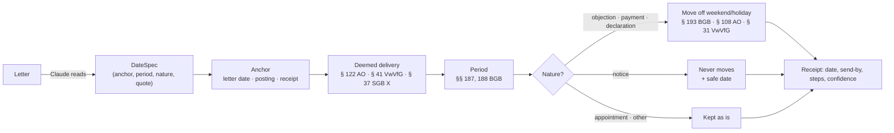

# How Ordnung computes dates

> **Not legal advice.** This page describes the law as of **25 September 2026** (`LAST_CHECKED` in
> `src/ordnung/rules/catalog.py`). It was researched and cross-checked against the statutes and court
> decisions linked below, but it has **not been reviewed by a lawyer**. When a date really matters —
> a court case, a fine, your residence permit — get advice (Verbraucherzentrale, Studierendenwerk,
> Mieterverein, a lawyer).

Ordnung's promise is simple: **the language model reads, deterministic code computes.** When Claude
reads a letter it does not produce a deadline. It produces a `DateSpec` — *what the letter says*
("one month after delivery", "by 10.10.2026", "two weeks after the letter's date") together with the
sentence it came from. The rules engine in `src/ordnung/rules/` turns that into a date, and every
result comes with a receipt that answers **"Why this date?"**:

- `due_date` — the date, `send_by` — when to send it, `safe_date` — the working day to aim for when a
  notice deadline falls on a weekend;
- `summary` — one plain-English sentence, e.g. *"Letter dated Tue 15 Sep 2026 counts as delivered on
  Sat 19 Sep, moved to Mon 21 Sep; one month later is Wed 21 Oct 2026."*;
- `steps` — each step with its rule id and citation; `holiday_calendar` — which holidays were used;
- `confidence` and `warnings` — how sure the engine is, and why not more.

Every worked example on this page is an executable test (`tests/test_rules_*.py`), and the engine is
covered 100 % by line and branch, plus Hypothesis property tests (month-end invariants, business
days never land on a holiday, deemed delivery ≥ posting + 4 days, send-by ≤ cancel-by …).

---

## 1. Safety policy and confidence

**Missing a deadline is far worse than acting early.** Whenever something is uncertain, the engine
computes the **earliest plausible date**, lowers the confidence and says why. Concretely:

| Uncertainty | What Ordnung does |
|---|---|
| Holiday region of the sender unknown | Uses only nationwide holidays: counted forward, a regional holiday could only make the deadline *later*. Counted back — a period before an event, the safe date of a deadline that never moves — one could make it *earlier* there: flagged (`medium`), "act a working day before it". |
| Payment to a company or person, payer's Land unknown | Uses only nationwide holidays (money is owed at the payer's home, §§ 269, 270 Abs. 4 BGB). |
| Posting day unknown | Uses the date printed on the letter (the real posting day can only be the same or later). |
| Letter arrived later than the deemed delivery day | Keeps the earlier deadline; shows the later one as "only if you can show it" (keep the envelope). |
| Letter says a later posting day than its date | Keeps the letter's date; mentions the later deadline. |
| Letter counts from "today" | Reads it as the letter's date, never the (later) day it is processed (`medium`). |
| Fine or penal order without the envelope date | Counts from the letter's date — no 4-day fiction, which could be later than a yellow-envelope delivery. |
| Period counted backwards ("one month before …") on a weekend/holiday | Never moves to a later day + a `safe_date` on the working day before. |
| Implausible period (over 100 years) or a date at the end of the calendar | No date, `low` confidence, "please check" — never an error that stops the document. |
| Arrival day of a letter needed but not confirmed | Uses the letter's date and asks when it really arrived (`low` confidence). |
| Arrival day stated in the letter and a different one entered by the person | Uses the earlier of the two and names both (one soft failure). |
| End of a job or tenancy (read by the model) not written in the notice's own sentence | The deadlines counted from it (objection to a landlord's notice, registering three months before the job ends) are `medium` when the date is written elsewhere in the letter, `low` with "Please check" when it isn't written in the letter at all (`termination_end`). |
| Kind of sender (procedural law) unknown | 3rd/4th-day rule **without** the weekend shift; 3 days unless the Land is known to use 4 (portal: the day after it was made available). |
| Letter from a company, landlord, bank, employer or other private sender | No deemed delivery — it is a rule for authorities' letters: a period from delivery runs from the day the letter arrived (§ 130 Abs. 1 BGB), the letter's date until the person says when (`low`); a period the letter counts from its own date or another date it names runs from that date, with no delivery days added and no question about the arrival day (`private_sender_no_delivery`). Whether the sender is an authority is read, not known (a municipal utility's Gebührenbescheid, a statutory health insurer filed as a company), so for a kind a public body may be filed as (company, insurer, utility, employer), and for any sender whose period names an administrative act in its own words (a *Bescheid*, its *Bekanntgabe* — in the spec's text or legal basis, or the item's quote), an arrival day after the day a letter usually counts as delivered never moves the date later: it runs from that earlier day (`medium`; from the arrival when both days give the same date), and a note says the date from arrival holds once the arrival is shown — for an authority's letter too (§ 41 Abs. 2 S. 3 VwVfG) — and that the deadline may still be open when only the earlier date has passed (`private_sender_late_arrival`). A gym's, landlord's or bank's letter whose words name no administrative act counts from the day it arrived. Words alone never bring deemed delivery back (a gym, too, writes "nach Bekanntgabe der Preiserhöhung"). A sender filed as private keeps the deemed delivery only when its letter names a remedy statute, or its *Einspruch*, *Widerspruch* or *Klage* notice names an administrative route (a *Bescheid* as the decision — "diesen Bescheid", a *Gebührenbescheid*, "Bescheid vom …", not "Bescheid geben" (let us know) —, its *Bekanntgabe*, an administrative, social or finance court); a Kündigungsschutzklage (§ 4 KSchG), a Widerspruch under the BGB or VVG, or a firm's own "Einspruch" window (a private parking operator's, say) does not. An unknown sender (kind `other`) keeps the deemed delivery. |
| A date counted back over a holiday of only part of a Land (15 August in Bavaria, Augsburg's 8 August, Fronleichnam in parts of Saxony and Thuringia) | The calendar never counts it (the community is unknown), so where it holds a send-by or safe date is a working day late: the warning names the holiday and where it holds (confidence unchanged). |
| Court order (Mahnbescheid, Vollstreckungsbescheid) without the envelope date | Counts from the order's own date and asks for the date on the yellow envelope (`low`); court deadlines are never `high`. Once the envelope date is entered it is the start, whatever anchor the period was read with — unless the reading names an earlier start of its own (a delivery day or an explicit start): then the earlier of the two, with a warning naming both. |
| Any other letter from a court (not filed as a court order) | No 4-day fiction (counts from the letter's date or the entered delivery day) and never `high`, whatever kind it was filed as. |
| Whether an operating-cost statement came too late | Resolved in the landlord's favour: called late only when it certainly arrived after the deadline (section 7). |
| Letter's period differs from the statute (e.g. "6 weeks" for a tax objection) | Computes both and uses the earlier date. |
| Notice period missing from a contract | Assumes the longest notice the law allows (earliest deadline). |
| Notice deadline on a weekend/holiday | No shift (BGH III ZR 172/04) + a `safe_date` on the working day before. |
| 3rd *Werktag* for a tenancy notice is a Saturday | Keeps the Saturday (see section 8). |

**Confidence rubric** (SPEC § 21). The engine judges the rule-related criteria; the ingest pipeline
further lowers confidence for quote problems (quote not found, digits not matching):

| Criterion | Fails when… | Weight |
|---|---|---|
| Anchor date stated in the document or confirmed by the user | anchor missing; arrival date assumed; a termination's end date not written in the letter | hard → `low` |
| Anchor date stated in the document | "today" read as the letter's date | soft |
| Rule known and its scope verified | unknown sender type; channel assumed; letter's period ≠ statute; Land not confirmed for the 4-day rule; *Anhörungsbogen*; fine counted from the letter date; court action (*Klage*: "get advice") | soft |
| Holiday region known | region unknown **and** a regional holiday could change this result (counted forward: the days counted or the end; counted back: the days counted back or the safe date) | soft |

`high` only if every criterion holds; one soft failure → `medium`; two soft failures or any hard
failure → `low`. The reasons are listed in `warnings` in plain English.

---

## 2. Calendar: holidays, business days and *Werktage*

- **Business day** — Monday to Friday, not a public holiday. This is the "next working day" of every
  end-of-period shift rule, which all treat Saturday like Sunday.
- **Werktag** — Monday to Saturday, not a public holiday. Used where the law counts *Werktage*, such
  as the three-day grace period for a tenancy notice. In legal language Saturday **is** a Werktag
  (BGH VIII ZR 206/04).
- **Holidays** come from the [`holidays`](https://pypi.org/project/holidays/) package
  (`holidays.Germany(subdiv=…)`). The nine nationwide holidays always count. Regional ones (e.g.
  Fronleichnam, Allerheiligen, Reformationstag, Buß- und Bettag, Frauentag in Berlin) count **only
  when the region is known**. 24 and 31 December are **not** public holidays (BFH III B 135/17), nor
  is Rosenmontag. Municipal holidays (Augsburg, Mariä Himmelfahrt in parts of Bavaria, Fronleichnam
  in parts of Saxony and Thuringia) are not used, which can only make a date counted forward earlier;
  a date counted back over one can come out a day late, so the engine names such a holiday where a
  send-by, safe or backward date passes it (`check_partial_holidays`; the app and the rules tools
  alike).
- **Whose holidays?** Those at the place where the declaration must be received — the seat of the
  authority, court or company (BAG 8 AZN 808/11, BGH VI ZA 27/11), i.e. `Party.region`. A **payment**
  to a company or person is owed at the payer's home (§§ 269, 270 Abs. 4 BGB), so § 193 BGB uses the
  holidays where you live (`RuleContext.recipient_region`; research *zahlungsziel*); payments to an
  authority use the authority's seat. For a tax letter's deemed delivery day, a regional holiday
  counts only if it applies both where you live and where the tax office is (OFD Cottbus 2004); a
  holiday only where you live is flagged, one only at the tax office is not. `recipient_region` is
  the Land chosen during onboarding — before that it is unknown.
- Every receipt names the calendar it used: `Nordrhein-Westfalen` or
  `Germany (nationwide holidays only)`.

| Example (research rule *feiertage_massgeblicher_ort*) | Result |
|---|---|
| Period ends Thu 4 Jun 2026 (Fronleichnam), authority in Cologne (NW) | Fri 5 Jun 2026 |
| Same day, tax office in Hamburg | Thu 4 Jun 2026 (no holiday there) |
| Ends Mon 8 Mar 2027 (Frauentag), Jobcenter Berlin / Potsdam | Tue 9 Mar 2027 / Mon 8 Mar 2027 |
| Ends Wed 18 Nov 2026 (Buß- und Bettag), court in Leipzig / Munich | Thu 19 Nov 2026 / Wed 18 Nov 2026 |
| Invoice payable within 7 days of Thu 28 May 2026, payer in Stuttgart (BW) | Thu 4 Jun (Fronleichnam) → Fri 5 Jun 2026 |
| Invoice payable within 14 days of Mon 22 Feb 2027, company in Berlin, payer in NRW | Mon 8 Mar 2027 (Frauentag only in Berlin) |

---

## 3. Periods — §§ 187, 188 BGB

The same arithmetic applies to civil, tax (§ 108 Abs. 1 AO), administrative (§ 31 Abs. 1 VwVfG),
social (§ 26 Abs. 1 SGB X, § 64 SGG) and fine/criminal (§ 43 StPO) periods.
`add_period(start, amount, unit, mode=…)` supports two start modes:

- **`event`** (§ 187 Abs. 1 BGB) — the period starts with an event during a day (delivery, receipt,
  the letter's date). That day is **not** counted. Weeks, months and years end on the day with the
  same weekday name or day number as the event day (§ 188 Abs. 2 Alt. 1); if the last month has no
  such day, on its last day (§ 188 Abs. 3). There is **no end-of-month rule**.
- **`day_start`** (§ 187 Abs. 2 BGB) — the period starts at the beginning of a day, like a contract
  term "from 1 March". That day counts, and the period ends on the day **before** the matching day
  (§ 188 Abs. 2 Alt. 2).

Units: `days`, `weeks`, `months`, `years`, `business_days` (Mon–Fri), `werktage` (Mon–Sat).

| Start | Period | Mode | Last day | Source |
|---|---|---|---|---|
| Mon 21 Sep 2026 | 10 days | event | Thu 1 Oct 2026 | *fristende* |
| Tue 31 Mar 2026 | 1 month | event | Thu 30 Apr 2026 (§ 188 Abs. 3) | *fristende* |
| Thu 30 Apr 2026 | 1 month | event | Sat 30 May 2026 — not 31 May | SPEC § 21 |
| Sat 31 Jan 2026 | 1 month | event | Sat 28 Feb 2026 | *arithmetic* |
| Thu 29 Feb 2024 | 1 year | event | Fri 28 Feb 2025 | *rbb one year* |
| Thu 17 Sep 2026 | 2 weeks | event | Thu 1 Oct 2026 (same weekday, § 43 StPO) | *owig 67* |
| Fri 1 Mar 2024 | 24 months | day_start | Sat 28 Feb 2026 | SPEC § 21 |
| Fri 15 Nov 2024 | 24 months | day_start | Sat 14 Nov 2026 | *arithmetic* |
| Thu 1 Oct 2026 | 1 year | day_start | Thu 30 Sep 2027 | *fristbeginn* |
| Wed 1 Mar 2023 | 12 months | day_start | Thu 29 Feb 2024 | leap year |

**Backwards** ("notice of three months to 31 January"): the latest day a notice can arrive is the
latest day from which the forward period still fits (`latest_receipt_for`). A month-end needs the
previous month-end, which a naive "minus n months" gets wrong:

| Contract ends | Notice | Must arrive by |
|---|---|---|
| Thu 31 Dec 2026 | 3 months | Wed 30 Sep 2026 |
| Sun 31 Jan 2027 | 3 months | Sat 31 Oct 2026 — no shift to Monday |
| Wed 30 Jun 2027 | 3 months | Wed 31 Mar 2027 (not 30 Mar) |
| Sun 28 Feb 2027 | 3 months | Mon 30 Nov 2026 (not 28 Nov) |
| Sun 28 Feb 2027 | 1 month | Sun 31 Jan 2027 |

The same backward count is used for any deadline a letter states backwards ("pay one month before
the course starts on Tue 6 Oct 2026" → Sat 5 Sep 2026). § 193 BGB only extends periods that run
forward, so a backward deadline **never moves to a later day** (`backward_no_shift`): it stays on
Sat 5 Sep and gets a `safe_date` of Fri 4 Sep.

---

## 4. When the last day is a weekend or holiday

If the **end** of a period (never its start) is a Saturday, Sunday or public holiday, it moves to the
next working day — repeatedly, so shifts chain:

| Rule id | Citation | Used for |
|---|---|---|
| `bgb_193` | § 193 BGB | private declarations and payments (e.g. a 14-day withdrawal period) |
| `ao_108_3` | § 108 Abs. 3 AO | tax deadlines |
| `vwvfg_31_3` | § 31 Abs. 3 VwVfG; § 57 Abs. 2 VwGO with § 222 Abs. 2 ZPO | authorities, VwGO objections |
| `sgbx_26_3` | § 26 Abs. 3 SGB X; § 64 Abs. 3 SGG | social law |
| `stpo_43` | § 43 StPO with § 46 OWiG | fines and penal orders |

| Raw last day | Moves to | Why |
|---|---|---|
| Sat 28 Mar 2026 | Mon 30 Mar 2026 | Saturday |
| Fri 25 Dec 2026 | Mon 28 Dec 2026 | Christmas, Saturday, Sunday |
| Fri 3 Apr 2026 | Tue 7 Apr 2026 | Good Friday … Easter Monday |
| Fri 1 Jan 2027 | Mon 4 Jan 2027 | New Year |
| Thu 31 Dec 2026 | Thu 31 Dec 2026 | Silvester is not a holiday |

Which DateSpecs shift (`DateSpec.nature` and `shift_rule`):

| nature | Shift? |
|---|---|
| `objection`, `payment`, `declaration` | yes, unless `shift_rule == "none"` (an authority may expressly exclude it, § 31 Abs. 3 S. 2 VwVfG) — and never for a period counted backwards (safe date instead) |
| `notice` | **never** — BGH III ZR 172/04: § 193 BGB does not apply to notice periods. A notice due on a Saturday must arrive by that Saturday; Ordnung adds `safe_date` = the working day before. |
| `appointment` | never — appointments keep their day (§ 108 Abs. 5 AO, § 31 Abs. 5 VwVfG) |
| `other` | only if `shift_rule == "next_business_day"` |

**Fixed dates** ("bis zum 10.10.2026") are used **as written**, and moved only when the DateSpec says
`shift_rule == "next_business_day"`. Deadlines *set by an authority* do move by law (§ 108 Abs. 3
AO; example: "Belege bis zum 10.10.2026" → Mon 12 Oct 2026); when the DateSpec doesn't say so, the
receipt keeps the written (earlier) date and warns that it may legally be later.

**A cancellation for an end date** ("denken Sie daran, dieses rechtzeitig zum 31.03.2027 zu kündigen",
"Kündigung zum 31.12.2026 möglich", "mit Wirkung zum …", "effective …") names the day the contract should
*end*, not the day the notice must arrive — unless its words say it must arrive then ("bis zum", "eingehen",
"vorliegen", "reach us"…). The letter doesn't say how long before that day the notice must arrive, so a
`notice` with such words counts back **one month**, the most a consumer contract concluded since March 2022
may ask (§ 309 Nr. 9 BGB, `bgb_309_9_new`), keeps that day (never moved later, safe date before a weekend) and
is `low` with a warning: the contract may ask less, and a flat, an insurance or an older contract up to three
months. Example: "rechtzeitig zum 31.03.2027" → must arrive by Sun 28 Feb 2027, safe date Fri 26 Feb, post by
Mon 22 Feb (walkthrough of phase 2: it was filed as "must arrive by Wed 31 Mar", three weeks after the
Deutschlandticket's own deadline, the 10th of March).

---

## 5. Deemed delivery (*Bekanntgabefiktion*)

A letter from an authority legally "arrives" on a fixed day after it was posted, whatever day it
really landed in your letterbox. Since the Postrechtsmodernisierungsgesetz (PostModG) this is the
**4th day** after posting for items posted from **1 January 2025** (3rd day before). Which rule
applies depends on the sender (`RuleContext.delivery_scope`, derived by `scope_for_party_kind`
from the sender's kind and, for a sender filed as a plain *authority*, its name and the letter's
remedy notice: a job centre, the employment agency, pension, care or accident insurance, a statutory
health insurer (a *Krankenkasse*, or by the brand of one of the largest: AOK, Die Techniker/TK,
BARMER, DAK, IKK, BKK, KKH, hkk, HEK, SBK, VIACTIV, BIG direkt gesund, mhplus, Knappschaft — not a
complete list; an unlisted one filed as an insurer counts from its arrival, never later than deemed
delivery), social welfare, a BAföG, Wohngeld or Elterngeld office, or a notice naming the Sozialgericht
or the SGB means social law; the Familienkasse is tax law when the remedy is an *Einspruch*, social law
otherwise):

| Scope | Senders | Rule | Weekend/holiday? |
|---|---|---|---|
| `ao` | tax office (`tax_office`), Familienkasse for Kindergeld (EStG), municipal Grundsteuer bills (delivery under the AO, but the remedy is *Widerspruch* or *Klage*) | § 122 Abs. 2 Nr. 1 AO; electronic § 122 Abs. 2a; ELSTER § 122a Abs. 4; abroad: one month (§ 122 Abs. 2 Nr. 2) | **moves** to the next working day (BFH IX R 68/98; AEAO zu § 108 Nr. 2) |
| `vwvfg` | general authorities: immigration office, city, university, broadcasting fee | § 41 Abs. 2 VwVfG and the Länder VwVfGs; portal: day after download (§ 41 Abs. 2a) | **does not move** (OVG NRW 19 A 4216/99, Nds. OVG 4 LA 44/10) |
| `sgbx` | health insurer (`health_insurer`), job centre, pension fund | § 37 Abs. 2 SGB X; portal: 4th day after the notification (§ 37 Abs. 2a) | **does not move** (BSG B 14 AS 12/09 R) |
| unknown | — | 3rd/4th day as below | does not move (earliest plausible) |

Only the *end* of the following objection period moves in every scope.

**Channel** (`DateSpec.delivery_rule`): `de_admin_post` (letter), `de_admin_electronic` (e-mail,
4th day after sending) and `de_admin_portal` (made available for download: ELSTER, BundID or another
portal). A portal decision of a general authority — or of a sender whose law is unknown — counts as
delivered the day after download (§ 41 Abs. 2a VwVfG); unless the download day is known, Ordnung
takes the day it was made available as the earliest download. Tax portals use the 4th day after
provision (§ 122a Abs. 4 AO), social-law portals the 4th day after the notification (§ 37 Abs. 2a SGB X).

**The Länder.** Authorities of a Land apply their own VwVfG. Confirmed 4-day rule: BY, NW, HH, MV
(from 1 Jan 2025), BW (from 7 Feb 2025, GBl. 2025 Nr. 8) and SH (§ 110 LVwG; confirmed in the text as
of 10 Jun 2025, so earlier postings keep 3 days); BE, BB, NI, RP, SN and ST refer to the federal law.
For Hessen (still showing the 3rd day), Bremen, Saarland and Thüringen — and whenever the Land is
unknown — Ordnung uses the **3rd day** with `medium` confidence (SPEC § 21). Baden-Württemberg keeps 3 days for procedures begun before 7 Feb 2025
(§ 102b LVwVfG); Ordnung cannot see when a procedure began and notes this here.

**Posting day.** The day the letter was handed to the post counts, not the printed date — but the
printed date is the conservative stand-in, because posting can only be the same day or later. If a
letter names a later posting day, Ordnung keeps the letter's date and mentions the later deadline
(legal research verdict: never replace the anchor with a later date for the primary result).

**Early receipt changes nothing** (BFH X R 96/98; BSG B 14 AS 12/09 R). **Late receipt** only helps
if you can show it (BFH VI R 18/22, VI R 6/23, IX B 95/25): Ordnung keeps the earlier deadline and
adds the later one as a warning. A **pre-dated** letter (received before its printed date) is
counted from the day it arrived, with a hint that you may get more time (Wiedereinsetzung).

**Formal delivery.** With a yellow envelope (*Postzustellungsurkunde*) the date written on the
envelope is the delivery day — no 4-day rule; the pipeline passes it as `anchor="explicit_date"`.
With *Einschreiben mit Rückschein* the date on the return receipt counts; with
*Übergabe-Einschreiben* the 4th day after posting (§ 4 Abs. 2 VwZG). A DateSpec cannot say which of
these a fine or penal order came by, so for § 67 OWiG and § 410 StPO the 4th-day fiction is never
applied: without the envelope date (`anchor="explicit_date"`/`"receipt"`) the two weeks are counted
from the letter's date, the earliest plausible start, with a warning to enter the envelope date. An *Einwurf-Einschreiben* is no
formal delivery: it is treated as an ordinary letter — unless the letter says it is meant as a
formal delivery, in which case the day it was put in your letterbox is used (the earlier, safe date).

| Posted | Sender (Land) | Delivered | Deadline (one month) | Source |
|---|---|---|---|---|
| **Tue 15 Sep 2026** | **tax office (NW)** | **Sat 19 Sep → Mon 21 Sep** | **Wed 21 Oct 2026** | hero case |
| Tue 29 Sep 2026 | tax office (NW) | Sat 3 Oct (holiday) → Mon 5 Oct | Thu 5 Nov 2026 | *ao 122* |
| Thu 24 Sep 2026 | tax office | Mon 28 Sep | Wed 28 Oct 2026 | *ao 122* |
| Tue 22 Dec 2026 | tax office (BE) | Sat 26 Dec → Mon 28 Dec | Thu 28 Jan 2027 | *ao 122* |
| Mon 21 Sep 2026 | tax office (NW) | Fri 25 Sep | Sun 25 Oct → Mon 26 Oct 2026 | *ao 355* |
| Fri 27 Feb 2026 | tax office (HE) | Tue 3 Mar | Fri 3 Apr (Good Friday) → Tue 7 Apr 2026 | *ao 355* |
| Mon 30 Dec 2024 | tax office | Thu 2 Jan 2025 (old 3-day rule) | — | *ao 122 transition* |
| Thu 2 Jan 2025 | tax office (NW / BY) | Mon 6 Jan / Tue 7 Jan (Epiphany in BY) | — | *ao 122 transition* |
| Mon 27 Oct 2025 | tax office (NI / BY) | Mon 3 Nov (Reformation Day in NI) / Fri 31 Oct | Wed 3 Dec / Mon 1 Dec 2025 | *ao shift* |
| Wed 23 Dec 2026 | tax office, e-mail | Sun 27 Dec → Mon 28 Dec | Thu 28 Jan 2027 | *ao 122 Abs. 2a* |
| Thu 2 Apr 2026 | ELSTER download | Mon 6 Apr (Easter Monday) → Tue 7 Apr | Thu 7 May 2026 | *elster* |
| Mon 14 Sep 2026 | authority portal (Bavaria), made available | Tue 15 Sep (day after the earliest download) | Thu 15 Oct 2026 | *vwvfg portal* |
| Tue 15 Sep 2026 | tax office, sent abroad | Thu 15 Oct | Sun 15 Nov → Mon 16 Nov 2026 | *ao abroad* |
| Tue 29 Sep 2026 | Bauamt (NW) | Sat 3 Oct — **not moved** | Tue 3 Nov 2026 | *vwvfg* |
| Tue 27 Oct 2026 | City of Hannover (NI) | Sat 31 Oct — not moved | Mon 30 Nov 2026 | *vwvfg* |
| Wed 23 Dec 2026 | immigration office (NW) | Sun 27 Dec — not moved | Wed 27 Jan 2027 | *vwvfg* |
| Tue 29 Sep 2026 | authority in Hessen | Fri 2 Oct (3rd day) | Mon 2 Nov 2026 | *vwvfg Hessen* |
| Tue 29 Sep 2026 | job centre | Sat 3 Oct — not moved | Tue 3 Nov 2026 | *sgg 84* |
| Fri 27 Nov 2026 | health insurer (BE) | Tue 1 Dec | Fri 1 Jan → Mon 4 Jan 2027 | *sgg 84* |
| Wed 26 Sep 2007 | social court letter (3-day era) | Sat 29 Sep 2007 | Mon 29 Oct 2007 | BSG B 14 AS 12/09 R |
| Mon 14 Sep 2026, arrived Wed 16 Sep | tax office | Fri 18 Sep (early arrival ignored) | Mon 19 Oct 2026 | *early receipt* |
| Mon 14 Sep 2026, arrived Tue 22 Sep | tax office | Fri 18 Sep | Mon 19 Oct 2026 (Thu 22 Oct only if late arrival is shown) | *late receipt* |
| dated Fri 16 Oct 2026, arrived Thu 15 Oct | tax office | counted from Thu 15 Oct | Mon 16 Nov 2026 | *pre-dated letter* |

---

## 6. Objections and other statutory deadlines

| Remedy | Period | Runs from | Citation | Rule id |
|---|---|---|---|---|
| Tax objection (*Einspruch*) | 1 month | deemed delivery | § 355 Abs. 1 AO | `ao_355` |
| Objection to an authority (*Widerspruch*) | 1 month | delivery | § 70 VwGO | `vwgo_70` |
| Objection in social law (*Widerspruch*) | 1 month (3 abroad) | delivery | § 84 SGG | `sgg_84` |
| Objection to a fine (*Einspruch gegen Bußgeldbescheid*) | 2 weeks | formal delivery (yellow envelope) | § 67 OWiG, § 43 StPO | `owig_67` |
| Objection to a penal order (*Strafbefehl*) | 2 weeks | formal delivery | § 410 StPO | `stpo_410` |
| Court action (*Klage*) | 1 month (SGG: 3 abroad) | delivery of the decision | § 74 VwGO, § 47 FGO, § 87 SGG | `klage_1_month` — "get advice" warning, at most `medium` |
| Hearing form (*Anhörungsbogen*) | **none** — the reply date is a request | — | § 55 OWiG | `owig_55` |
| Missing/wrong instructions (*Rechtsbehelfsbelehrung*) | 1 year | delivery | § 356 Abs. 2 AO, § 58 Abs. 2 VwGO, § 66 Abs. 2 SGG | `rbb_one_year` |

When a DateSpec names one of these statutes (`legal_basis`, e.g. "§ 355 Abs. 1 AO"), the engine
checks the letter's period against the statute and uses the earlier date if they differ. Three months
are accepted only where the law allows them (SGG remedies after delivery abroad, §§ 84, 87 SGG).

| Delivered | Remedy (seat) | Deadline | Source |
|---|---|---|---|
| Thu 17 Sep 2026 | fine (Bavaria) | Thu 1 Oct 2026 | *owig 67* |
| Sat 19 Sep 2026 (put in letterbox) | fine (NW) | Sat 3 Oct → Mon 5 Oct 2026 | *owig 67* |
| Fri 11 Dec 2026 | fine (Berlin) | Fri 25 Dec → Mon 28 Dec 2026 | *owig 67* |
| Übergabe-Einschreiben posted Mon 21 Sep 2026 | fine | delivered Fri 25 Sep → Fri 9 Oct 2026 (with that day as anchor); from the letter's date alone Ordnung shows Mon 5 Oct 2026 | *owig 67* |
| Wed 4 Nov 2026 | penal order, AG Dresden / AG München | Thu 19 Nov / Wed 18 Nov 2026 | *stpo 410* |
| Fri 18 Dec 2026 | penal order, AG Hamburg | Fri 1 Jan → Mon 4 Jan 2027 | *stpo 410* |
| Thu 10 Sep 2026 | tax objection against a VAT return filed that day | Sat 10 Oct → Mon 12 Oct 2026 | *ao 355* |
| Thu 15 Oct 2026 (abroad) | social-law objection, 3 months | Fri 15 Jan 2027 | *sgg 84* |
| Fri 16 Oct 2026 (yellow envelope) | court action, VG Frankfurt | Mon 16 Nov 2026 | *klage* |
| Mon 21 Sep 2026 | hearing form "reply within a week" | Mon 28 Sep 2026 — shown as a request, `medium` | *owig 55* |

**One-year fallback** (`compute_one_year_fallback`): only if the instructions on how to object were
missing or wrong. Whether they were is a legal judgement, so the result is always `low` confidence
and the app shows it only as a warning ("get advice"), never as the deadline:

| Delivered | Outer limit |
|---|---|
| Tue 7 Oct 2025 | Wed 7 Oct 2026 |
| Fri 31 Oct 2025 (Leipzig) | Sat 31 Oct → Mon 2 Nov 2026 |
| Thu 29 Feb 2024 | Fri 28 Feb 2025 |
| Fri 3 Oct 2025 (authority, not moved) | Sat 3 Oct → Mon 5 Oct 2026 |

**Payments.** A payment deadline moves off weekends like any declaration (§ 193 BGB). `send_by` for a
payment is **one bank business day** before the due date: a transfer reaches the payee's bank by the
end of the next business day (§ 675s Abs. 1 BGB), and banks do not process transfers on 24 and 31
December, which are skipped too (a payment due Mon 4 Jan 2027 should be ordered by Wed 30 Dec 2026). Consumers normally pay on time by ordering the transfer
by the due date (BGH VIII ZR 222/15), but tax payments count on the day of credit (§ 224 Abs. 2 AO).
Example: tax back payment on the hero letter — due Wed 21 Oct 2026, order the transfer by Tue 20 Oct.

---

## 7. High-stakes letters

Some letters are rare but catastrophic when missed, and several of them never state their most
important deadline. Ordnung files these letters under their own kind **in code** (`rules/routing.py`, a
short written policy per ADR 0007, and ADR 0010 for why code assigns these kinds). Since extraction prompt
version 9 the model names the kind itself (`high_stakes_kind`); code weighs that against the kind it
reads from the rest of the reading (the table below):

- the model names none (every reading recorded before version 9): code's kind, as before;
- code reads a kind: code's, whether the model names the same one or another;
- only the model names one: the model's, unless the reading rules it out — a court order whose sender is
  clearly no court (read as a company, a landlord, a bank … under a name that names no court, or a bailiff
  or a court cashier) or that is a European order for payment; a dismissal or landlord's notice whose
  contract is of another category (a gym, a job ticket; a tenancy for a dismissal, a job for a landlord's
  notice); a rent increase of a kind that needs no consent (the vetoes in its row). The model's
  `operating_costs` is never filed: it makes a statement one on read, with the vetoes in its row.

A veto only takes the model's kind away when the reading says the letter is something else, so a court
named only in English, a court order read without its remedy or a termination the reading doesn't record
is filed under the kind the model names. The kind the person chose on the letter's page wins over both.

| Kind | Code reads it when the reading … | Its dates follow | Deadlines the law adds (filed as to-dos) | Card |
|---|---|---|---|---|
| `court_payment_order` (*Mahnbescheid*) | comes from a court (the sender's name is a kind of court — *Amtsgericht*, also *des Amtsgerichts*, *Zentrales Mahngericht*, *Verfassungsgerichtshof* — or abbreviates one before a place of a word or two, *AG Hagen*, *SG Berlin*, *VG Minden* — a federal court's needs no place, *BGH*, *BSG* —, from a sender read as an authority (or of no particular kind; a club "SG …" or "VG Wort" read so counts as a court, the safe side) — a recipient typed into a template letter, whose kind is unknown, only by the court's full name; never any word ending in "gericht", a company whose name starts like one — *LG Electronics Deutschland GmbH*, *OLG Immobilien* —, a bailiff — *Gerichtsvollzieher bei dem Amtsgericht …* — or a court cashier), asks the person to answer it as the respondent, and names the order (see below) | `zpo_692` (at a labour court `arbgg_46a`) | pay or object within two weeks (one week at a labour court) | get advice now |
| `enforcement_order` (*Vollstreckungsbescheid*) | comes from a court, names a Vollstreckungsbescheid, asks the person to answer it, and is one (see below) | `zpo_339` (at a labour court `arbgg_59`) | object within two weeks (one week at a labour court) | get advice now |
| `dismissal` | reports a termination by the other side about a job — what it ends is decided by the contract it names (an employment contract; any other category but "other", like a job ticket, is neither), then the letter's kind, and only then the sender's (an employer) | `kschg_4`, `sgb3_38` | court action within three weeks; register as job-seeking | get advice now |
| `landlord_notice` | reports a termination by the other side about a tenancy, in the same order (a rent contract, a tenancy letter, a landlord): an employer ending the lease of a company flat gives a landlord's notice, not a dismissal | `bgb_574b` | the objection, when the notice has a notice period (or gives one in the alternative): two months before its stated end — or before the earliest end the law allows (`bgb_573c_landlord`) when the stated end is too early for it or a notice in the alternative names none | tenants' association |
| `rent_increase` | reports a rent increase whose quoted German wording asks for consent (Zustimmung, Vergleichsmiete, Mietspiegel, § 558 BGB), unless the increase's own quote or the title names another kind of increase (graduated, index, prepayments, §§ 557a, 557b, 559, 560 BGB; a modernisation only when the increase's own quote doesn't ask for consent) or a quote says consent isn't needed — what happens *without* consent ("Sollten Sie Ihre Zustimmung nicht erteilen …"), the prepayment in the new total and a Mietspiegel feature ("Bad modernisiert", "nach der Modernisierung des Bades … zuzustimmen") never veto it | `bgb_558b` | decide on the consent | rent cap check |
| `operating_costs` | names an operating-cost statement in its title, or with a tenancy or a billing period (or the model names it one), isn't a reminder (a reminder about an old statement's back-payment quotes the statement without being it) and isn't from a utility or a public body — recognised on read only, because its dates don't depend on it | ordinary 12-month period | — | late-statement check |

**Which court order a court's letter is.** A court writes many letters that name an order: to the
claimant (the other side objected, the order was served, a cost invoice, a request to fix the
application, the application was withdrawn), after an objection (the case is handed on:
*Abgabenachricht*), and during enforcement (a garnishment order, a suspension). A bailiff's letterhead
names the court too ("Gerichtsvollzieher bei dem Amtsgericht Frankfurt am Main"), and his letter quotes
the order he enforces. None of them starts a two-week period for the person. The policy has three
signals and **no list of exceptions** (ADR 0007: an earlier list of "later letter" wordings kept growing
and vetoed genuine orders whose reading said "you have not objected" or "served on you"):

1. **A court.** The sender is a court by name (above).
2. **Respondent.** The letter asks the person to answer the order: its reading states a *Widerspruch* or
   *Einspruch* remedy (from the *Rechtsbehelfsbelehrung*), or gives an objection date. A notice to the
   claimant, a bailiff's demand, an invoice or a garnishment order does neither.
3. **Which order.** The order the title names first (German, or "payment order" / "enforcement order");
   else, when the reading names an order, the remedy the letter states (*Widerspruch* → Mahnbescheid,
   *Einspruch* → Vollstreckungsbescheid, from the remedy or the objection date's own wording). Nothing
   else decides: every Mahnbescheid warns that a Vollstreckungsbescheid can follow (§ 692 Abs. 1 Nr. 4
   ZPO), and later letters quote the order they are about.

*Limitation:* a later letter whose reading nevertheless gives the person an objection date (or a
remedy), and whose title names the order, is filed as that order — the safe side for a two-week
*Notfrist*. The person changes the kind on the letter's page. A court order these signals don't
recognise — a court named only in English, a reading with no remedy and no objection date — is filed
under the kind the model names (above); only a sender that is clearly no court, or a European order for
payment, takes that kind away.

A debt collector threatening a Mahnbescheid is not a court, so its letter stays a payment reminder;
text in the model's own advice (`explanation`, `warnings`) never classifies a letter. A court order
about an invoice takes over its payment like a reminder does, so the invoice isn't shown to pay twice.
A letter the policy misses gets the kind the model names, else keeps the model's ordinary kind; the
person can set the kind on the letter's page ("What kind of letter is this?") whenever it is wrong, and
its dates and to-dos are recomputed at once. A kind
the person chose is kept when the letter is read again; a kind Ordnung chose is not, so a letter filed
before Ordnung knew these kinds gets its high-stakes kind the next time it is read.

**A court's other letters.** Whatever kind a court's letter is filed as — the policy may miss an order
(a reading with no remedy), or it is another court letter (a *Versäumnisurteil*, a hearing) — its dates
never get an authority's 4-day delivery fiction (they run from the letter's date, the earliest plausible
start, or the delivery day the person entered) and are never `high`: each carries a note that a court's
periods usually run from the date on the yellow envelope, and every period that doesn't count from a day
the letter names cites § 180 ZPO (`zpo_180`), so the letter's page asks "When was it delivered?" with no
date filled in — never "When did it arrive?" with today; its receipt counts from "the day it was
delivered", and its warnings ask for the date the postman wrote on the yellow envelope. A court's periods
are counted by §§ 187, 188 BGB through § 222 Abs. 1 ZPO — at a labour court through § 46 Abs. 2 ArbGG —
and their receipts cite them so, never the AO's or the VwVfG's counting rules; a social court (Sozialgericht,
LSG, BSG) counts under its own act, § 64 Abs. 1–3 SGG (`sgg_64`) — the same dates. A court in a place whose
name holds "kasse" (Kassel) is a court; only a cashier ("Gerichtskasse", "Landesjustizkasse") is not. The rules tools the
assistant can call (`compute_deadline`, ADR 0009) treat a sender they name as a court the same way: the
court order's kind from the remedy, the same start, the same question. A court's own period that the letter counts
from its own date ("binnen zwei Wochen ab dem Datum dieses Schreibens", "ab heute") is the exception: a
court may set another start than delivery (§ 221 ZPO), so it counts from the letter's date, the envelope
date entered never moves it later, and it doesn't cite § 180 ZPO. When the letter's date wasn't read, the
envelope date entered is the latest it can be dated, so the period counts from there (never from the day
Ordnung processed the letter), with a warning that the real deadline may be earlier — as for any letter
that counts from "today" without its date. A statute's period (a Mahnbescheid's, an enforcement order's)
always runs from delivery, whatever anchor it was read with.

**Labour courts** (`arbgg_46a`, `arbgg_59`; § 46a Abs. 1, 3, § 59 ArbGG). A labour court's (*Arbeitsgericht*)
Mahnbescheid gives **one week**, not two (§ 46a Abs. 3 ArbGG), and the objection to its enforcement order
is a one-week *Notfrist* (§ 59 S. 1 ArbGG with § 700 Abs. 1 ZPO). A court order whose sender is a labour
court is filed under the same kinds, but its dates, to-dos, card and sending advice use the week: the card
names the labour court's office, where the objection can be made for the record (§ 59 S. 2 ArbGG), and not
online-mahnantrag.de. A period the reading gives as two weeks is cut to the law's week with a note.
Example: delivered Tue 22 Sep 2026 → **Tue 29 Sep 2026**; an enforcement order delivered Sat 26 Sep 2026 →
Sat 3 Oct (German Unity Day) → **Mon 5 Oct 2026** ([§ 46a ArbGG](https://www.gesetze-im-internet.de/arbgg/__46a.html),
[§ 59 ArbGG](https://www.gesetze-im-internet.de/arbgg/__59.html)).

**Which rule a date follows.** A date follows the rule its legal basis or wording cites only if its
nature fits that rule: a registration is a declaration (an appointment "about your Arbeitsuchendmeldung"
or an authority's own fixed date is never re-dated as one, and the wording must say "arbeitsuchend
melden" or cite § 38 SGB III), the consent period takes declarations and objections (the date the higher
rent is owed from is a payment), the § 574b period takes objections only, and a withdrawal wording that
cites another law's withdrawal right (insurance, VVG) keeps its own period. The court rules only take
the dates they are about: the objection or court action, and for a Mahnbescheid paying instead — a
withdrawal takes declarations only (a cancellation "unabhängig von Ihrem Widerrufsrecht" or a payment
"30 Tage nach Ablauf der Widerrufsfrist" keeps its own rule) — a
labour-court hearing "in Sachen Kündigungsschutzklage" or a severance paid "if you don't sue" (§ 1a
KSchG) mentions the court action but doesn't follow it. A deadline the law adds is filed as a to-do
(`origin = "rule"`, one per rule) unless one of the letter's own dates was **computed under** that rule
(routed to it, or a period counted under it; a fixed date that only cites a court rule keeps the
letter's day, so the law's to-do is filed next to it); it has no quote to check, so it never makes a
letter "Please check". Rule to-dos are filed when the letter is read and when the person chooses its
kind; a changed region, postal buffer or arrival day only recomputes the ones that are left, so one the
person deleted stays deleted. Court deadlines — and every date on a court order, fixed or relative — are
**never `high`** confidence: each carries a "get advice" note, and without the envelope date also the
"when was it delivered?" question (`low`).

**Court payment order** (`zpo_692`, § 692 Abs. 1 Nr. 3, § 694 ZPO). Two weeks from delivery
(*Zustellung*): the date the postman wrote on the yellow envelope — also a Saturday, if that is when
it was put in the letterbox (§ 180 ZPO, `zpo_180`). No 4-day rule. Counted by §§ 187, 188 BGB and
moved off weekends and holidays at the court's seat (§ 222 ZPO, `zpo_222`). Without the envelope date
the order's own date is used (it can only be earlier); once the person enters it, it is the start even
when the reading counted the period from the order's date. A late objection still counts until the
enforcement order is issued (§ 694 Abs. 1 ZPO) — shown as a warning, never relied on.

| Delivered | Court | Deadline | Source |
|---|---|---|---|
| Thu 24 Sep 2026 (envelope) | AG Hagen (NW) | Thu 8 Oct 2026 | § 692 ZPO; [mahngerichte.de](https://www.mahngerichte.de/verfahrensueberblick/verfahrensablauf/widerspruch/) |
| Sat 19 Dec 2026 (letterbox) | AG Hagen | Sat 2 Jan → Mon 4 Jan 2027 | § 180, § 222 Abs. 2 ZPO |
| unknown; order dated Mon 21 Sep 2026 | AG Hagen | Mon 5 Oct 2026, `low`, "enter the envelope date" | SPEC § 21 |

**Enforcement order** (`zpo_339`, § 700 Abs. 1, § 339 Abs. 1 ZPO). Like a default judgment: it can
be enforced at once, and the objection (*Einspruch*) must reach the court within two weeks of delivery.
This *Notfrist* can't be extended. Example: delivered Sat 19 Sep 2026 in Berlin → Sat 3 Oct is German
Unity Day → **Mon 5 Oct 2026** ([Hessen courts](https://ordentliche-gerichtsbarkeit.hessen.de/themen-der-ordentlichen-gerichtsbarkeit/mahnverfahren/einspruch-gegen-einen-vollstreckungsbescheid)).

**Objecting for the record** (`zpo_129a`, § 129a Abs. 1, 3 ZPO). Any Amtsgericht's *Rechtsantragstelle*
can take down an objection to either order, but at a court other than the issuing one it only takes
effect when the record reaches the issuing court (§ 129a Abs. 3 S. 2 ZPO). The card, the sending
advice and the help link therefore recommend the issuing court's desk or a letter, and say to go to
another court early — by the send-by date, as for a letter.

**When the usual time to post has passed.** A letter that must *arrive* by its deadline is posted by the
send-by date (the postal buffer before it). Once that day has passed, the sending advice never says "post a
letter by" the last day — for a Notfrist a letter posted then arrives late (§§ 700 Abs. 1, 339 ZPO): it says a
letter posted today may arrive too late, ranks the allowed ways that reach the recipient the same day first
(fax of the signed letter, online, e-mail where text form is enough, in person) and recommends the first; the
letter page shows "Must arrive by", and the Today, inbox and timeline rows of the to-do say "Must arrive by"
its due date instead of "Send by" today.

**Dismissal: court action** (`kschg_4`, § 4 S. 1, § 7 KSchG). Three weeks from *receiving* the written
dismissal; afterwards the dismissal counts as valid. The end moves off weekends and holidays (§ 193 BGB).
The letter never states this deadline, so a dismissal always brings it as a to-do, with the "get
advice" card (union, employment lawyer, the labour court's *Rechtsantragstelle*). Ordnung never drafts
a court action. **From any employer** — a city, a university or a Land too: a dismissal is a declaration
under private law that takes effect when it arrives (§ 130 BGB), so an authority's delivery fiction never
applies to it, and the three weeks are counted by §§ 187, 188 BGB alone. It arrives when it is put in the
letterbox or handed over, even when the person is away or opens it later: the letter's page asks for that
day with no date filled in (never today, as for a landlord's notice, a rent increase or a statement) and
says so; until then the three weeks count from the letter's own date, the earliest possible. The action may be filed at the labour
court of the employer's seat or of the place of work (§ 48 Abs. 1a ArbGG), which may be in another Land: a
regional holiday moves the end only when it holds both at the employer's seat and where the person lives
(the place of work's stand-in) — a joint calendar of the two Länder, whose receipt names both and warns when
the end falls on a holiday only one of them has —, and with either Land unknown nationwide holidays only: the
earlier date, with the warning that a Land's holiday may make it later. Examples: received Mon 6 Jan 2025 → Mon 27 Jan 2025; received Fri 11 Dec 2026 (Berlin)
→ Fri 1 Jan → **Mon 4 Jan 2027** ([Arbeitsgericht Hamburg](https://justiz.hamburg.de/gerichte/arbeitsgericht-hamburg/informationen-merkblaetter-und-klagevordrucke-641146)).

**Registering as job-seeking** (`sgb3_38`, § 38 Abs. 1 SGB III). At the latest three months before the
job ends; when less than three months are left, within three days of learning the end date. "Three
months before" counts back from the last day (ends 30 Sep → by 30 Jun; ends 31 Dec → by 30 Sep; some
guides say 1 Oct — the earlier day is used; on that reading, someone who learns the end on 1 Oct still
had three months, so the deadline is that very day, earlier than three days later). The three days are not moved off a weekend: § 26 Abs. 3
SGB X may extend them, but registering online works on any day (the Agentur's phone line is open on
working days only), so Ordnung keeps the earlier date and says so. Without a known end date the three-day
rule is used (the earlier of the two). A dismissal without notice period (*fristlos*, also *außerordentlich*
with an ordinary notice given in the alternative) ends the job when it arrives: the three days count from
then, and an end the letter gives for the notice in the alternative is only noted (§ 38 Abs. 1 S. 2, 3 SGB III:
the duty holds even when the dismissal is challenged).
No postal buffer: it counts the day you register. A date the letter names that is earlier than the law's
is used; a later one is noted in the receipt next to the law's (earlier) date, which is kept, and the
date is no longer `high` — the end it counts from may be misread (the same holds for the objection to a
landlord's notice). The end of the job is the termination's effective
date as read ([Bundesagentur für Arbeit](https://www.arbeitsagentur.de/arbeitslos-arbeit-finden/arbeitslosengeld/ihre-schritte-wenn-sie-arbeitslos-werden/wie-sie-sich-arbeitsuchend-melden)).

| Learned | Job ends | Register by |
|---|---|---|
| Sat 2 May 2026 | Wed 30 Sep 2026 | Tue 30 Jun 2026 |
| Fri 25 Sep 2026 (dismissal) | Thu 31 Dec 2026 | Wed 30 Sep 2026 |
| Fri 25 Sep 2026 | Sat 31 Oct 2026 | Mon 28 Sep 2026 (three days) |
| Thu 1 Oct 2026 | Mon 30 Nov 2026 | Sun 4 Oct 2026 (kept; may run to Mon 5 Oct) |
| Thu 1 Oct 2026 | Thu 31 Dec 2026 | Thu 1 Oct 2026 (the day learned: the other reading of "three months before") |

Registering late can cost one week of unemployment benefit (*Sperrzeit*, § 159 Abs. 1 S. 2 Nr. 9, Abs. 6
SGB III; not with an important reason). Working students (*Werkstudenten*, § 27 Abs. 4 S. 1 Nr. 2 SGB III)
and mini-jobbers (§ 27 Abs. 2 SGB III) are usually not insured against unemployment, so they have no
benefit to lose; the to-do says so rather than guessing who is insured. It doesn't replace **registering as unemployed** (`sgb3_141`,
§ 141 Abs. 1, § 137 Abs. 1 SGB III): online or in person, at the latest on the first day without work (up
to three months before is allowed) — unemployment benefit is only paid from then. The dismissal card
says so next to the job-seeking to-do ([Bundesagentur für Arbeit](https://www.arbeitsagentur.de/arbeitslos-arbeit-finden/arbeitslosengeld/ihre-schritte-wenn-sie-arbeitslos-werden/wie-sie-sich-arbeitsuchend-melden):
"Die Arbeitsuchendmeldung ersetzt nicht die Arbeitslosmeldung"). **Apprentices** don't have to register when a company apprenticeship ends (§ 38 Abs. 1 S. 4
SGB III), and where their chamber has set up a conciliation board (*Schlichtungsausschuss*, § 111 Abs. 2
ArbGG) it must hear a dispute before the labour court. Ordnung can't tell an apprenticeship from a job,
so the to-do and the card say so instead of dropping the registration.

**Rent increase request** (`bgb_558b`, § 558b Abs. 1, 2 BGB). The tenant may decide until the end of
the second calendar month after the month the request arrived (arrived 15 January → until 31 March); only
with consent is the higher rent owed, from the start of the third month. So a payment to-do the model
reads from the request (the new total, often recurring) says in its receipt that the higher rent is only
owed once the tenant agrees, that paying it can count as agreeing, and to decide first if they haven't
agreed yet (citing `bgb_558b`; the receipt keeps it, so it says what holds either way), and the verdict
doesn't lead with "Pay" for it ("Decide before you pay"). Its first payment is never due before the law
allows it: the start of the third month after the request arrived (`bgb_558b`); a later start the letter names
is kept, an earlier one is noted next to the law's date. The assistant's money summary lists such a payment
apart ("decide before paying", never in the totals), and an answer citing it carries the same note, written by
code (ADR 0008). Once the person closed the consent decision's
to-do — done or dismissed only says they decided, not which way — it still doesn't: "Only if you agreed to
the increase: the higher rent is due from this date. If you didn't, keep paying your current rent". The
letter is then handled (the recurring new rent never carries its deadline). Consent is a declaration within a period, so a last day on a weekend or
holiday moves to the next working day (§ 193 BGB). A date the landlord names is shown next to the
law's: an earlier one can't shorten the period, a later one is noted and the law's (earlier) date is
kept. The card checks the **rent cap** (`bgb_558_3`, § 558 Abs. 3 BGB) from
the old and new amounts the model read: more than 20 % within three years is not allowed, more than
15 % not in the many cities with the lower cap. The caps are limits in euros, so the amounts are compared
exactly, in cents (800 → 920.30 € is 15.04 %: above 15 %); the percentage is only rounded for display
(two decimals near a cap), and a card above a cap names the highest rent it allows. The cap counts from the rent three years ago and
without operating costs, so a result within the cap is only "as far as these amounts show".

| Request arrived | Decide by | Higher rent from | Source |
|---|---|---|---|
| Thu 15 Jan 2026 | Tue 31 Mar 2026 | Wed 1 Apr 2026 | [Mieterverein zu Hamburg](https://mieterschutz-hamburg.de/rat-und-tipps/mieterhoehung) |
| Fri 15 May 2026 | Fri 31 Jul 2026 | Sat 1 Aug 2026 | [mietrecht.org](https://www.mietrecht.org/mieterhoehung/frist-zustimmung-mieterhoehung/) |
| Fri 29 Aug 2025, landlord in NI | Fri 31 Oct (Reformation Day) → Mon 3 Nov 2025 | Sat 1 Nov 2025 | § 193 BGB |

**Objecting to the landlord's notice** (`bgb_574b`, §§ 574, 574b BGB). If moving out would be a
hardship, the tenant can object and ask to stay; the objection must reach the landlord **at the latest
two months before the tenancy ends**, counted backwards, never moved to a later day (a safe date on the
working day before). Since the *Bürokratieentlastungsgesetz IV* (1 Jan 2025) text form is enough; a
signed letter by Einwurf-Einschreiben is still the safest proof. If the landlord didn't point out the
right to object, its form and its deadline in time (§ 568 Abs. 2 BGB), it can still be raised at the
first hearing of an eviction suit (§ 574b Abs. 2 S. 2) — the card says so, and so does the receipt once
the date has passed; the date shown is never moved for it. A notice without notice period gets no
objection to-do: the hardship objection doesn't apply to it (§ 574 Abs. 1 S. 2 BGB); the card says so,
the composer refuses the objection letter with the same words, and both point to advice and, for rent
arrears, to paying them in time (§ 569 Abs. 3 Nr. 2 BGB). The objection is excluded **whenever the landlord
had grounds** for a notice without notice period — also against an ordinary notice given in the
alternative for the same reasons, and a payment within the grace period doesn't revive it (BGH,
01.07.2020, [VIII ZR 323/18](https://dejure.org/dienste/vernetzung/rechtsprechung?Gericht=BGH&Datum=01.07.2020&Aktenzeichen=VIII+ZR+323/18)).
Ordnung still keeps the to-do and the letter for a notice given in the alternative (the grounds may not
have existed — the safe side), and the card, the ordinary card's step and the objection letter's note say
when it is excluded: "Object in time anyway if you think those grounds didn't exist, and get advice at
once." A notice counts as one only when **its own
quote or the title** says so (*fristlos*, "ohne Einhaltung einer Kündigungsfrist") — never the model's summary
or another quote, which may mention a *fristlose Kündigung* the landlord only reserves. A statute alone (§ 543
or § 569 BGB; § 626 BGB for a job) makes it only *probably* one: a citation is named in a reservation, a threat
or a refusal as often as in the notice itself, and any reservation in its sentence ("Eine fristlose Kündigung
nach § 543 BGB behalten wir uns vor") makes it none. A refusal is no notice either: "von einer fristlosen
Kündigung sehen wir ab", "verzichten wir", "wir wären … berechtigt". A notice only called *außerordentlich* ("außerordentliche Kündigung", "kündigen … außerordentlich";
never the adverb of something else, "wegen Ihres außerordentlich störenden Verhaltens") is only *probably*
one: a special termination with the statutory period is called extraordinary too (§ 573d BGB), so its
objection to-do and letter are kept and its card says "This may be a notice without notice period". The
notice itself must not be called ordinary (*ordentlich*, *fristgerecht*, *fristgemäß* before any notice given
in the alternative), and the wording must not be negated — before it ("keine fristlose Kündigung") or at the
end of its clause ("eine fristlose Kündigung ist damit nicht verbunden", "… sprechen wir nicht aus") —,
only reserved (a reservation of the notice itself: "eine fristlose Kündigung behalten wir uns vor", "…
vor, fristlos zu kündigen" — not "wir kündigen fristlos und behalten uns weitere Ansprüche vor") or given
"mit der gesetzlichen Frist" or "mit gesetzlicher (Kündigungs-)Frist" (as § 573d BGB is headed; in the
title also "with statutory notice", "statutory period") — a special termination (§ 573d, § 575a BGB, § 57a
ZVG, § 111 InsO, § 564 BGB) which the objection applies to (§ 574 Abs. 1 BGB, § 575a Abs. 2 BGB), even
without an end date ("zum nächstmöglichen Zeitpunkt"). The statutory period counts only when it is said of
the notice itself: not denied in its sentence ("Termination without statutory notice"), and not after
*hilfsweise* (or *vorsorglich/zugleich … ordentlich*, "gilt sie als ordentliche Kündigung", "in eine
ordentliche Kündigung umgedeutet", "alternatively") — the usual arrears notice "fristlos wegen
Zahlungsverzugs, hilfsweise ordentlich unter Einhaltung der gesetzlichen Kündigungsfrist" stays a notice
without notice period — and
the tenancy ends within two months of the letter (or no end is stated). When unsure it is an ordinary
notice: the to-do stays, and the card says the objection doesn't apply to a notice without notice period. A notice without
notice period that also gives notice with one in the alternative (*hilfsweise fristgemäß*, in its own
quote or the title — never the model's summary) keeps the to-do and the letter: the objection applies to
that notice. Whether a to-do carries the notice is read from the to-dos themselves: one computed under
§ 574b BGB — the law's, or the letter's own objection date, even when the reading missed the end. When
none does — a notice without notice period, or one whose end wasn't read — its card is urgent and comes
first, and the verdict says "get advice now", never "nothing to do". **A notice too short for its period**
— an ordinary notice ending less than two months after its date, so the objection date counted from that
end had passed when it was written, or ending before the earliest end a notice that arrived when it did can
have (dated 25 Aug "zum 31.10.", arriving after the third working day of August: 30 Nov at the earliest) —
usually ends the tenancy at the next permissible date instead. Its
objection to-do (`bgb_573c_landlord`; `low` until the arrival day is entered) counts back two months from the
**earliest end a landlord's ordinary notice can have** (§ 573c Abs. 1 S. 1 BGB): the end of the month after
next when the notice arrived by the third working day of a month (*Werktag*: Saturday counts, BGH VIII ZR
206/04), else a month later. Each doubt makes that end earlier: a Saturday third day runs on to the next
working day (§ 193 BGB, as some courts hold), and without the tenant's Land a holiday of any Land is no
working day; after five and eight years of tenancy the period is longer (S. 2), which only makes the end
later. The card is urgent and says both readings: if the stated end is right, the objection date had passed
before the letter was written, so the objection can still be raised at the first hearing of an eviction suit
(§ 574b Abs. 2 S. 2 BGB); if the notice is too short, the objection is due two months before the next
permissible end and may still be open. For a notice that is short only for its period, the card says that the
date counted from the stated end may have passed while the one from the next permissible end is still open.
A notice given in the alternative (*hilfsweise fristgemäß*) that names
no end of its own (none read, or the immediate one) gets the same to-do, and its card says which end it
counts from — never the immediate one. So does **any other notice whose end wasn't read** ("fristgerecht zum
nächstmöglichen Termin", or an end the reading missed): the real end can only be later than the earliest
one, which only makes the objection's date later.

| Notice arrived | Earliest end | Objection by | Source |
|---|---|---|---|
| Tue 4 Aug 2026 (Sat 1 Aug counts: 1, 3, 4 Aug) | Sat 31 Oct 2026 | Mon 31 Aug 2026 | § 573c Abs. 1 BGB; BGH VIII ZR 206/04 |
| Tue 6 Oct 2026 (Sat 3 Oct is a holiday: 1, 2, 5 Oct) | Sun 31 Jan 2027 | Mon 30 Nov 2026 | § 573c Abs. 1 BGB |
| Mon 5 Apr 2027 (the third, Sat 3 Apr, runs on to Monday) | Wed 30 Jun 2027 | Fri 30 Apr 2027 | § 193 BGB |

Once the person has closed every to-do that carries a high-stakes letter's legal deadline
(done or dismissed: objected, went to court, registered) — the law's to-dos and those whose receipt cites
a rule of the letter's card, never another to-do of the letter nor a recurring one (it moves on when
done) — its card is no longer urgent and says so (`advice.handled`: "You've closed the to-dos that carry
this letter's deadline"), stops asking for the delivery day and offers no letter to draft, and the verdict
says the letter is filed. A landlord's notice that no to-do carries (above) is not filed by its to-dos:
paying the arrears a notice without notice period demands doesn't deal with it. Its card is `closable`
instead: "I've dealt with this" (had advice, moved out, settled) files it — stored as the letter's tag
`dealt-with`, undone with "Not dealt with yet"; nothing is closed for the person (ADR 0006). Paying the
arrears in time — all rent due by then and the compensation for use after the notice (§ 546a Abs. 1 BGB),
or a public body such as the Jobcenter or Sozialamt undertaking to pay it — undoes only the notice without
notice period, not if that already happened within two years (§ 569 Abs. 3 Nr. 2 BGB), and under current
law never a notice with a notice period given as well (BGH, 19.09.2018, VIII ZR 231/17 and VIII ZR 261/17)
— the card, the ordinary card's step and the composer's refusal say so. The pending *Mietrecht II* bill
would change that last part ([Pending changes](#pending-changes)). **Only
for a home**: a garage, parking space or business premises let on its own follows § 578 BGB, without the
hardship objection; the to-do, the card and the catalog say so, as Ordnung can't tell them from the
letter. **Not for every tenancy** (`bgb_549`, § 549
Abs. 2, 3 BGB): a flat let only for temporary use and a furnished room in the flat the landlord lives
in have no hardship objection (§§ 574–575) and no consent procedure for rent increases (§§ 557–561);
a student hall has no consent procedure either. Ordnung can't tell these from the letter, so the to-do,
the cards and the catalog say so and point to a tenants' association. Examples: ends Sun 31 Oct 2027 → by Tue 31 Aug 2027; ends Fri 30 Apr 2027 → by **Sun 28 Feb
2027**, safe date Fri 26 Feb ([Deutscher Mieterbund](https://mieterbund.de/app/uploads/2025/02/4-Siegmund-Vortrag-Kuendigungswiderspruch-und-Fortsetzung.pdf)).

**Operating-cost statement** (`bgb_556_3`, § 556 Abs. 3, 4 BGB). The statement must reach the tenant by
the end of the twelfth month after the billing period; after that a back-payment is no longer owed
unless the landlord was not responsible for the delay (a credit stays the tenant's). The tenant's
objections are due twelve months after it arrived (an ordinary period the engine already computes),
and the tenant may inspect the receipts. The card's check is written so that it never wrongly says
"you don't owe it":

* **The billing period** is read from the letter's text (and the reading's title): every date range in it
  that ended before the statement arrived — in figures ("01.07.2024 – 30.06.2025"), in words ("vom 1. Januar
  2025 bis 31. Dezember 2025"), as ISO dates or months ("Januar bis Dezember 2025", "01/2025 – 12/2025") —
  and every billing year ("Abrechnungsjahr 2024", "Abrechnungszeitraum 2023/2024",
  "Betriebskostenabrechnung für das Jahr 2025", "Operating-cost statement 2025"), taken to end on
  31 December of its last year. The **latest** end wins, because a later end only makes the deadline later;
  a billing year gives way only to a range that says which months it covers — one the letter calls its
  billing period that ends in the year or later, or a split year's own months ("2023/2024": 01.07.2023 –
  30.06.2024) — never to another range that ends earlier in it (a cost item's service period: the later end
  is the landlord's reading). A bare "Zeitraum" is a cost item's service period ("Gebäudeversicherung,
  Zeitraum: 01.04.2024 – 31.03.2025"), never the billing period's label — only right after the statement's
  own name ("Heizkostenabrechnung\nZeitraum: …"), and even then it never makes a named billing year end
  earlier. The tenant's own time in the flat ("Nutzungszeitraum", "Mietdauer … (Auszug)", "Mietende" on the
  next line) is never the billing period, even when the letter labels it so: a tenant who moved out mid-year
  gets the landlord's period all the same, so such a range decides at most "probably". A range with the
  tenant's own range written beside it ("Abrechnungszeitraum 01.01.–31.12.2025 · Ihr Nutzungszeitraum
  01.10.–31.12.2025", as most statements do) is not the tenant's: the marker labels its own dates. A date
  near the ends of the calendar (a misread year such as 9999) claims nothing. The previous year's comparison (next to "Vorjahr", "Vergleich"; a heating statement must show
  it, § 6a Abs. 3 S. 1 Nr. 5 HeizkostenV) never decides: when it is the latest range found, the
  statement's own period was missed and nothing is claimed.
* The later reading of "end of the twelfth month" is used, and the deadline moves off weekends and
  holidays in the landlord's favour (with *any* Land's holiday when the tenant's is unknown).
* A statement is called late only when it certainly arrived after the deadline — its own date after the
  deadline, or a confirmed arrival day after it — **and** the range is one the letter calls its billing
  period ("Abrechnungszeitraum", "Abrechnung für den Zeitraum vom …", "Abrechnungsjahr 2023/2024 (…)"). From any
  other range or a billing year alone it is at most "probably too late — check the billing period".
* "On time" is only said without "probably" when the weekend/holiday shift (whose use here is disputed)
  and an unknown Land didn't decide it.
* **The arrival** is the day the person entered, else the letter's own date — unless the text dates *the
  statement whose billing period it names* (the period the card checks) before the letter's date, after
  that period ended:
  * with that period's year ("aus unserer Betriebskostenabrechnung 2023 vom 15.11.2024"), the letter is a
    later one about it (a reminder, a reply to objections, a correction), and the statement's own date
    counts, never confirmed;
  * with no year ("zu Ihren Einwendungen gegen unsere Abrechnung vom 15.11.2024", "Anlage:
    Heizkostenabrechnung der Techem vom 20.03.2025") it is ambiguous: a later letter about that statement
    (which often repeats the billing period, "Abrechnungszeitraum 01.01.2023 bis 31.12.2023") or the
    statement itself dating something it encloses. The day this letter arrived counts, but the statement
    is **never called late when that earlier date would make it on time**: the card says both readings
    ("Too late only if this letter is the statement itself") without urgency, and the back-payment gets no
    warning. When both readings say late, it is late;
  * another year's statement ("das Guthaben aus der Abrechnung 2023 vom 10.11.2024" in the 2024 statement)
    never counts.
  Missed: an enclosure dated with the statement's own year ("Heizkostenabrechnung 2024 der Techem vom …")
  counts as the statement's date, so a late statement reads as "probably on time" — the landlord's side,
  which the policy allows. A reminder (read as `dunning`) is never recognised as a statement at all.
* When the card says "too late" or "probably too late", the letter's back-payment to-dos carry the same
  warning in their receipt ("may not be owed … check before you pay", citing `bgb_556_3`), the card is
  urgent and comes first, and the verdict no longer leads with "Pay". Only money the person pays once:
  never a credit (it stays the tenant's) nor the new monthly prepayment (it is owed). Nothing is dismissed:
  the landlord may not be responsible for the delay (ADR 0006).

| Billing period ends | Statement arrived | Deadline | Result | Source |
|---|---|---|---|---|
| Tue 31 Dec 2024 | Fri 2 Jan 2026 (confirmed) | Wed 31 Dec 2025 | too late: back-payment probably not owed | [Verbraucherzentrale Brandenburg](https://www.verbraucherzentrale-brandenburg.de/pressemeldungen/energie/verspaetete-betriebskostenabrechnung-91939) |
| Wed 31 Dec 2025 | dated Tue 15 Dec 2026 | Thu 31 Dec 2026 | "probably on time — tell us when it arrived" | § 556 Abs. 3 BGB |
| Thu 31 Oct 2024 | Mon 3 Nov 2025, Land unknown | Fri 31 Oct → Mon 3 Nov 2025 | probably on time (only by the shift) | § 193 BGB |
| Sun 30 Jun 2024 ("Abrechnungsjahr 2023/2024 (01.07.2023 bis 30.06.2024)") | Mon 10 Mar 2025 (confirmed) | Mon 30 Jun 2025 | on time | § 556 Abs. 3 S. 2 BGB |
| "Abrechnungszeitraum 2024" (previous year 01.01.–31.12.2023 also named) | Mon 10 Feb 2025 (confirmed) | Wed 31 Dec 2025 | probably on time | § 556 Abs. 3 S. 2 BGB |
| Wed 31 Dec 2025 ("für den Zeitraum vom 1. Januar 2025 bis 31. Dezember 2025", previous year in figures next to it) | Thu 10 Sep 2026 (confirmed) | Thu 31 Dec 2026 | on time | § 556 Abs. 3 S. 2 BGB; § 6a HeizkostenV |

**Withdrawal** (`bgb_355`, `bgb_356_4`, `bgb_356a`; §§ 355, 356, 356a BGB). A contract concluded online,
by phone or at the door can be withdrawn within 14 days; for goods the days start when they arrive.
A last day on a weekend or holiday moves to the next working day at the consumer's home (§ 193 BGB),
and **sending in time is enough** (§ 355 Abs. 1 S. 5 BGB), so the send-by date is the deadline itself.
Since 19 June 2026 contracts made online must offer a withdrawal button (§ 356a BGB); it doesn't exist
for contracts made at the door or by phone, so the sending advice recommends e-mail and lists the
button as one channel. Without proper instructions the 14 days don't start (§ 356 Abs. 3 S. 1 BGB) and
the right ends at the latest "zwölf Monate und 14 Tage" later (§ 356 Abs. 4 S. 1 BGB): twelve months
after the regular period would have ended (Art. 10 Abs. 1 Directive 2011/83/EU); the German wording can
also be read as "12 months, then 14 days", which differs by a day or two around month ends — the earlier
date is used. A letter's wording routes here only when it cites §§ 355/356 BGB or names a
*Widerrufsfrist/-recht/-belehrung*, the date is a declaration (the withdrawal itself), the sender is not
an authority or a court (their *Widerruf* is a revocation) and no other law's withdrawal right is cited
(insurance: § 8, § 152 VVG). A period the letter states that isn't 14 days — also in working days
(*14 Werktage*) — is shown next to the law's: a shop may grant more (30 days) and some contracts
have a longer period by law (life insurance: 30 days, § 152 VVG), a shorter one doesn't count against the
consumer. The earlier date is shown while it lasts, then the later one, so a
right that still runs is never called "passed". The same holds for the withdrawal letter when the person
ticks "I was never told about my right to withdraw": whether instructions were proper is a legal
judgement (they are often in the terms or the order e-mail), so while the 14 days run they stay the
send-by date and the twelve months and 14 days are only a note; only once the 14 days have passed does
the longer period become the date, with "get advice if you're unsure".

| Start | Deadline | Source |
|---|---|---|
| Doorstep subscription, Sat 12 Sep 2026 | Sat 26 Sep → Mon 28 Sep 2026 | [Verbraucherzentrale](https://www.verbraucherzentrale.de/wissen/vertraege-reklamation/kundenrechte/fristen-dschungel-der-termine-10387): "am Montag zwei Wochen später" |
| Goods received Wed 16 Dec 2026 | Wed 30 Dec 2026 | § 356 Abs. 2 BGB |
| Goods received 1 Mar 2025, no instructions | 15 Mar 2026 | § 356 Abs. 4 BGB |
| Goods received 16 Feb 2024, no instructions | 1 Mar 2025 (the other reading: 2 Mar) | Art. 10 Directive 2011/83/EU |

**Old claims** (`bgb_195`, §§ 195, 199, 214 BGB). A court order's card says which claims *may* be
time-barred (three years from the end of the year they arose: on 26 Sep 2026, claims from 2022 or
earlier) — never that one *is*: the period can be paused (§ 204 BGB), and only a court decides once
the person raises it.

Every example here is a test (`tests/golden/letter_cases.json`, with the sources quoted; the earliest ends
and the boundary registration in `tests/test_rules_letters.py`) and the rules
have Hypothesis properties (consent periods end on a month end; the objection is the last day two months
still fit; court deadlines end on a working day; no date on a court order, fixed or relative, is ever
`high`; a statement is called late only when it certainly is).

---

## 8. Contracts

`compute_contract(terms, ctx, channel=…)` first derives a **regime** from the contract's category,
the other party's kind and its dates (`regime_for`), then computes:

- `current_term_end` — end of the term running today;
- `cancel_by` — last day the cancellation must **arrive** to reach `earliest_exit` (never moved off
  weekends); `None` when the contract can be ended any day with a fixed notice period;
- `safe_date` — last business day on or before `cancel_by`;
- `send_by` — by channel: online cancellation button → `cancel_by` itself (it counts the moment you
  press it, § 312k BGB); e-mail, fax, portal, in person → `safe_date`; letter → 4 business days
  before `safe_date`. Never before today;
- `next_renewal` — the day it continues if nobody cancels in time (`None` = nothing locks you in);
- `earliest_exit` — when it ends if you act today;
- `summary`, `notes` (with citations), `steps`, `rule_ids`, `warnings`, `confidence`.

Contract terms run from the start of their first day (`day_start` mode). Written notice periods are
capped at the statutory maximum where one exists; if the contract asks for more, the receipt says
so and shows the contract's own (earlier) date as a way to avoid an argument.

`renewal_term_months = 0` means "continues indefinitely after the first term" (the extraction's
convention): such a contract never "ends by itself"; after its first term it can be ended any day
with its notice period (insurance: at the end of each insurance year, § 11 Abs. 2, § 12 VVG). Zero or
negative terms and notice periods are misreadings and treated as missing; values over 100 years are
ignored with `low` confidence. If the usual sending time has passed, `send_by` is today and the last
step says so.

Two terms a notice period can't say:

- **The contract's own day of the month** (`notice_day`: "Die Kündigung muss bis zum 10. eines Monats zum
  Ende dieses Monats bei uns eingehen"). Read under `bgb309_new`, `tkg56`, `bgb309_old` and `as_written`
  when the notice basis is the end of a month. The cancellation must arrive by that day of the month the
  contract is to end in (the 29th–31st: a shorter month's last day; a first term that ends before the day:
  the day of the month before), never moved off a weekend. A notice period read with it applies as well
  (limited as a period alone would be) and the earlier deadline decides — neither wins, since a misreading
  can put either in the other's place (prompt 9 read this very clause as "10 days' notice"). Notice terms
  the person saves on the card replace the day: the API clears it (an Undo puts it back). A first term
  still running is left by the day of its last month, and an end date with a day needs notice (it never
  "ends by itself"). The day asks for less than a month before the month's end. After a fixed first term,
  § 309 Nr. 9 BGB and § 56 Abs. 3 TKG may instead let a cancellation end the contract one month after it
  arrives (not settled for a contract open-ended from the start): the dates keep the contract's rule, and
  a warning names the earlier end, hedged, when a cancellation sent now would reach it. Days outside 1–31
  are misreadings, treated as missing. *Limitation:* other month-end forms ("zum Ende des Folgemonats",
  "bis zum 15. zum Ende des übernächsten Monats") are not read; their notice is assumed as for a missing
  period.
- **A fixed-term job its contract lets be ended earlier by ordinary notice** (`notice_before_end`: "Nach
  Ablauf der Probezeit kann das Arbeitsverhältnis … ordentlich gekündigt werden", § 15 Abs. 4 TzBfG). A
  notice period alone never says so — a fixed-term job ends with its time (§ 15 Abs. 1 TzBfG) — so
  without the flag a job with an end date simply ends then. With it, and while the end date is ahead, the
  job is planned like an open-ended one (four weeks to the 15th or the end of a month, or the written
  period), with § 622 Abs. 1 BGB as the floor: a shorter period or notice to any day is usually the
  probation clause's (§ 622 Abs. 3 BGB), and after probation a contract can rarely agree less (§ 622 Abs.
  4, 5 BGB), so the dates use at least four weeks to the 15th or the end of a month, with a warning. If
  that notice ends it before the end date, those are its dates and `current_term_end` is the end date it
  otherwise ends on by itself; if not, the end date decides, explained by the fixed term alone. Read for a
  job only: a flat let's fixed term is § 575 BGB's question (above).

| Regime | Applies to | Rule |
|---|---|---|
| `bgb309_new` | consumer contracts concluded from 1 Mar 2022 (streaming, gym, energy …) | first term ≤ 2 years, notice ≤ 1 month before its end; afterwards indefinite, cancellable any day with ≤ 1 month (§ 309 Nr. 9 BGB, Art. 229 § 60 EGBGB) — or by the contract's own day of the month for that month's end (`notice_day`). Fixed renewals in such contracts are invalid. |
| `bgb309_old` | consumer contracts concluded before 1 Mar 2022 | first term ≤ 2 years (a longer one is capped, `medium`), renewals ≤ 1 year, notice ≤ 3 months before the end of each term |
| `tkg56` | phone and internet | first term ≤ 24 months; afterwards one month's notice any day, also for old contracts (§ 56 Abs. 1, 3 TKG) |
| `vvg11` | insurance (not statutory health) | renews for ≤ 1 year; notice 1–3 months before the end of the insurance year; contracts > 3 years (by term or end date) can be cancelled at the end of year 3 and every later year with **three** months' notice, whatever shorter notice the contract has (§ 11 Abs. 4 VVG) |
| `sgbv175` | statutory health insurance | 12-month lock-in, then to the end of the second month after the month of notice — always a month end, so a lock-in ending mid-month is left at the end of that month; switching = just join the new insurer (§ 175 SGB V) |
| `stromgvv20` | basic energy supply (*Grundversorgung*) | two weeks' notice any day, text form (§ 20 StromGVV/GasGVV) |
| `rent573c` | tenant of a flat | notice by the 3rd *Werktag* of a month → end of the month after next (§ 573c BGB); hand-signed letter (§ 568 BGB); a fixed-term lease ends by itself only with a written reason (§ 575 BGB), and one lived in past its end may continue (§ 545 BGB) |
| `employment622` | employee | four weeks to the 15th or the end of a month, or the longer written period (§ 622 BGB); hand-signed letter (§ 623 BGB); fixed-term contracts simply end — unless the contract allows ordinary notice before the end (§ 15 Abs. 4 TzBfG, `notice_before_end`: that notice while it ends the job sooner) — and one worked on past its end with the employer's knowledge may continue (§ 15 Abs. 6 TzBfG) |
| `bgb675h` | a consumer's current account its terms say can be ended any time (*jederzeit kündigen*) | any time, without notice unless one was agreed; an agreed notice counts for at most one month (§ 675h Abs. 1 BGB) |
| `as_written` | other bank contracts, business contracts, anything unknown | the contract's own terms, `low` confidence |

**Tenancy: which days are *Werktage*?** The BGH held that Saturday **counts** as a Werktag in the
three-day grace period of § 573c BGB (BGH, 27.4.2005, VIII ZR 206/04 — we read the decision). It
expressly left open whether the period extends to Monday when the 3rd Werktag itself is a Saturday
(some courts say yes). Ordnung keeps the Saturday as `cancel_by` (earliest plausible) and says so.
(For *paying* rent, § 556b BGB, Saturday does not count — BGH VIII ZR 129/09 — which is a different
rule and not computed here.)

Worked examples (demo persona Sam, today = Fri 25 Sep 2026, region NW, letter by post):

| Contract | Regime | Result |
|---|---|---|
| Phone: started 15 Nov 2024, 24 months, 1 month's notice | `tkg56` | term ends Sat 14 Nov 2026; **cancel by Wed 14 Oct 2026**; post by Thu 8 Oct |
| Same, cancellation arrives Tue 20 Oct 2026 | `tkg56` | too late for 14 Nov; ends Fri 20 Nov 2026 (month to month) |
| Gym: concluded 2 Jan 2025, from 15 Jan 2025, 12 months, 1 month any time | `bgb309_new` | indefinite since 15 Jan 2026; letter arriving Thu 1 Oct → ends Sun 1 Nov 2026 (button today → Sun 25 Oct) |
| Liability insurance from 1 Dec 2023, insurance year Dec–Nov, 3 months | `vvg11` | deadline was Mon 31 Aug 2026 → renews Tue 1 Dec 2026; next: **cancel by Tue 31 Aug 2027** to leave Tue 30 Nov 2027 |
| Insurance from 1 Jan 2024 for 5 years, 1 month's notice (today 1 Sep 2026) | `vvg11` | end of year 3: **cancel by Wed 30 Sep 2026** (three months) to leave Thu 31 Dec 2026 |
| Gym concluded 1 Oct 2021 for 30 months, then yearly, 3 months (today 1 May 2026) | `bgb309_old` | first term capped at 24 months (30 Sep 2023) → cancel by Tue 30 Jun 2026 to leave Wed 30 Sep 2026 |
| Statutory health insurance, member since 1 Oct 2024 | `sgbv175` | notice by Wed 30 Sep 2026 → ends Mon 30 Nov 2026 |
| Statutory health insurance, member since 15 Jun 2026 | `sgbv175` | bound until 14 Jun 2027 → notice by Fri 30 Apr 2027 → ends Wed 30 Jun 2027 |
| Basic electricity supply, notice arrives Tue 29 Sep 2026 | `stromgvv20` | ends Tue 13 Oct 2026 |
| Flat (tenant), October 2026 | `rent573c` | 3rd Werktag = Mon 5 Oct (Sat 3 Oct is a holiday) → ends Thu 31 Dec 2026; post the signed letter by Tue 29 Sep |
| Flat, notice arrives Tue 6 Oct 2026 | `rent573c` | next month: by Wed 4 Nov → ends Sun 31 Jan 2027 |
| Flat, April 2026 | `rent573c` | 3rd Werktag = **Sat 4 Apr** (Good Friday skipped) → ends Tue 30 Jun 2026; safe date Thu 2 Apr |
| Werkstudent job ending 31 Mar 2027, no notice clause | `employment622` | ends by itself — no cancellation needed |
| Same, "nach Ablauf der Probezeit … ordentlich gekündigt werden" (no period of its own) | `employment622` | four weeks to the end of October: **arrive by Sat 3 Oct 2026** (German Unity Day, kept; safe date Fri 2 Oct; post the signed letter by Mon 28 Sep) → ends Sat 31 Oct 2026; otherwise it ends by itself on Wed 31 Mar 2027 (`medium`: the statutory four weeks) |
| Deutschlandticket from 1 Jan 2026, "bis zum 10. eines Monats zum Ende dieses Monats" | `bgb309_new` | 10 Sep has passed: **arrive by Sat 10 Oct 2026** (safe date Fri 9 Oct; post by Mon 5 Oct) → ends Sat 31 Oct 2026; arriving on the 11th, it ends Mon 30 Nov |
| Current account, "jederzeit kündigen", no notice period | `bgb675h` | a letter posted today arrives Thu 1 Oct → the account ends then |
| Magazine from 1 Jan 2021, yearly renewal, 3 months | `bgb309_old` | cancel by Wed 30 Sep 2026 for 31 Dec 2026, else Fri 31 Dec 2027 |
| Gym from 1 Jun 2021, 24 months then yearly, 3 months | `bgb309_old` | term ends Mon 31 May 2027; cancel by **Sun 28 Feb 2027** (no shift); safe Fri 26 Feb; post by Mon 22 Feb |
| Streaming, first term ends Tue 1 Dec 2026, 1 month | `bgb309_new` | cancel by Sun 1 Nov 2026 — button until Sunday midnight, letter by Mon 26 Oct |
| DSL from 2019, cancellation arrives Mon 5 Oct 2026 | `tkg56` | ends Thu 5 Nov 2026 |

**Price increases** (`price_increase_window`) — special cancellation rights become "Ideas":

| Contract | Rule | Last day the cancellation must arrive | Example |
|---|---|---|---|
| Electricity/gas | § 41 Abs. 5 EnWG (households must be told ≥ 1 month ahead) | the day before the new price applies (BNetzA) | increase Tue 1 Dec 2026 → by Mon 30 Nov 2026 |
| Basic supply | § 5 Abs. 2, 3 StromGVV (announced ≥ 6 weeks ahead, only on the 1st of a month) | the day before | increase Fri 1 Jan 2027 (announce by Thu 19 Nov 2026) → by Thu 31 Dec 2026 |
| Phone/internet | § 57 Abs. 1, 2 TKG (told 1–2 months ahead) | 3 months after you were told; before the change if you want the new price never to apply | told Thu 15 Oct, change Tue 1 Dec 2026 → until Fri 15 Jan 2027 (by Mon 30 Nov to avoid the new price) |
| Insurance | § 40 VVG | 1 month after you were told | told Fri 20 Nov 2026 → by Sun 20 Dec 2026 (safe Fri 18 Dec) |
| Statutory health insurance | § 175 Abs. 4 S. 5 SGB V (only when the *Zusatzbeitrag* rate rises: the letter's old and new rate must be read as numbers; a contribution that rises with income opens no right) | end of the month the higher contribution is first charged | from 1 Jan 2027 → Sun 31 Jan 2027 |
| Anything else | — | no statutory special right (`low`) | — |

Late notices are flagged (the increase may not be valid yet — object, and cancel in time anyway).
Not detectable from a letter and therefore not computed: unchanged pass-through of a VAT change or of
lower regulated price components (no special right, § 41 Abs. 6 EnWG) and increases under the
pass-through clause of a fixed-price electricity contract (§ 41a Abs. 4 EnWG, since 23 Dec 2025).
Windows are not moved off weekends; `safe_date` gives the working day before.

---

## 9. How to send it

`send_guidance(kind, contract_category=…, party_kind=…, due=…)` ranks channels and states the form:

| Letter | Form | Channels (recommended first) |
|---|---|---|
| Cancellation of a consumer contract | text form — e-mail, fax or letter; no signature (§ 309 Nr. 13 BGB) | ranked by proof: online cancellation button (§ 312k BGB; not required for insurers and banks), Einwurf-Einschreiben, fax, e-mail, letter |
| Tenancy notice | hand-signed letter by every tenant, or with the missing tenants' original written authorisation (§ 568, § 174 BGB); a qualified e-signature is valid but harder to prove | Einwurf-Einschreiben, in person with a witness, letter — **not** e-mail, fax or button |
| Employment notice | hand-signed letter (§ 623 BGB) | as for tenancy |
| Switching health insurer | — | join the new insurer; it notifies the old one (§ 175 SGB V) |
| Tax objection | in writing or electronically, or in person (§ 357 AO) | ELSTER, fax, e-mail, Einwurf-Einschreiben, letter, in person |
| Other objections | signed, in writing or for the record — plain e-mail is **not** enough (§ 70 VwGO, § 84 SGG) | Einwurf-Einschreiben, fax of the signed letter, in person, letter, the authority's own ID-based portal |
| General reply | none | e-mail, portal, letter, fax |
| Objection to a court payment order (`zpo_692`) | in writing to the court, best on the enclosed form; no reasons needed; **not by e-mail** (§ 694, § 692 Abs. 1 Nr. 5 ZPO) | signed form by Einwurf-Einschreiben, online-mahnantrag.de (ID card or barcode print-out), a *Rechtsantragstelle* (`zpo_129a`: at another court than the issuing one it only counts once the record arrives there — go early), fax of the signed form, letter |
| Objection to an enforcement order (`zpo_339`) | in writing to the court; not by e-mail (§ 700, § 340 ZPO) | signed letter by Einwurf-Einschreiben, *Rechtsantragstelle* (as above, § 129a Abs. 3 S. 2 ZPO), fax, letter; an objection doesn't stop enforcement by itself |
| Objection to a labour court's order (`arbgg_46a`, `arbgg_59`) | within **one week**, in writing to the labour court or for the record at its office (§ 46a Abs. 3, § 59 S. 2 ArbGG); not by e-mail | signed form or letter by Einwurf-Einschreiben, the labour court's office, fax, letter — not online-mahnantrag.de |
| Tenant's objection to a landlord's notice (`bgb_574b`) | text form since 2025 (§ 574b Abs. 1 BGB) | signed letter by Einwurf-Einschreiben (safest proof), in person with a witness, e-mail, letter |
| Withdrawal (`bgb_355`) | any clear statement; **sending it in time is enough** (§ 355 Abs. 1 S. 5 BGB), so send-by = the deadline | e-mail, the withdrawal button (`bgb_356a`, since 19 Jun 2026, only for contracts made online), Einwurf-Einschreiben, fax, letter |
| Deferral of a tax payment (`ao_222`) | no form (§ 222 AO); until agreed, the full amount stays due | ELSTER, fax, e-mail, letter |
| Defect notice to the landlord (`bgb_536c`) | no form, but keep proof: the rent is reduced while the defect lasts, and if the landlord didn't know of it you can lose that for the time they couldn't repair it (§ 536c Abs. 2 BGB) | Einwurf-Einschreiben, e-mail, in person, letter |
| Reply to a rent increase request (`bgb_558b`) | none, but make consent provable; consent to part of the increase is possible, and paying the higher rent can count as consent | Einwurf-Einschreiben, e-mail, in person, letter |
| Receipts inspection, reply to an operating-cost statement (`bgb_556_3`) | none; objections must reach the landlord within twelve months of receiving the statement (§ 556 Abs. 3 S. 5 BGB) | Einwurf-Einschreiben, e-mail, in person, letter |
| More time, instalments, data access (Art. 15 GDPR), deposit, new address | none | ranked by proof, as for a general reply; an extension only counts once confirmed — statutory deadlines can't be extended by asking, so more time against a court order or a dismissal is refused, and so are instalments offered to a court (the claimant agrees them) |
| Any other letter to a court (sender's name ends a word in "gericht", no bailiff or cashier) | in writing | signed letter, fax of the signed letter, the court's *Rechtsantragstelle* — **never plain e-mail** |
| An objection, reply or request for more time to a recipient typed in as a court's abbreviation before a place ("AG Hagen", "LG Köln"; `may_be_court`) | in writing, if it is a court | the court's channels, signed letter first; e-mail last, "Not valid if this is a court … Fine for a company whose name only starts like one" ("LG Electronics" can't be told apart) — other letters (a withdrawal) keep their own channels |

For an Einwurf-Einschreiben keep the posting receipt and request the delivery record
(*Auslieferungsbeleg*): the online tracking status alone is no proof (BAG 2 AZR 68/24).
`must_arrive_by` is the due date; `send_by` is when to post a letter: 4 business days before the last
business day on or before the due date. The post must deliver 95 % of letters by the 3rd and 99 %
by the 4th working day after posting (§ 18 PostG); Ordnung counts Mon–Fri and from the safe date,
which is slightly more cautious than counting Saturday deliveries.

---

### Pending changes

Changes to the law that are on their way and would change a rule or its copy. They are listed in code
(`PENDING_CHANGES` in `src/ordnung/rules/catalog.py`, next to `LAST_CHECKED`) and re-checked whenever
`LAST_CHECKED` is updated; until they pass, Ordnung says what holds "under current law".

| Change | Status (25 Sep 2026) | Update when it passes | Source |
|---|---|---|---|
| *Mietrecht II* (BT-Drs. 21/6807), new § 573 Abs. 4 BGB: paying the rent arrears within the grace period also undoes an **ordinary** notice for arrears, once per tenancy | adopted by the federal cabinet on 29 Apr 2026; first reading on 9 Jul 2026, in committee | `ARREARS_CURE` (the card's fact, the ordinary card's step, the composer's refusal) and the landlord's notice above | [Deubner Recht](https://www.deubner-recht.de/themen/neues-mietrecht/mietrechtsreform-2026/schonfristzahlung.html) |

## 10. What Ordnung deliberately does not compute

| Not computed | Why |
|---|---|
| A legal deadline for a hearing form (*Anhörungsbogen*) | There is none (§ 55 OWiG). The reply date is shown as a request with `medium` confidence; the binding two weeks start only with a formal fine notice. |
| Drafting a court action against a dismissal (*Kündigungsschutzklage*) | Ordnung files its three-week deadline with a "get advice" card; the action itself belongs with a union, a lawyer or the labour court's *Rechtsantragstelle*. |
| Rent increases that need no consent (graduated or index rent, modernisation, §§ 557a, 557b, 559 BGB) | Not consent requests, so no consent period; they keep the model's kind. |
| Whether a claim *is* time-barred, or a statement's lateness was the landlord's fault | Legal judgements: shown as "may be" / "probably", with advice. |
| Court actions (*Klage*) as a remedy card | Court proceedings need advice; the app shows a "get advice" warning and never drafts them. If a letter states the court deadline as an item, the engine computes it so it is not missed, but always with the "get advice" warning and at most `medium` confidence (`klage_1_month`). |
| The one-year period for missing instructions as *the* deadline | Whether instructions are wrong is a legal judgement — shown only as a warning. |
| Wiedereinsetzung, extensions (§ 109 AO), limitation of prosecution (§ 26 Abs. 3 StVG, 6 months since 1 Jul 2026) | Discretionary or disputed; never something to rely on. |
| Work-day limits for students (§ 16b Abs. 3 AufenthG: 140 days, weekly counting) | Needs complete work records and lecture periods; replaced by a static info card with links (SPEC § 21). |
| Residence permit extension deadlines beyond "apply before the expiry date" (§ 81 Abs. 4 AufenthG) | The expiry date is used as written; how early to apply is office practice, shown as reminders. |
| Several formal deliveries (e.g. to you and your lawyer, § 51 Abs. 4 OWiG, § 37 Abs. 2 StPO) | Ordnung uses the delivery you know about — the earlier, safe date. |
| Baden-Württemberg procedures begun before 7 Feb 2025 (§ 102b LVwVfG) | Not visible in a letter; the 3rd-day risk is documented here. |
| Municipal fee notices under a Land KAG (which may follow the AO shift) | Treated as general authority letters — no shift, the earlier date. |
| Late-payment surcharges (§ 240 AO, 3-day grace period), default interest (§ 288 BGB) | Money consequences, not deadlines; the grace period is never used for planning. |
| Energy move-out cancellation (§ 41b Abs. 5 EnWG), early telecom extensions (BGH III ZR 61/24), missing cancellation buttons (§ 312k Abs. 6) | Need facts a letter rarely contains; flagged for review instead. |
| District heating and water supply (AVBFernwärmeV/AVBWasserV: up to 10-year terms, 9 months' notice, written form) | Not a contract category in Ordnung. Filed as an energy contract, the consumer caps would not hold — the receipt's notes say so; check the contract. |
| Landlord notice periods, probation periods, collective agreements | Not in the persona's scope; the contract's written terms apply. |
| Foreign law | German rules only; other countries get `low` confidence. |

---

## 11. Rule catalog

Every receipt step cites one of these rule ids (`catalog.RULES`, served at `/api/rules`; a test
enforces that every id used by the engine exists here). Settings → "How dates are computed" lists
them under the topics of `catalog.TOPIC_STARTS` (counting periods, delivery, objections and court
action, contracts, sending and form, price increases).

| Id | Title | Citation | In force from | Link |
|---|---|---|---|---|
| `bgb_187_1` | The day of the event is not counted | § 187 Abs. 1 BGB; § 108 Abs. 1 AO; § 31 Abs. 1 VwVfG; § 26 Abs. 1 SGB X | — | [gesetze-im-internet.de](https://www.gesetze-im-internet.de/bgb/__187.html) |
| `bgb_187_2` | Periods that start at the beginning of a day | § 187 Abs. 2 BGB | — | [gesetze-im-internet.de](https://www.gesetze-im-internet.de/bgb/__187.html) |
| `bgb_188` / `bgb_188_3` | When a period ends / shorter months | § 188 BGB; § 43 StPO; § 64 Abs. 2 SGG | — | [gesetze-im-internet.de](https://www.gesetze-im-internet.de/bgb/__188.html) |
| `bgb_193` | Weekend and holiday shift | § 193 BGB | — | [gesetze-im-internet.de](https://www.gesetze-im-internet.de/bgb/__193.html) |
| `ao_108_3` | Shift (tax) | § 108 Abs. 3 AO | — | [gesetze-im-internet.de](https://www.gesetze-im-internet.de/ao_1977/__108.html) |
| `vwvfg_31_3` | Shift (authorities) | § 31 Abs. 3 VwVfG | — | [gesetze-im-internet.de](https://www.gesetze-im-internet.de/vwvfg/__31.html) |
| `sgbx_26_3` | Shift (social law) | § 26 Abs. 3 SGB X; § 64 Abs. 3 SGG | — | [gesetze-im-internet.de](https://www.gesetze-im-internet.de/sgb_10/__26.html) |
| `stpo_43` | Week periods (fines, penal orders) | § 43 StPO | — | [gesetze-im-internet.de](https://www.gesetze-im-internet.de/stpo/__43.html) |
| `holidays_place` | Which public holidays count | § 193 BGB; §§ 269, 270 Abs. 4 BGB; BAG 8 AZN 808/11 | — | [bundesarbeitsgericht.de](https://www.bundesarbeitsgericht.de/entscheidung/8-azn-808-11/) |
| `unit_werktage` | Saturday is a Werktag | BGH VIII ZR 206/04 | — | [dejure.org](https://dejure.org/dienste/vernetzung/rechtsprechung?Gericht=BGH&Datum=27.04.2005&Aktenzeichen=VIII+ZR+206/04) |
| `notice_no_shift` | Notice periods never move | BGH III ZR 172/04 | — | [dejure.org](https://dejure.org/dienste/vernetzung/rechtsprechung?Gericht=BGH&Datum=17.02.2005&Aktenzeichen=III+ZR+172/04) |
| `backward_no_shift` | Periods counted backwards never move later | § 193 BGB; safety policy | — | [gesetze-im-internet.de](https://www.gesetze-im-internet.de/bgb/__193.html) |
| `authority_deadline` | Deadlines and appointments set by an authority | § 108 AO; § 31 VwVfG; § 26 SGB X | — | [gesetze-im-internet.de](https://www.gesetze-im-internet.de/vwvfg/__31.html) |
| `ao_122_2_1` | Tax letters: 4th day | § 122 Abs. 2 Nr. 1 AO; Art. 97 § 1 Abs. 15 EGAO | 2025-01-01 | [gesetze-im-internet.de](https://www.gesetze-im-internet.de/ao_1977/__122.html) |
| `ao_122_2_2` / `ao_122_2a` / `ao_122a_4` | Abroad / electronic / ELSTER | § 122 Abs. 2 Nr. 2, Abs. 2a, § 122a Abs. 4 AO | 2025-01-01 | [gesetze-im-internet.de](https://www.gesetze-im-internet.de/ao_1977/__122a.html) |
| `ao_fiction_shift` | Tax delivery day moves off weekends | BFH IX R 68/98; AEAO zu § 108 Nr. 2 | — | [dejure.org](https://dejure.org/dienste/vernetzung/rechtsprechung?Gericht=BFH&Datum=14.10.2003&Aktenzeichen=IX+R+68/98) |
| `vwvfg_41_2` / `vwvfg_41_2a` / `vwvfg_land_days` | Authorities: 4th day, no shift / portal / Länder | § 41 Abs. 2, 2a VwVfG and Länder VwVfGs | 2025-01-01 | [gesetze-im-internet.de](https://www.gesetze-im-internet.de/vwvfg/__41.html) |
| `sgbx_37_2` / `sgbx_37_2a` | Social law: 4th day, no shift / portal | § 37 Abs. 2, 2a SGB X; BSG B 14 AS 12/09 R | 2025-01-01 | [gesetze-im-internet.de](https://www.gesetze-im-internet.de/sgb_10/__37.html) |
| `posting_day`, `early_receipt`, `late_receipt`, `pzu`, `delivery_scope_unknown`, `private_sender_arrival`, `private_sender_late_arrival`, `private_sender_no_delivery` | Posting day, early/late arrival, yellow envelope, unknown sender, private sender (from arrival; a late arrival no later than deemed delivery; from the date it names) | § 122 AO; § 41 VwVfG; § 37 SGB X; BFH X R 96/98; BFH VI R 18/22; § 3 VwZG; §§ 130, 187 BGB | — | [gesetze-im-internet.de](https://www.gesetze-im-internet.de/vwzg_2005/__3.html) |
| `ao_355`, `vwgo_70`, `sgg_84`, `owig_67`, `stpo_410`, `klage_1_month`, `owig_55`, `rbb_one_year` | Remedies (section 6) | see section 6 | — | [gesetze-im-internet.de](https://www.gesetze-im-internet.de/ao_1977/__355.html) |
| `bgb_309_9_new` / `bgb_309_9_old` | Consumer contracts | § 309 Nr. 9 BGB; Art. 229 § 60 EGBGB | 2022-03-01 | [gesetze-im-internet.de](https://www.gesetze-im-internet.de/bgb/__309.html) |
| `tkg_56` / `tkg_57` | Telecom term / price changes | §§ 56, 57 TKG | 2021-12-01 | [gesetze-im-internet.de](https://www.gesetze-im-internet.de/tkg_2021/__56.html) |
| `vvg_11` / `vvg_40` | Insurance term / premium increases | §§ 11, 40 VVG | — | [gesetze-im-internet.de](https://www.gesetze-im-internet.de/vvg_2008/__11.html) |
| `sgbv_175` / `sgbv_175_4_zb` | Statutory health insurance / contribution increase | § 175 Abs. 4 SGB V | — | [gesetze-im-internet.de](https://www.gesetze-im-internet.de/sgb_5/__175.html) |
| `stromgvv_20`, `enwg_41_5`, `stromgvv_5_3` | Basic supply; energy price changes (basic supply also § 5 StromGVV/GasGVV) | § 20 StromGVV; § 41 Abs. 5 EnWG; § 5 Abs. 2, 3 StromGVV | — | [gesetze-im-internet.de](https://www.gesetze-im-internet.de/enwg_2005/__41.html) |
| `bgb_573c`, `bgb_573c_landlord`, `bgb_568` | Tenancy notice (a tenant's; a landlord's earliest end) and its form | §§ 573c, 568 BGB; BGH VIII ZR 206/04 | — | [gesetze-im-internet.de](https://www.gesetze-im-internet.de/bgb/__573c.html) |
| `bgb_675h` | Current accounts: cancel any time | § 675h Abs. 1 BGB | — | [gesetze-im-internet.de](https://www.gesetze-im-internet.de/bgb/__675h.html) |
| `bgb_622`, `bgb_623`, `fixed_term` | Employment notice, form, fixed terms | §§ 622, 623, 620 BGB; § 15 TzBfG | — | [gesetze-im-internet.de](https://www.gesetze-im-internet.de/bgb/__622.html) |
| `bgb_130`, `bgb_312k`, `bgb_309_13`, `ao_357` | Arrival, cancellation button, text form, tax objection form | § 130, § 312k, § 309 Nr. 13 BGB; § 357 AO | `bgb_312k` 2022-07-01 | [gesetze-im-internet.de](https://www.gesetze-im-internet.de/bgb/__312k.html) |
| `bgb_675s` | Bank transfer time | § 675s Abs. 1 BGB | — | [gesetze-im-internet.de](https://www.gesetze-im-internet.de/bgb/__675s.html) |
| `zpo_180`, `zpo_222` | Court letters count from delivery; court deadline shift | § 180 ZPO; § 222 ZPO | — | [gesetze-im-internet.de](https://www.gesetze-im-internet.de/zpo/__222.html) |
| `sgg_64` | A social court's periods: counting and shift | § 64 Abs. 1–3 SGG | — | [gesetze-im-internet.de](https://www.gesetze-im-internet.de/sgg/__64.html) |
| `zpo_129a` | Objections for the record at any Amtsgericht; effect only on arrival at the issuing court | § 129a Abs. 1, 3 ZPO | — | [gesetze-im-internet.de](https://www.gesetze-im-internet.de/zpo/__129a.html) |
| `zpo_692`, `zpo_339` | Court payment order; enforcement order (section 7) | § 692 Abs. 1 Nr. 3, § 694 ZPO; § 700 Abs. 1, § 339 Abs. 1 ZPO | — | [gesetze-im-internet.de](https://www.gesetze-im-internet.de/zpo/__692.html) |
| `bgb_195` | Old claims may be time-barred | §§ 195, 199 Abs. 1, 214 BGB | — | [gesetze-im-internet.de](https://www.gesetze-im-internet.de/bgb/__199.html) |
| `arbgg_46a` | A labour court's payment order: one week to object | § 46a Abs. 1, 3 ArbGG; § 692 Abs. 1 Nr. 3 ZPO | — | [gesetze-im-internet.de](https://www.gesetze-im-internet.de/arbgg/__46a.html) |
| `arbgg_59` | A labour court's enforcement order: one-week Notfrist, objection for the record | § 59 ArbGG; § 700 Abs. 1 ZPO | — | [gesetze-im-internet.de](https://www.gesetze-im-internet.de/arbgg/__59.html) |
| `kschg_4`, `sgb3_38` | Dismissal: court action; registering as job-seeking | § 4 S. 1, § 7 KSchG; § 38 Abs. 1, § 159 Abs. 1 S. 2 Nr. 9 SGB III | — | [gesetze-im-internet.de](https://www.gesetze-im-internet.de/kschg/__4.html) |
| `sgb3_141` | Registering as unemployed, at the latest on the first day without work | §§ 137, 141 SGB III | — | [gesetze-im-internet.de](https://www.gesetze-im-internet.de/sgb_3/__141.html) |
| `bgb_558b`, `bgb_558_3` | Rent increase request; rent cap | § 558b Abs. 1, 2 BGB; § 558 Abs. 1, 3 BGB | — | [gesetze-im-internet.de](https://www.gesetze-im-internet.de/bgb/__558b.html) |
| `bgb_574b` | Objecting to a landlord's notice | §§ 574, 574b BGB | 2025-01-01 (text form) | [gesetze-im-internet.de](https://www.gesetze-im-internet.de/bgb/__574b.html) |
| `bgb_549` | Short lets and furnished rooms in the landlord's flat: no hardship objection, no consent procedure | § 549 Abs. 2, 3 BGB | — | [gesetze-im-internet.de](https://www.gesetze-im-internet.de/bgb/__549.html) |
| `bgb_556_3`, `bgb_536c` | Operating-cost statements; reporting defects | § 556 Abs. 3, 4 BGB; § 536c BGB | — | [gesetze-im-internet.de](https://www.gesetze-im-internet.de/bgb/__556.html) |
| `bgb_355`, `bgb_356_4`, `bgb_356a` | Withdrawal: 14 days; without instructions; withdrawal button | § 355, § 356 Abs. 2–4 BGB; Art. 10 RL 2011/83/EU; § 356a BGB | `bgb_356a` 2026-06-19 | [gesetze-im-internet.de](https://www.gesetze-im-internet.de/bgb/__355.html) |
| `ao_222` | Tax payment deferral (Stundung) | § 222 AO | — | [gesetze-im-internet.de](https://www.gesetze-im-internet.de/ao_1977/__222.html) |
| `date_as_written`, `safe_date`, `postal_buffer`, `contract_as_written`, `unit_business_days`, `termination_end` | Ordnung's own policies | — | — | — |

---

*Law as of 25 September 2026. Not legal advice. Not reviewed by a lawyer.* If you find a mistake,
please open an issue with the statute or decision — every rule here is a unit test, so a correction
is one test away.
